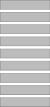
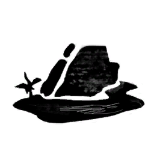
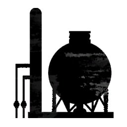
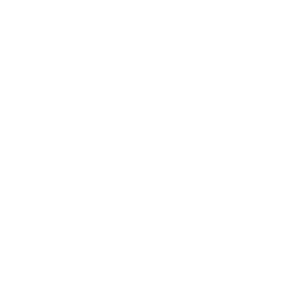

# Sprite list
All of the Sprites currently in the game.
This file is automatically generated from Sunkenland 0.1.34 using the SunkenDoc mod found on our GitHub.

| Name                                                                                                                                                        |TextureAtlas |Coords |
|-------------------------------------------------------------------------------------------------------------------------------------------------------------|---|---|
| 1                                                                         |1|(x:44.08, y:11.08, width:40.85, height:99.85)|
| 2                                                                            |2|(x:24.08, y:11.03, width:80.85, height:99.95)|
| 3                                                                            |3|(x:4.08, y:11.03, width:119.85, height:99.95)|
| Abandoned Settlement                                      |Abandoned Settlement|(x:8.08, y:64.03, width:230.85, height:132.90)|
| Abandoned Settlement 1                                  |Abandoned Settlement 1|(x:5.08, y:42.03, width:230.90, height:211.93)|
| Amuzement park                                                  |Amuzement park|(x:86.00, y:68.03, width:339.97, height:375.90)|
| arrow                                                                    |arrow|(x:0.00, y:0.00, width:183.00, height:339.00)|
| arrow_0                                                                |arrow|(x:51.00, y:49.00, width:99.00, height:122.00)|
| arrowdown                                                            |arrowdown|(x:18.08, y:26.08, width:43.85, height:23.85)|
| Arrow-Down-Icon                                                |Arrow-Down-Icon|(x:3.05, y:0.08, width:57.90, height:35.85)|
| Arrow-Right-Icon                                              |Arrow-Right-Icon|(x:1.08, y:3.03, width:34.85, height:56.90)|
| atol3                                                                    |atol3|(x:0.00, y:35.03, width:256.00, height:185.90)|
| atol5                                                                    |atol5|(x:15.08, y:6.08, width:225.85, height:231.90)|
| atol9                                                                    |atol9|(x:16.01, y:38.01, width:239.99, height:145.96)|
| atol9 1                                                                |atol9 1|(x:9.01, y:48.04, width:238.92, height:158.88)|
| atol9 2                                                                |atol9 2|(x:19.00, y:41.08, width:208.92, height:194.85)|
| atol9 3                                                                |atol9 3|(x:19.00, y:41.08, width:214.97, height:166.90)|
| Background                                                          |Background|(x:0.03, y:0.05, width:31.95, height:31.90)|
| Background                                                          |Background|(x:0.03, y:0.05, width:31.95, height:31.90)|
| Background                                                          |Background|(x:0.00, y:0.00, width:512.00, height:288.00)|
| Background (400ppu)                                        |Background (400ppu)|(x:0.00, y:0.00, width:512.00, height:512.00)|
| Background (400ppu)                                        |Background (400ppu)|(x:0.00, y:0.00, width:512.00, height:512.00)|
| Background 2                                                      |Background 2|(x:0.00, y:0.00, width:512.00, height:288.00)|
| Background 2 (400ppu)                                    |Background 2 (400ppu)|(x:0.00, y:0.00, width:511.92, height:285.92)|
| Background 4 (400ppu)                                    |Background 4 (400ppu)|(x:0.00, y:0.00, width:512.00, height:288.00)|
| Background 5 (400ppu)                                    |Background 5 (400ppu)|(x:0.00, y:0.00, width:512.00, height:288.00)|
| Bandit Faction Icon                                        |Bandit Faction Icon|(x:0.00, y:0.00, width:256.00, height:160.00)|
| boat motor boat 1                                            |boat motor boat 1|(x:3.06, y:30.04, width:249.86, height:209.94)|
| book mark                                                            |book mark|(x:7.03, y:0.08, width:248.97, height:113.92)|
| BOOK1                                                                    |BOOK1|(x:47.08, y:16.08, width:1936.85, height:1580.85)|
| BOOK1 1                                                                |BOOK1 1|(x:47.08, y:16.08, width:1936.85, height:1580.85)|
| BOOK2                                                                    |BOOK2|(x:47.08, y:16.08, width:1936.85, height:1580.85)|
| Border Wide 2                                                    |Border Wide 2|(x:0.00, y:0.00, width:334.00, height:512.00)|
| Border Wide 4                                                    |Border Wide 4|(x:0.00, y:0.00, width:334.00, height:512.00)|
| Box-Outline-Icon                                              |Box-Outline-Icon|(x:2.08, y:2.04, width:52.85, height:51.93)|
| Brush Impact                                                      |Brush Impact|(x:3.03, y:0.00, width:495.85, height:85.00)|
| Brush Impact 3                                                  |Brush Impact 3|(x:1.03, y:0.00, width:495.90, height:85.00)|
| Brush Radial 2                                                  |Brush Radial 2|(x:0.00, y:0.00, width:250.00, height:256.00)|
| Brush Wide 2                                                      |Brush Wide 2|(x:0.00, y:0.00, width:512.00, height:107.00)|
| building1                                                            |building1|(x:0.00, y:23.08, width:256.00, height:209.90)|
| Campfire                                                              |Campfire|(x:5.00, y:0.00, width:117.95, height:128.00)|
| Checkmark                                                            |Checkmark|(x:19.08, y:20.08, width:26.86, height:22.85)|
| Circle                                                                  |Circle|(x:0.00, y:0.00, width:256.00, height:256.00)|
| Circle01                                                              |Circle01|(x:7.08, y:6.08, width:242.85, height:242.85)|
| city                                                                      |city|(x:20.04, y:33.03, width:204.91, height:188.92)|
| Crafting                                                              |Crafting|(x:4.08, y:4.03, width:119.90, height:119.90)|
| CustomCursorSprite_0                                      |CustomCursorSprite|(x:0.00, y:31.00, width:26.00, height:33.00)|
| DianLiang                                                            |DianLiang|(x:0.00, y:0.00, width:62.00, height:132.00)|
| DirectionalDamageIndicator                          |DirectionalDamageIndicator|(x:6.03, y:182.03, width:505.97, height:195.95)|
| discord2                                                              |discord2|(x:5.03, y:1.03, width:177.90, height:136.92)|
| DiTu                                                                      |DiTu|(x:0.00, y:0.00, width:80.00, height:202.00)|
| Dreadville                                                          |Dreadville|(x:44.03, y:65.08, width:438.93, height:371.85)|
| DropdownArrow                                                    |DropdownArrow|(x:20.08, y:23.08, width:23.85, height:15.85)|
| Eating                                                                  |Eating|(x:45.03, y:9.04, width:265.95, height:344.88)|
| factory                                                                |factory|(x:4.08, y:68.08, width:247.85, height:158.85)|
| Faraway Island                                                  |Faraway Island|(x:22.03, y:110.08, width:466.96, height:295.85)|
| followme                                                              |followme|(x:3.08, y:18.04, width:81.85, height:61.89)|
| Food Category                                                    |Food Category|(x:11.08, y:0.00, width:106.85, height:128.00)|
| FusionPrototypeWhitePixel                            |FusionPrototypeWhitePixel|(x:0.00, y:0.00, width:1.00, height:1.00)|
| gasmask                                                                |gasmask|(x:18.03, y:12.03, width:218.91, height:232.95)|
| gasmask 1                                                            |gasmask 1|(x:18.03, y:5.08, width:226.95, height:245.90)|
| gasmask 2                                                            |gasmask 2|(x:3.08, y:45.00, width:249.85, height:180.92)|
| gizmo-microphone                                              |gizmo-microphone|(x:56.08, y:10.08, width:142.85, height:229.85)|
| gizmo-microphone-off                                      |gizmo-microphone-off|(x:41.08, y:19.08, width:177.85, height:220.90)|
| gizmo-speaker                                                    |gizmo-speaker|(x:1.08, y:42.08, width:509.85, height:427.85)|
| Gradient                                                              |Gradient|(x:0.00, y:0.00, width:256.00, height:256.00)|
| GradientPanel01                                                |GradientPanel01|(x:0.00, y:0.00, width:1024.00, height:32.00)|
| GradientPanel02                                                |GradientPanel02|(x:0.00, y:0.00, width:251.92, height:32.00)|
| GradientPanel03                                                |GradientPanel03|(x:0.00, y:0.00, width:256.00, height:32.00)|
| Grid                                                                      |Grid|(x:0.00, y:0.00, width:512.00, height:512.00)|
| HeadShot 1                                                          |HeadShot 1|(x:7.08, y:4.03, width:132.85, height:144.90)|
| Health_Normal                                                    |Health_Normal|(x:15.08, y:14.08, width:226.85, height:226.85)|
| helmet icon                                                        |helmet icon|(x:1.08, y:18.03, width:125.85, height:89.90)|
| horizontal frame                                              |horizontal frame|(x:0.00, y:0.00, width:658.00, height:339.00)|
| Hunger_Normal                                                    |Hunger_Normal|(x:6.08, y:3.08, width:51.90, height:58.90)|
| ICON AIR CANISTER                                            |ICON AIR CANISTER|(x:19.08, y:0.00, width:73.88, height:128.00)|
| icon bed                                                              |icon bed|(x:6.03, y:12.08, width:87.95, height:72.85)|
| icon bleeding                                                    |icon bleeding|(x:0.00, y:6.03, width:120.95, height:119.90)|
| icon boat1                                                          |icon boat1|(x:65.08, y:0.00, width:116.85, height:253.97)|
| icon build                                                          |icon build|(x:2.03, y:0.03, width:125.95, height:122.95)|
| icon checkmark                                                  |icon checkmark|(x:0.08, y:7.08, width:71.92, height:56.85)|
| icon chiop pickaxe                                          |icon chiop pickaxe|(x:0.00, y:0.00, width:127.92, height:127.92)|
| icon chop wood                                                  |icon chop wood|(x:2.03, y:12.08, width:121.90, height:114.85)|
| icon close                                                          |icon close|(x:6.02, y:10.04, width:108.95, height:108.90)|
| icon close 2                                                      |icon close 2|(x:0.00, y:7.03, width:128.00, height:118.95)|
| Icon Defence                                                      |Icon Defence|(x:17.08, y:7.03, width:99.85, height:113.96)|
| Icon Engine                                                        |Icon Engine|(x:0.00, y:3.08, width:75.96, height:74.92)|
| icon fish                                                            |icon fish|(x:12.08, y:30.03, width:231.90, height:195.90)|
| icon flag                                                            |icon flag|(x:66.08, y:4.08, width:144.85, height:238.85)|
| icon gender male                                              |icon gender male|(x:11.03, y:0.00, width:50.90, height:72.00)|
| icon gender male 1                                          |icon gender male 1|(x:0.08, y:2.03, width:68.85, height:66.90)|
| icon lights                                                        |icon lights|(x:18.03, y:0.08, width:63.90, height:99.90)|
| icon lung capacity                                          |icon lung capacity|(x:1.03, y:8.03, width:125.95, height:111.90)|
| icon map                                                              |icon map|(x:16.03, y:4.08, width:67.95, height:91.90)|
| icon medicine                                                    |icon medicine|(x:21.03, y:1.03, width:58.95, height:98.95)|
| icon mission                                                      |icon mission|(x:14.08, y:5.06, width:70.85, height:85.86)|
| icon mission marker                                        |icon mission marker|(x:0.00, y:0.00, width:256.00, height:256.00)|
| icon props                                                          |icon props|(x:17.08, y:0.00, width:68.85, height:98.92)|
| icon question mark                                          |icon question mark|(x:43.03, y:34.08, width:41.97, height:59.88)|
| icon radio                                                          |icon radio|(x:0.00, y:0.00, width:179.00, height:176.92)|
| ICON RESEARCH                                                    |ICON RESEARCH|(x:14.08, y:0.08, width:99.85, height:127.89)|
| icon rotate                                                        |icon rotate|(x:7.04, y:28.08, width:113.93, height:61.85)|
| icon sleep                                                          |icon sleep|(x:7.03, y:7.03, width:85.90, height:85.95)|
| icon steering wheel                                        |icon steering wheel|(x:2.08, y:2.08, width:124.90, height:124.85)|
| icon stop                                                            |icon stop|(x:4.08, y:4.08, width:121.85, height:121.85)|
| icon support                                                      |icon support|(x:3.08, y:4.08, width:122.85, height:116.85)|
| ICON SWIMMING                                                    |ICON SWIMMING|(x:1.08, y:25.04, width:125.85, height:76.94)|
| icon trade                                                          |icon trade|(x:7.09, y:6.08, width:114.88, height:110.88)|
| Icon Workstation                                              |Icon Workstation|(x:5.08, y:1.08, width:118.85, height:124.85)|
| INDICATOR                                                            |INDICATOR|(x:1.08, y:16.08, width:75.85, height:40.85)|
| indicator lock                                                  |indicator lock|(x:30.08, y:20.08, width:68.85, height:89.88)|
| InputFieldBackground                                      |InputFieldBackground|(x:0.03, y:0.05, width:31.95, height:31.90)|
| Island                                                                  |Island|(x:16.01, y:48.08, width:226.96, height:201.91)|
| Island 2                                                              |Island 2|(x:12.08, y:32.05, width:233.77, height:181.87)|
| jetski 1                                                              |jetski 1|(x:6.08, y:44.08, width:244.89, height:167.85)|
| JiaSuDian                                                            |JiaSuDian|(x:0.00, y:0.00, width:256.00, height:234.00)|
| JiaSuTiao                                                            |JiaSuTiao|(x:0.00, y:0.00, width:256.00, height:235.00)|
| Keyboard_White_A                                              |Keyboard_White_A|(x:10.03, y:12.03, width:79.96, height:75.95)|
| Keyboard_White_C                                              |Keyboard_White_C|(x:10.03, y:12.03, width:79.96, height:75.95)|
| Keyboard_White_C 1                                          |Keyboard_White_C 1|(x:10.03, y:12.03, width:79.96, height:75.95)|
| Keyboard_White_D                                              |Keyboard_White_D|(x:10.03, y:12.03, width:79.96, height:75.95)|
| Keyboard_White_E                                              |Keyboard_White_E|(x:10.03, y:12.03, width:79.96, height:75.95)|
| Keyboard_White_S                                              |Keyboard_White_S|(x:10.03, y:12.03, width:79.96, height:75.95)|
| Keyboard_White_W                                              |Keyboard_White_W|(x:10.03, y:12.03, width:79.96, height:75.95)|
| KeyboardKey                                                        |KeyboardKey|(x:14.08, y:14.08, width:99.85, height:99.85)|
| KeyboardKey_BG                                                  |KeyboardKey_BG|(x:14.08, y:14.08, width:99.85, height:99.85)|
| Knob                                                                      |Knob|(x:12.03, y:12.03, width:39.95, height:39.95)|
| Knob                                                                      |Knob|(x:12.03, y:12.03, width:39.95, height:39.95)|
| Kraken1                                                                |Kraken1|(x:0.00, y:0.00, width:512.00, height:320.00)|
| loadingAnimationCircle_ChasingBlock_0    |loadingAnimationCircle_ChasingBlock|(x:0.00, y:0.00, width:128.00, height:128.00)|
| loadingAnimationCircle_ChasingBlock_1    |loadingAnimationCircle_ChasingBlock|(x:128.00, y:0.00, width:128.00, height:128.00)|
| loadingAnimationCircle_ChasingBlock_10  |loadingAnimationCircle_ChasingBlock|(x:1280.00, y:0.00, width:128.00, height:128.00)|
| loadingAnimationCircle_ChasingBlock_11  |loadingAnimationCircle_ChasingBlock|(x:1408.00, y:0.00, width:128.00, height:128.00)|
| loadingAnimationCircle_ChasingBlock_2    |loadingAnimationCircle_ChasingBlock|(x:256.00, y:0.00, width:128.00, height:128.00)|
| loadingAnimationCircle_ChasingBlock_3    |loadingAnimationCircle_ChasingBlock|(x:384.00, y:0.00, width:128.00, height:128.00)|
| loadingAnimationCircle_ChasingBlock_4    |loadingAnimationCircle_ChasingBlock|(x:512.00, y:0.00, width:128.00, height:128.00)|
| loadingAnimationCircle_ChasingBlock_5    |loadingAnimationCircle_ChasingBlock|(x:640.00, y:0.00, width:128.00, height:128.00)|
| loadingAnimationCircle_ChasingBlock_6    |loadingAnimationCircle_ChasingBlock|(x:768.00, y:0.00, width:128.00, height:128.00)|
| loadingAnimationCircle_ChasingBlock_7    |loadingAnimationCircle_ChasingBlock|(x:896.00, y:0.00, width:128.00, height:128.00)|
| loadingAnimationCircle_ChasingBlock_8    |loadingAnimationCircle_ChasingBlock|(x:1024.00, y:0.00, width:128.00, height:128.00)|
| loadingAnimationCircle_ChasingBlock_9    |loadingAnimationCircle_ChasingBlock|(x:1152.00, y:0.00, width:128.00, height:128.00)|
| Lock_0                                                                  |Lock|(x:10.00, y:351.00, width:663.00, height:665.00)|
| Lock_2                                                                  |Lock|(x:787.00, y:762.00, width:220.00, height:220.00)|
| Lock_3                                                                  |Lock|(x:1134.00, y:14.00, width:166.00, height:1001.00)|
| Lock_4                                                                  |Lock|(x:399.03, y:31.08, width:342.90, height:48.85)|
| Lock_5                                                                  |Lock|(x:38.00, y:120.05, width:717.00, height:128.95)|
| Lock_6                                                                  |Lock|(x:1597.03, y:178.08, width:102.90, height:779.87)|
| Loner Base                                                          |Loner Base|(x:12.08, y:32.05, width:234.88, height:181.87)|
| Loner Base 1                                                      |Loner Base 1|(x:12.08, y:32.05, width:234.88, height:181.94)|
| Loner Base 2                                                      |Loner Base 2|(x:11.08, y:36.05, width:234.88, height:182.94)|
| Loner Base 4                                                      |Loner Base 4|(x:8.04, y:36.05, width:239.93, height:182.94)|
| Loner Base 5                                                      |Loner Base 5|(x:12.08, y:32.05, width:234.88, height:194.92)|
| Loner Base 6                                                      |Loner Base 6|(x:12.08, y:14.03, width:234.88, height:236.94)|
| Map BG 1                                                              |Map BG 1|(x:0.00, y:0.00, width:1024.00, height:716.00)|
| Map Boarder                                                        |Map Boarder|(x:0.00, y:0.00, width:512.00, height:334.00)|
| Marauders                                                            |Marauders|(x:0.00, y:0.00, width:512.00, height:320.00)|
| MetalScrapMaterial                                          |MetalScrapMaterial|(x:18.08, y:7.08, width:222.90, height:235.90)|
| MG GUNNER                                                            |MG GUNNER|(x:9.08, y:2.08, width:83.85, height:83.85)|
| mission 1 setup base                                      |mission 1 setup base|(x:0.00, y:0.00, width:1024.00, height:499.00)|
| mission complete                                              |mission complete|(x:1.03, y:0.00, width:48.95, height:47.92)|
| mission IN complete                                        |mission IN complete|(x:2.03, y:0.03, width:48.95, height:47.97)|
| Missions                                                              |Missions|(x:56.08, y:56.08, width:143.85, height:143.85)|
| mouse button left                                            |mouse button left|(x:46.08, y:7.08, width:119.85, height:198.85)|
| mouse button middle 1                                    |mouse button middle 1|(x:68.08, y:29.08, width:119.85, height:198.85)|
| mouse button right                                          |mouse button right|(x:46.08, y:7.08, width:119.85, height:198.85)|
| mouse scrollwheel                                            |mouse scrollwheel|(x:67.08, y:28.08, width:120.85, height:211.86)|
| New order brotherhood                                    |New order brotherhood|(x:0.00, y:0.00, width:512.00, height:320.00)|
| Nuclear1                                                              |Nuclear1|(x:0.00, y:0.00, width:512.00, height:320.00)|
| Paper2                                                                  |Paper2|(x:32.01, y:19.01, width:836.97, height:1145.97)|
| PickUpHand                                                          |PickUpHand|(x:0.00, y:0.00, width:64.00, height:64.00)|
| Police Station                                                  |Police Station|(x:0.00, y:25.03, width:211.97, height:205.85)|
| price down 1                                                      |price down 1|(x:24.03, y:2.08, width:50.95, height:93.85)|
| Ps4                                                                        |Ps4|(x:386.03, y:107.05, width:1055.95, height:866.90)|
| radio background                                              |radio background|(x:13.08, y:13.08, width:993.85, height:817.85)|
| Radio Island                                                      |Radio Island|(x:12.08, y:32.05, width:233.77, height:215.92)|
| radio power button                                          |radio power button|(x:0.00, y:0.00, width:127.00, height:71.00)|
| recycle                                                                |recycle|(x:3.03, y:6.08, width:113.95, height:107.85)|
| Refinery                                                              |Refinery|(x:25.08, y:16.08, width:205.85, height:225.90)|
| Repairing                                                            |Repairing|(x:59.08, y:55.08, width:393.85, height:400.85)|
| RopeMaterial                                                      |RopeMaterial|(x:3.08, y:2.08, width:250.85, height:250.85)|
| Running                                                                |Running|(x:18.06, y:11.08, width:218.86, height:238.90)|
| sack                                                                      |sack|(x:45.05, y:9.08, width:169.88, height:240.85)|
| Salvation Clan                                                  |Salvation Clan|(x:0.00, y:0.00, width:512.00, height:320.00)|
| SharpPanel01                                                      |SharpPanel01|(x:0.00, y:0.00, width:256.00, height:128.00)|
| SharpPanel02                                                      |SharpPanel02|(x:0.08, y:0.08, width:511.85, height:1023.85)|
| SharpPanel03                                                      |SharpPanel03|(x:0.08, y:0.08, width:1023.85, height:511.85)|
| Shelter_Category                                              |Shelter_Category|(x:2.08, y:24.03, width:124.85, height:82.90)|
| shield                                                                  |shield|(x:13.08, y:3.03, width:104.85, height:115.89)|
| ship                                                                      |ship|(x:7.01, y:18.08, width:246.96, height:218.91)|
| shirt icon                                                          |shirt icon|(x:14.03, y:14.08, width:227.95, height:227.90)|
| ShuiShen                                                              |ShuiShen|(x:0.00, y:0.00, width:26.00, height:62.00)|
| Slavers                                                                |Slavers|(x:0.00, y:0.00, width:512.00, height:320.00)|
| Slot02                                                                  |Slot02|(x:0.00, y:0.00, width:128.00, height:128.00)|
| small square                                                      |small square|(x:0.00, y:0.00, width:128.00, height:128.00)|
| Soda Can                                                              |Soda Can|(x:19.08, y:1.01, width:228.88, height:240.91)|
| squar frame                                                        |squar frame|(x:0.00, y:0.00, width:128.00, height:128.00)|
| Square                                                                  |Square|(x:0.00, y:0.00, width:256.00, height:256.00)|
| Stamina_Normal                                                  |Stamina_Normal|(x:14.01, y:6.03, width:104.97, height:115.90)|
| STAR1                                                                    |STAR1|(x:0.00, y:2.03, width:85.00, height:81.90)|
| STAR1 1                                                                |STAR1 1|(x:0.00, y:0.00, width:85.00, height:76.88)|
| STAR1 bp                                                              |STAR1 bp|(x:1.08, y:4.03, width:83.85, height:75.92)|
| STAR1 broke                                                        |STAR1 broke|(x:0.03, y:4.08, width:80.90, height:73.90)|
| Storage_Category                                              |Storage_Category|(x:0.00, y:0.00, width:128.00, height:128.00)|
| story2                                                                  |story2|(x:0.00, y:0.00, width:198.97, height:149.96)|
| STRENGTH UI                                                        |STRENGTH UI|(x:0.00, y:2.29, width:299.00, height:21.41)|
| STRENGTH UI 1                                                    |STRENGTH UI 1|(x:0.00, y:2.29, width:299.00, height:21.41)|
| STRENGTH UI 2                                                    |STRENGTH UI 2|(x:0.00, y:2.29, width:299.00, height:21.41)|
| STRENGTH UI 3                                                    |STRENGTH UI 3|(x:0.00, y:2.29, width:299.00, height:21.41)|
| Sunken ship                                                        |Sunken ship|(x:25.08, y:16.08, width:205.85, height:225.90)|
| Sunken ship 1                                                    |Sunken ship 1|(x:0.00, y:0.00, width:221.95, height:256.00)|
| survival book tab2                                          |survival book tab2|(x:0.08, y:0.00, width:320.92, height:162.00)|
| survival book tab3                                          |survival book tab3|(x:2.08, y:2.08, width:691.87, height:374.85)|
| survival book tab4                                          |survival book tab4|(x:0.00, y:0.00, width:427.97, height:203.00)|
| survival book2b                                                |survival book2b|(x:0.00, y:1.08, width:453.00, height:691.88)|
| The Bridge                                                          |The Bridge|(x:0.00, y:26.02, width:256.00, height:192.90)|
| The Bridge 1                                                      |The Bridge 1|(x:4.08, y:25.03, width:247.85, height:169.90)|
| The Hunters                                                        |The Hunters|(x:0.00, y:0.00, width:512.00, height:320.00)|
| Thirst_Normal                                                    |Thirst_Normal|(x:25.06, y:7.08, width:78.91, height:112.85)|
| trash                                                                    |trash|(x:3.08, y:3.08, width:121.85, height:124.92)|
| trash 2                                                                |trash 2|(x:4.08, y:4.03, width:56.85, height:57.95)|
| treasure map 1                                                  |treasure map 1|(x:64.08, y:0.00, width:900.85, height:716.00)|
| Tutorial_Category 1                                        |Tutorial_Category 1|(x:9.08, y:12.03, width:109.85, height:103.90)|
| Tutorial_Category 3                                        |Tutorial_Category 3|(x:16.08, y:3.08, width:95.85, height:121.86)|
| UIMask                                                                  |UIMask|(x:2.03, y:2.03, width:27.95, height:27.95)|
| UISprite                                                              |UISprite|(x:0.03, y:0.05, width:31.95, height:31.90)|
| UISprite                                                              |UISprite|(x:0.03, y:0.05, width:31.95, height:31.90)|
| venom1                                                                  |venom1|(x:0.00, y:0.00, width:512.00, height:320.00)|
| vest                                                                      |vest|(x:34.08, y:14.08, width:187.87, height:226.88)|
| Warheads Tribe                                                  |Warheads Tribe|(x:0.00, y:0.00, width:512.00, height:320.00)|
| Weight                                                                  |Weight|(x:135.03, y:131.08, width:241.96, height:249.90)|
| Wood Plank                                                          |Wood Plank|(x:0.00, y:18.03, width:255.92, height:219.95)|
| Xbox                                                                      |Xbox|(x:411.03, y:127.03, width:1020.95, height:823.90)|
| Xbox Chinese                                                      |Xbox Chinese|(x:0.00, y:0.00, width:1920.00, height:1080.00)|
