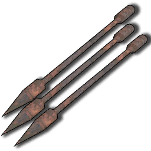
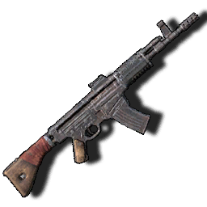
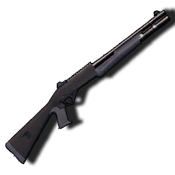
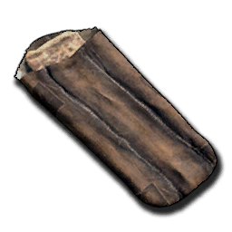
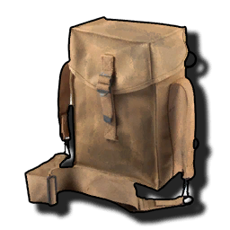
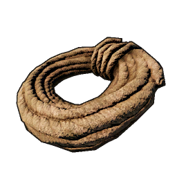
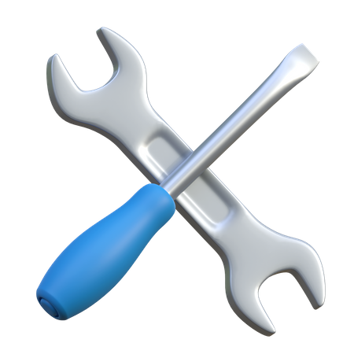

# Craftable Item list
All of the items currently in the game that are craftable, with English localizations applied
This file is automatically generated from Sunkenland 0.5.12 using the SunkenDoc mod found on our GitHub.

|Item |Name |Item ID |Slot Type |Description |Resources required |
|---|---|---|---|---|---|
|50 Cal Ammo |50 Cal Ammo|6251|None|Ammunition for large-caliber machine guns and rifles.|<ul><li>2 H_Copper Ingot</li><li>2 B1_Smokeless Powder</li></ul>|
|B1_Black Powder |Black Powder|6252|None|Essential materials for making black powder bullets or smokeless gunpowder.|<ul><li>1 Sulfur</li><li>5 Charcoal</li></ul>|
|Black Powder Ammo |Black Powder Ammo|6253|None|Ammunition used in various types of black powder firearms.|<ul><li>10 B1_Black Powder</li><li>10 Scrap Metal</li></ul>|
|Crude Grenade |Crude Grenade|6501|None|Improvised explosive made from scrap metal.|<ul><li>8 B1_Black Powder</li><li>5 Scrap Metal</li><li>1 A1_Rope</li></ul>|
|Military Grenade |Military Grenade|6502|None|Powerful modern military grenade.|<ul><li>10 Iron Ingot</li><li>10 B1_Smokeless Powder</li></ul>|
|Molotov |Molotov|6503|None|A glass bottle filled with gasoline, which can cause sustained area burning when exploded.|<ul><li>1 A5 Alcohol</li><li>2 A2_Cloth</li><li>1 D5_Water Bottle</li></ul>|
|Pistol Ammo |Pistol Ammo|6254|None|Ammunition for modern pistols.|<ul><li>2 H_Copper Ingot</li><li>2 B1_Smokeless Powder</li></ul>|
|Rifle Ammo |Rifle Ammo|6255|None|Ammunition for modern rifles.|<ul><li>3 H_Copper Ingot</li><li>3 B1_Smokeless Powder</li></ul>|
|Shotgun Ammo |Shotgun Ammo|6256|None|Ammunition for modern shotguns.|<ul><li>20 Scrap Metal</li><li>4 A3_Components</li><li>2 B1_Smokeless Powder</li></ul>|
|Sniper Ammo |Sniper Ammo|6259|None|Ammunition used in sniper rifles.|<ul><li>3 H_Copper Ingot</li><li>4 B1_Smokeless Powder</li></ul>|
|A0_Stone Hatchet |Stone Hatchet|1006|None|A small hand axe tied together from scrap iron and wood strewn along the beach is barely good enough to cut a little bit of small shrubbery. Better grab another upgrade, this axe doesn't look too reliable.|<ul><li>4 Scrap Metal</li><li>1 Wood Plank</li></ul>|
|A1_Crude Axe |Crude Axe|1001|None|Stone axe upgraded model, composed of scrap iron to form the axe face, sharpness greatly improved - but chopping trees is still a bit reluctant, chopping bushes is a lot more efficient. Fish are too short, so use a spear.|<ul><li>1 A0_Stone Hatchet</li><li>10 Wood Plank</li><li>5 Scrap Metal</li><li>1 A1_Rope</li></ul>|
|A2_Metal Axe |Twohand Axe|1002|None|A two-handed axe built at the anvil from iron ingots. Heavy feel and stable center of gravity brings leaps and bounds in chopping efficiency, slower, good for felling trees - and chopping people if you're happy with that.|<ul><li>1 A1_Crude Axe</li><li>4 Iron Ingot</li><li>20 Wood Plank</li><li>2 A1_Rope</li></ul>|
|A3_Wooden Spear |Wooden Spear|1003|None|A simple spear put together from twigs, crooked and not very strong, wins because it's easy to make, the materials are cheap, and mutants can build it. It can be used to poke crabs, sea fish and turtles - but don't touch the sharks.|<ul><li>10 Wood Plank</li></ul>|
|C1_Bow |Bow|1004|None|A simple wooden bow made of planks and string spliced together to shoot enemies at long range. Use the same easy-to-make wooden arrows as projectiles to main a cost-effective one.|<ul><li>15 Wood Plank</li><li>1 A1_Rope</li></ul>|
|C2_Crossbow |Crossbow|1101|None|A crossbow assembled from pulleys and scrap iron, its performance has improved by leaps and bounds over a wooden bow. It is powerful and possesses the power to kill mutants with a single blow, but unfortunately it cannot be fired underwater.|<ul><li>20 Scrap Metal</li><li>8 A3_Components</li><li>2 A1_Rope</li></ul>|
|C3_Arrow |Arrow|6257|None|Wooden arrows sharpened from wood and fired using a wooden bow. The primitive manufacturing techniques lead to a worrying quality that cannot be expected too much.|<ul><li>5 Wood Plank</li></ul>|
|C3_Bolt |Crossbow Bolt|6258|None|Use of arrows made from scrap iron, ammunition used in crossbows and harpoon guns. Due to the improved materials, the performance is much better than wooden arrows.|<ul><li>8 Scrap Metal</li></ul>|
|Chainsaw |Chainsaw|1110|None|Using battery-powered advanced logging tools, the roaring electric-driven engine drives a chain saw so indestructible that all trees are cut in half - and so are people.|<ul><li>2 Steel Igot</li><li>10 Rubber</li><li>5 E_Electronic Parts</li><li>1 Advanced Parts</li><li>1 High-efficiency alloy motor</li></ul>|
|Harpoon Guns |Harpoon Guns|1109|None|Don't be fooled by the appearance of this seemingly haphazardly cobbled together weapon, it actually performs very reliably, and it's the only cold weapon that can be fired underwater!|<ul><li>1 C2_Crossbow</li><li>1 E0_Handcrafted Air tank</li><li>1 B3_Fishing Rod</li><li>2 Modern Parts</li></ul>|
|A2C1_Skull Crusher |Serrated Axe|1108|None|The pirate-modified axe is a bit more for chopping people than for cutting down trees.|<ul><li>1 Broken Skull Crusher</li><li>4 Iron Ingot</li><li>1 A1_Rope</li><li>6 A3_Components</li></ul>|
|A2C2_Iron Axe |Iron Axe|1102|None|A very sharp iron axe that is very efficient at cutting down trees, second only to a chainsaw in efficiency.|<ul><li>1 A2_Metal Axe</li><li>2 Steel Igot</li><li>2 Modern Parts</li><li>4 H_Duct Tape</li></ul>|
|A2C3_Iron Spear |Iron Spear|1103|None|A long, powerful spear of fine iron forged using iron ore.|<ul><li>1 A4_Scrap Metal Spear</li><li>2 Iron Ingot</li><li>6 A3_Components</li><li>4 H_Duct Tape</li></ul>|
|A2C5_Iron Sword |Iron Sword|1106|None|Iron swords cobbled together from various industrial tools are unexpectedly powerful against slashing.|<ul><li>12 Iron Ingot</li><li>2 H_Copper Ingot</li><li>6 Q_Leather</li></ul>|
|A2C6_Iron Mace |Iron Mace|1105|None|Adapted from a Savage's stick, it works unexpectedly well.|<ul><li>1 Spiked Club</li><li>8 Iron Ingot</li><li>20 Wood Plank</li><li>8 A3_Components</li></ul>|
|A2C7_Machete |Machete|1107|None|You can cut down both people and small trees, but efficiency-wise, it's better to cut down people.|<ul><li>1 Broken Machete</li><li>8 Iron Ingot</li><li>6 H_Duct Tape</li></ul>|
|A4_Scrap Metal Spear |Scrap Metal Spear|1008|None|Converted from a wooden spear, the scrap iron formed a less solid tip, fittingly its power was greatly enhanced. It can be used against mutants and pirates, but shark hunting with it is still difficult.|<ul><li>1 A3_Wooden Spear</li><li>12 Scrap Metal</li><li>4 A3_Components</li></ul>|
|Combat Knife |Combat Knife|1104|None|Pre-apocalyptic military daggers with very fast attack speeds and very handy melee weapons.|<ul><li>1 Broken Combat Knife</li><li>6 Iron Ingot</li><li>2 Modern Parts</li></ul>|
|Percussion Pistol |Percussion Pistol|1203|None|Much more powerful and a bit more practical than a black powder pistol, but still slow to load.|<ul><li>15 Wood Plank</li><li>15 Scrap Metal</li><li>6 Iron Ingot</li><li>6 A3_Components</li></ul>|
|Tripple Barrel Pistol |Tripple Barrel Pistol|1204|None|Three rounds in one breath, and while the trajectory is erratic, the power at close range is outstanding - and the loading is slower that is.|<ul><li>15 Scrap Metal</li><li>10 A3_Components</li><li>10 A2_Cloth</li></ul>|
|A2_Scrap Pistol |Scrap Pistol|1205|None|A black powder weapon that can be fired in bursts, with stable ballistics and good versatility.|<ul><li>20 Scrap Metal</li><li>8 A3_Components</li><li>5 H_Duct Tape</li></ul>|
|A3_Homemade Revolver |Homemade Revolver|1202|None|Powerful revolver that can be fired in bursts, but the trajectory is unstable and needs to be fired close to the target.|<ul><li>6 Iron Ingot</li><li>5 D_Gun Parts</li><li>3 H_Duct Tape</li></ul>|
|A4_Double Barrel Shotgun |Double Barrel Shotgun|1301|None|When you see a savage enemy charging up with a machete or combat dagger, you should pull out this shotgun and give him a taste of technological civilization.|<ul><li>15 Wood Plank</li><li>4 D_Gun Parts</li><li>8 A2_Cloth</li><li>4 Iron Ingot</li></ul>|
|A4_PM |PM|1302|None|The classic Soviet semi-automatic pistol is as safe and reliable as that unbreakable union.|<ul><li>1 Broken PM</li><li>15 Scrap Metal</li><li>4 D_Gun Parts</li><li>2 H_Duct Tape</li></ul>|
|A5_GP20 |GP20|1401|None|The classic American police pistol, ready to start patrolling like the sheriff?|<ul><li>1 Broken GP20</li><li>6 D_Gun Parts</li><li>4 Iron Ingot</li></ul>|
|A6 Mauser Pistol |Mauser Pistol|1307|None|The classic pistol, which had been assembled in large numbers by the German army and even exported to Asia, was nicknamed the "box gun" by the Chinese army because of its high rate of fire - very fast indeed, but also very bad in terms of stability.|<ul><li>1 Broken Mauser Pistol</li><li>4 D_Gun Parts</li><li>4 Iron Ingot</li><li>6 A3_Components</li></ul>|
|A7 DEG 45 |DEG 45|1406|None|The classic representation of a high-powered pistol, the recoil can even fracture your wrist if not held correctly.|<ul><li>1 Broken DE</li><li>6 D_Gun Parts</li><li>6 Iron Ingot</li><li>6 Rubber</li></ul>|
|B2_Pump Shotgun |Pump Shotgun|1402|None||<ul><li>1 Broken Pump Shotgun</li><li>8 D_Gun Parts</li><li>8 Rubber</li><li>6 Iron Ingot</li></ul>|
|C1_SMG |SMG|1403|None||<ul><li>1 Broken SMG</li><li>10 D_Gun Parts</li><li>6 Iron Ingot</li></ul>|
|C1_Stun SMG |Stun SMG|1306|None||<ul><li>1 Broken Stun SMG</li><li>8 D_Gun Parts</li><li>6 Iron Ingot</li><li>4 H_Duct Tape</li></ul>|
|Crude Hunting Rifle |Hunting Rifle|1303|None||<ul><li>1 Broken Hunting Rifle</li><li>10 Wood Plank</li><li>8 D_Gun Parts</li><li>6 Iron Ingot</li></ul>|
|E1_Old Bolt Action Rifle |Old Bolt Action Rifle|1304|None||<ul><li>1 Broken Old Bolt Action Rifle</li><li>15 Wood Plank</li><li>8 D_Gun Parts</li><li>8 Iron Ingot</li></ul>|
|AK12 |AK12|1414|None||<ul><li>1 Broken STG44</li><li>10 D_Gun Parts</li><li>10 A2_Cloth</li><li>8 Steel Igot</li></ul>|
|AUG |AUG|1413|None||<ul><li>1 Broken STG44</li><li>10 D_Gun Parts</li><li>10 A2_Cloth</li><li>8 Steel Igot</li></ul>|
|FAMAS |FAMAS|1412|None||<ul><li>1 Broken STG44</li><li>10 D_Gun Parts</li><li>10 A2_Cloth</li><li>8 Steel Igot</li></ul>|
|G1_AK47 |AK47|1404|None||<ul><li>1 Broken AK47</li><li>10 Fine Wood Plank</li><li>10 D_Gun Parts</li><li>6 Steel Igot</li></ul>|
|LW 59 |LW 59|1407|None||<ul><li>1 Broken LW 59</li><li>8 D_Gun Parts</li><li>6 Iron Ingot</li><li>6 H_Duct Tape</li><li>10 A3_Components</li></ul>|
|M14 |M14|1305|None||<ul><li>1 Broken M14</li><li>20 Fine Wood Plank</li><li>8 D_Gun Parts</li><li>4 Steel Igot</li></ul>|
|M16 |M16|1405|None||<ul><li>1 Broken M16</li><li>10 D_Gun Parts</li><li>10 A2_Cloth</li><li>8 Steel Igot</li></ul>|
|STG44 |STG44|1308|None||<ul><li>1 Broken STG44</li><li>10 D_Gun Parts</li><li>10 A2_Cloth</li><li>8 Steel Igot</li></ul>|
|Supernova |Supernova|1411|None||<ul><li>1 Broken Pump Shotgun</li><li>8 D_Gun Parts</li><li>8 Rubber</li><li>6 Iron Ingot</li></ul>|
|SVD |SVD|1409|None||<ul><li>1 Broken Old Bolt Action Rifle</li><li>15 Wood Plank</li><li>8 D_Gun Parts</li><li>8 Iron Ingot</li></ul>|
|US45 SMG |US45 SMG|1408|None||<ul><li>1 Broken US45 SMG</li><li>10 D_Gun Parts</li><li>8 Iron Ingot</li><li>8 A3_Components</li></ul>|
|VSS |VSS|1410|None||<ul><li>1 Broken Old Bolt Action Rifle</li><li>15 Wood Plank</li><li>8 D_Gun Parts</li><li>8 Iron Ingot</li></ul>|
|A2_Thick Cloth Armor |Leather Armor|4002|Armor|Lightweight armor tanned with leather that provides extremely limited defense against primitive weapons and is a lining material for scrap iron gauntlets.|<ul><li>3 Q_Leather</li></ul>|
|A3_Thick Cloth Helmet |Leather Helmet|4003|Helmet|Helmets that go with leather armor provide protection that is better than nothing, and are mainly used as lining material for scrap iron helmets.|<ul><li>2 Q_Leather</li></ul>|
|B1_Scrap Armor |Scrap Armor|4004|Armor|Armor made from scrap iron provides higher armor than leather armor - but the durability is still a concern due to the use of scrap iron for the main material, requiring frequent repairs.|<ul><li>1 A2_Thick Cloth Armor</li><li>18 Scrap Metal</li><li>1 A1_Rope</li></ul>|
|B2_Scrap Helmet |Scrap Helmet|4005|Helmet|A helmet made of scrap iron provides some defense, determined that, like scrap iron armor, it is not very durable.|<ul><li>1 A3_Thick Cloth Helmet</li><li>12 Scrap Metal</li></ul>|
|C1_Combat Armor |Combat Armor|4006|Armor|The Scrap Iron Armor upgrade replaces the scrap iron used as the main ingredient with molten iron ingots, providing a reliable defense that can even withstand the sharp teeth of sharks when worn.|<ul><li>1 B1_Scrap Armor</li><li>4 Iron Ingot</li><li>6 A2_Cloth</li><li>6 Q_Leather</li></ul>|
|D3 Helmet Football |Football Helmet|4009|Helmet|Don't underestimate it just because it's a previous sports gauntlet, the perfect curvature combined with the hardened fine iron material gives it very reliable protection against even the blasts of black powder weapons.|<ul><li>1 B2_Scrap Helmet</li><li>2 Iron Ingot</li><li>4 Rubber</li></ul>|
|A1 Vest3 Forest |Forest Combat Vest|4008|Armor||<ul><li>1 Broken Vest3 Forest</li><li>15 A2_Cloth</li><li>5 Iron Ingot</li><li>2 Ballistic Fiber</li></ul>|
|A2 P Tucked-SH Forest |Tucked-SH Forest|4020|Pants||<ul><li>10 A2_Cloth</li><li>6 Q_Leather</li></ul>|
|A3 Motorcycle Helmet |Motorcycle Helmet|4010|Helmet||<ul><li>1 Broken Motorcycle Helmet</li><li>4 Iron Ingot</li><li>4 Q_Leather</li></ul>|
|B1 Vest Police |Police Vest|4011|Armor||<ul><li>1 Broken Police Vest</li><li>15 A2_Cloth</li><li>6 Rubber</li><li>6 Ballistic Fiber</li></ul>|
|B2 Police Helmet |Police Helmet|4012|Helmet||<ul><li>1 Broken Police Helmet</li><li>8 Iron Ingot</li><li>2 Ballistic Fiber</li></ul>|
|B3 P Tucked-SH Sand |Tucked-SH Sand|4021|Pants||<ul><li>10 A2_Cloth</li><li>6 Q_Leather</li></ul>|
|C1 Army Vest |Army Vest|4013|Armor||<ul><li>1 Broken Army Vest</li><li>20 A2_Cloth</li><li>8 Q_Leather</li><li>8 Ballistic Fiber</li></ul>|
|C2 Helmet Heavy2 |Iron Helmet|4007|Helmet||<ul><li>1 Broken Metal Helme</li><li>2 Steel Igot</li><li>8 Q_Leather</li></ul>|
|C3 Tucked-SH Navy |Tucked-SH Navy|4022|Pants||<ul><li>10 A2_Cloth</li><li>6 Q_Leather</li></ul>|
|D1 Spetznaz Vest |Spetznaz Vest|4016|Armor||<ul><li>1 Broken Special Force Armor</li><li>30 A2_Cloth</li><li>10 Ballistic Fiber</li><li>4 Steel Igot</li></ul>|
|D2 Spetsnaz Helmet |Spetsnaz Helmet|4017|Helmet||<ul><li>1 Broken Special Force Helmet</li><li>4 Steel Igot</li><li>4 Ballistic Fiber</li><li>15 Glass</li></ul>|
|A1_Sack |Sack|7004|Backpack|The simple bag made of coarse cloth and rope weighs little on the back and is very suitable for water expeditions.|<ul><li>5 A2_Cloth</li><li>1 A1_Rope</li></ul>|
|A2_Backpack |Backpack|7011|Backpack|A larger backpack made of leather and cloth.|<ul><li>1 A1_Sack</li><li>12 A2_Cloth</li><li>5 Q_Leather</li></ul>|
|A3_Military Backpack |Military Backpack|7018|Backpack|The Ultimate Backpack, built using a large amount of materials, is a great improvement in item portability for expedition-level exploration, providing you with a reliable storage experience.|<ul><li>1 A2_Backpack</li><li>12 A2_Cloth</li><li>10 Rubber</li><li>5 Ballistic Fiber</li></ul>|
|B1_Seawater Bucket |Seawater Bucket|7002|None|Iron drums made from scrap iron were used in conjunction with stills to obtain fresh water. Although inefficient, the process is simple and the materials are easily accessible.|<ul><li>5 Scrap Metal</li></ul>|
|B2_Diving Fins |Diving Fins|7008|Footgear|Ropes are simple flippers made of fish skin and leather, primitive yet reliable.|<ul><li>3 Fish Skin</li><li>2 A1_Rope</li></ul>|
|B2a_Scuba Diving Fins |Scuba Diving Fins|7019|Footgear|Upgraded from flippers, they are lighter and more useful, and are a must-have for underwater exploration.|<ul><li>1 B2_Diving Fins</li><li>8 Rubber</li><li>4 H_Duct Tape</li></ul>|
|B3_Fishing Rod |Fishing Rod|7009|None|A simple rod cobbled together using twigs, thin line and scrap iron is certainly not going to be able to hold up against a big fish tossing it around, but it will hold up for some smaller fish.|<ul><li>12 Wood Plank</li><li>8 Scrap Metal</li><li>2 A1_Rope</li></ul>|
|B3_Torch |Torch|7001|None|Suggested torches made of fabric and boards provide only a small patch of bright light to the holder.|<ul><li>1 Wood Plank</li><li>1 A2_Cloth</li></ul>|
|C1_Pickaxe |Pickaxe|7005|None|Pieced together from scrap iron and wood, simple craftsmanship and cheap materials make up an unexpectedly reliable mining tool for all minerals, a must-have for miners.|<ul><li>10 Wood Plank</li><li>15 Scrap Metal</li></ul>|
|C2_Reparing Hammer |Repair hammer|7006|None|Rough mallets held together with boards and string, but unexpectedly strong and durable, were used to dismantle and repair buildings and carriers.|<ul><li>10 Wood Plank</li><li>1 A1_Rope</li></ul>|
|C3_Packing Box |Packing Box|7021|None|Pack one piece of furniture at a time, regardless of size!|<ul><li>8 Wood Plank</li></ul>|
|D5_Water Bottle |Water Bottle|7003|None|Bottles blown after the glass has been dissolved and corked to keep them sealed can be used to hold water.|<ul><li>1 Glass</li></ul>|
|E0_Handcrafted Air tank |Handcrafted Air tank|7026|Rebreather|Handmade from scrap iron and rubber, the oxygen tanks look very unreliable and are really unreliable to use, they can only be used for exploring shallow water, you can't expect too much, let's just say that something is better than nothing.|<ul><li>15 Scrap Metal</li><li>6 A3_Components</li><li>6 Rubber</li></ul>|
|E1_Small Air Tank |Small Air Tank|7020|Rebreather|The fine iron used to cast the bottle is much more reliable and airtight than scrap iron, and with it, the user can finally stay in the sea and explore for a longer period of time without having to go to the surface frequently to change the air.|<ul><li>1 E0_Handcrafted Air tank</li><li>2 Modern Parts</li><li>8 Rubber</li></ul>|
|E2 Big Air Tank |Big Air Tank|7023|Rebreather|A large oxygen tank made from two small oxygen tanks spliced together, deep-sea exploration depends on it.|<ul><li>1 E1_Small Air Tank</li><li>1 Steel Igot</li><li>2 Advanced Parts</li><li>12 Rubber</li></ul>|
|G1_Battery |Battery|7012|None|A homemade, high-capacity rechargeable battery, vital for surviving in the sunken world. Lightweight and rugged, it powers your gear for extended use.|<ul><li>2 H_Copper Ingot</li><li>2 A3_Components</li><li>2 E_Electronic Parts</li></ul>|
|G2_Metal Detector |Ore Detector|7015|None|Very handy metal detector to help you find the minerals you need, pay attention to its beeps and distances, and soon you'll be digging up pots of gold|<ul><li>15 Scrap Metal</li><li>8 A3_Components</li></ul>|
|G3_HeadLight |Headlight|7013|Misc|A strong headlamp with far-reaching light, perfect for illuminating the dark depths of the sea.|<ul><li>15 Scrap Metal</li><li>3 E_Electronic Parts</li><li>8 Glass</li><li>8 Rubber</li></ul>|
|I1_Flare |Flare|7010|None|Hand-mixed flares with illumination times proportional to the proficiency of the maker.|<ul><li>2 A3_Components</li><li>1 Sulfur</li></ul>|
|Kevlar armor plate |Kevlar armor plate|7032|Misc|High-tech fiber plates make up a reliable armor plate, making your survivability much improved. It is also difficult for modern weapons to do effective damage to this armor plate as long as you are not continuously bombarded.|<ul><li>5 A2_Cloth</li><li>5 Ballistic Fiber</li><li>1 Steel Igot</li></ul>|
|Night vision device |Night vision device|7028|Misc|Allows you to easily see objects at night.|<ul><li>2 Advanced Parts</li><li>6 E_Electronic Parts</li><li>6 Rubber</li><li>10 Glass</li></ul>|
|Precision iron armor plate |Iron Ballistic Plate|7031|Misc|The armor plate, made of fine iron, is an effective defense against black powder weapons and risks breaking if attacked by automatic weapons for an extended period of time.|<ul><li>2 Iron Ingot</li><li>5 Q_Leather</li></ul>|
|SleepingBag |Sleeping Bag|7027|None|It can be placed anywhere, and when you die you can set off again from here - but the quality is bad, so you can only use it once, and you can only stuff one person down.|<ul><li>1 Q_Leather</li><li>3 A2_Cloth</li><li>5 H_Cotton</li></ul>|
|U2 UNDERWATER SCOOTER |Underwater Scooter|7030|None|By installing more powerful engines and parts on top of the underwater thrusters, the power is boosted to the limit and the battery drain is further increased.|<ul><li>10 Rubber</li><li>8 E_Electronic Parts</li><li>2 Modern Parts</li><li>1 High-efficiency alloy motor</li></ul>|
|Welding |Welding Tool|7022|None|The best option for repairing buildings and carriers.|<ul><li>4 Iron Ingot</li><li>6 E_Electronic Parts</li></ul>|
|Z_AmmunitionPouch |Ammunition Pouch|7033|Misc|A carry-on pouch made of canvas to store some extra ammo, a must-have for sea expeditions.|<ul><li>8 A2_Cloth</li><li>8 Fish Skin</li></ul>|
|Z_GrenadePouch |Grenade Pouch|7034|Misc|Pockets made of canvas and latches to carry extra throws to support the fight.|<ul><li>8 Q_Leather</li><li>2 A1_Rope</li></ul>|
|Algal Rug |Algal Rug|22001|None|Decoration. Right click to place it.|<ul><li>1 Algal Rug</li></ul>|
|Ballons Halloween |Balloons Halloween|22097|None|Decoration. Right click to place it.|<ul><li>1 Ballons Halloween</li></ul>|
|Ballons Happy |Balloons Happy|22098|None|Decoration. Right click to place it.|<ul><li>1 Ballons Happy</li></ul>|
|Black Cat Statue |Black Cat Statue|22099|None|Decoration. Right click to place it.|<ul><li>1 Black Cat Statue</li></ul>|
|Broken Tombstone |Broken Tombstone|22100|None|Decoration. Right click to place it.|<ul><li>1 Broken Tombstone</li></ul>|
|Candles |Candles|22101|None|Decoration. Right click to place it.|<ul><li>1 Candles</li></ul>|
|Coffin |Coffin|22102|None|Decoration. Right click to place it.|<ul><li>1 Coffin</li></ul>|
|Creepy Hand |Creepy Hand|22103|None|Decoration. Right click to place it.|<ul><li>1 Creepy Hand</li></ul>|
|Death Statue |Death Statue|22104|None|Decoration. Right click to place it.|<ul><li>1 Death Statue</li></ul>|
|Dragon Statue |Dragon Statue|22105|None|Decoration. Right click to place it.|<ul><li>1 Dragon Statue</li></ul>|
|Goest Decor |Ghost Decor|22106|None|Decoration. Right click to place it.|<ul><li>1 Goest Decor</li></ul>|
|HauntedHalloween |HauntedHalloween|22107|None|Decoration. Right click to place it.|<ul><li>1 HauntedHalloween</li></ul>|
|Large Spider |Large Spider|22108|None|Decoration. Right click to place it.|<ul><li>1 Large Spider</li></ul>|
|Neon Ghost |Neon Ghost|22109|None|Decoration. Right click to place it.|<ul><li>1 Neon Ghost</li></ul>|
|Neon Pumpkin |Neon Pumpkin|22110|None|Decoration. Right click to place it.|<ul><li>1 Neon Pumpkin</li></ul>|
|Old Candle Holder |Old Candle Holder|22111|None|Decoration. Right click to place it.|<ul><li>1 Old Candle Holder</li></ul>|
|Pumpkin Dead |Pumpkin Dead|22112|None|Decoration. Right click to place it.|<ul><li>1 Pumpkin Dead</li></ul>|
|Pumpkin Evil |Evil Pumpkin|22113|None|Decoration. Right click to place it.|<ul><li>1 Pumpkin Evil</li></ul>|
|Pumpkin Grin |Pumpkin Grin|22114|None|Decoration. Right click to place it.|<ul><li>1 Pumpkin Grin</li></ul>|
|Pumpkin Malice |Pumpkin Malice|22115|None|Decoration. Right click to place it.|<ul><li>1 Pumpkin Malice</li></ul>|
|Pumpkin Round |Pumpkin Round|22116|None|Decoration. Right click to place it.|<ul><li>1 Pumpkin Round</li></ul>|
|Pumpkin Sad |Sad Pumpkin|22117|None|Decoration. Right click to place it.|<ul><li>1 Pumpkin Sad</li></ul>|
|Pumpkin Short |Pumpkin Short|22118|None|Decoration. Right click to place it.|<ul><li>1 Pumpkin Short</li></ul>|
|Pumpkin Tall |Pumpkin Tall|22119|None|Decoration. Right click to place it.|<ul><li>1 Pumpkin Tall</li></ul>|
|Small Spider |Small Spider|22120|None|Decoration. Right click to place it.|<ul><li>1 Small Spider</li></ul>|
|Square Tombstone |Square Tombstone|22121|None|Decoration. Right click to place it.|<ul><li>1 Square Tombstone</li></ul>|
|Vampire Statue |Vampire Statue|22122|None|Decoration. Right click to place it.|<ul><li>1 Vampire Statue</li></ul>|
|Voodoo Doll |Voodoo Doll|22123|None|Decoration. Right click to place it.|<ul><li>1 Voodoo Doll</li></ul>|
|Witch Cauldron |Witch Cauldron|22124|None|Decoration. Right click to place it.|<ul><li>1 Witch Cauldron</li></ul>|
|Bike Toy |Toy Bike|22002|None|Decoration. Right click to place it.|<ul><li>1 Bike Toy</li></ul>|
|Blue Oil Bottle |Blue Oil Bottle|22003|None|Decoration. Right click to place it.|<ul><li>1 Blue Oil Bottle</li></ul>|
|Candlestick |Candlestick|22004|None|Decoration. Right click to place it.|<ul><li>1 Candlestick</li></ul>|
|Carpet |Carpet|22005|None|Decoration. Right click to place it.|<ul><li>1 Carpet</li></ul>|
|Ceramic Bottle |Ceramic Bottle|22006|None|Decoration. Right click to place it.|<ul><li>1 Ceramic Bottle</li></ul>|
|Colored Rug |Colored Rug|22007|None|Decoration. Right click to place it.|<ul><li>1 Colored Rug</li></ul>|
|Cooling Chair |Cooling Chair|22008|None|Decoration. Right click to place it.|<ul><li>1 Cooling Chair</li></ul>|
|Darts Target |Darts Target|22009|None|Decoration. Right click to place it.|<ul><li>1 Darts Target</li></ul>|
|Decorative Plate Stand |Decorative Plate Stand|22010|None|Decoration. Right click to place it.|<ul><li>1 Decorative Plate Stand</li></ul>|
|Delicate Chandelier |Delicate Chandelier|22011|None|Decoration. Right click to place it.|<ul><li>1 Delicate Chandelier</li></ul>|
|Desk Clock |Desk Clock|22012|None|Decoration. Right click to place it.|<ul><li>1 Desk Clock</li></ul>|
|Easel Covered |Covered Easel|22013|None|Decoration. Right click to place it.|<ul><li>1 Easel Covered</li></ul>|
|Exquisite Wooden Shelf |Exquisite Wooden Shelf|22014|None|Decoration. Right click to place it.|<ul><li>1 Exquisite Wooden Shelf</li></ul>|
|Exquisite Wooden Table |Exquisite Wooden Table|22015|None|Decoration. Right click to place it.|<ul><li>1 Exquisite Wooden Table</li></ul>|
|Figure Rug |Figure Rug|22016|None|Decoration. Right click to place it.|<ul><li>1 Figure Rug</li></ul>|
|Fish Statue |Fish Statue|22017|None|Decoration. Right click to place it.|<ul><li>1 Fish Statue</li></ul>|
|Floor Mirror |Floor Mirror|22018|None|Decoration. Right click to place it.|<ul><li>1 Floor Mirror</li></ul>|
|Game Console |Game Console|22019|None|Decoration. Right click to place it.|<ul><li>1 Game Console</li></ul>|
|Globe |Globe|22020|None|Decoration. Right click to place it.|<ul><li>1 Globe</li></ul>|
|Skeleton Duck |Skeleton Duck|575|None|Decoration. Right click to place it.|<ul><li>1 Skeleton Duck</li></ul>|
|Handbag |Handbag|22021|None|Decoration. Right click to place it.|<ul><li>1 Handbag</li></ul>|
|Hanger |Hanger|22022|None|Decoration. Right click to place it.|<ul><li>1 Hanger</li></ul>|
|Horse Statue |Horse Statue|22023|None|Decoration. Right click to place it.|<ul><li>1 Horse Statue</li></ul>|
|Horse Toy |Horse Toy|22024|None|Decoration. Right click to place it.|<ul><li>1 Horse Toy</li></ul>|
|Household Desk Lamp |Household Desk Lamp|22025|None|Decoration. Right click to place it.|<ul><li>1 Household Desk Lamp</li></ul>|
|Jewelry Casket |Jewelry Casket|22026|None|Decoration. Right click to place it.|<ul><li>1 Jewelry Casket</li></ul>|
|Lamp Table |Table Lamp|22027|None|Decoration. Right click to place it.|<ul><li>1 Lamp Table</li></ul>|
|Lamp Wall |Wall Lamp|22028|None|Decoration. Right click to place it.|<ul><li>1 Lamp Wall</li></ul>|
|Lantern |Flashlight|22029|None|Decoration. Right click to place it.|<ul><li>1 Lantern</li></ul>|
|Large Vase |Large Vase|22030|None|Decoration. Right click to place it.|<ul><li>1 Large Vase</li></ul>|
|Mirror |Mirror|22031|None|Decoration. Right click to place it.|<ul><li>1 Mirror</li></ul>|
|Model Train |Model Train|22032|None|Decoration. Right click to place it.|<ul><li>1 Model Train</li></ul>|
|Moire |Moire|22034|None|Decoration. Right click to place it.|<ul><li>1 Moire</li></ul>|
|Moire Ceramic |Moire Ceramic|22033|None|Decoration. Right click to place it.|<ul><li>1 Moire Ceramic</li></ul>|
|Neon Bestdayever |Neon Bestdayever|22035|None|Decoration. Right click to place it.|<ul><li>1 Neon Bestdayever</li></ul>|
|Neon Cat |Neon Cat|22036|None|Decoration. Right click to place it.|<ul><li>1 Neon Cat</li></ul>|
|Neon Gamer |Neon Gamer|22037|None|Decoration. Right click to place it.|<ul><li>1 Neon Gamer</li></ul>|
|Neon Guitar |Neon Guitar|22038|None|Decoration. Right click to place it.|<ul><li>1 Neon Guitar</li></ul>|
|Neon Hotel |Neon Hotel|22039|None|Decoration. Right click to place it.|<ul><li>1 Neon Hotel</li></ul>|
|Neon Money |Neon Money|22040|None|Decoration. Right click to place it.|<ul><li>1 Neon Money</li></ul>|
|Neon Nightclub |Neon Nightclub|22041|None|Decoration. Right click to place it.|<ul><li>1 Neon Nightclub</li></ul>|
|Neon Peace |Neon Peace|22042|None|Decoration. Right click to place it.|<ul><li>1 Neon Peace</li></ul>|
|Neon Route66 |Neon Route66|22043|None|Decoration. Right click to place it.|<ul><li>1 Neon Route66</li></ul>|
|Neon Woman 1 |Neon Woman 1|22044|None|Decoration. Right click to place it.|<ul><li>1 Neon Woman 1</li></ul>|
|Neon Woman 2 |Neon Woman 2|22045|None|Decoration. Right click to place it.|<ul><li>1 Neon Woman 2</li></ul>|
|Oil Painting(Birds Singing and Flowers Fragrant) |Oil Painting(Birds Singing and Flowers Fragrant)|22046|None|Decoration. Right click to place it.|<ul><li>1 Oil Painting(Birds Singing and Flowers Fragrant)</li></ul>|
|Oil Painting(Comfortable) |Oil Painting(Comfortable)|22047|None|Decoration. Right click to place it.|<ul><li>1 Oil Painting(Comfortable)</li></ul>|
|Oil Painting(Deep in the Valley) |Oil Painting(Deep in the Valley)|22048|None|Decoration. Right click to place it.|<ul><li>1 Oil Painting(Deep in the Valley)</li></ul>|
|Oil Painting(Desert Oasis) |Oil Painting(Desert Oasis)|22049|None|Decoration. Right click to place it.|<ul><li>1 Oil Painting(Desert Oasis)</li></ul>|
|Oil Painting(Divine Tree) |Oil Painting (Divine Tree)|22050|None|Decoration. Right click to place it.|<ul><li>1 Oil Painting(Divine Tree)</li></ul>|
|Oil Painting(Forgotten Castle) |Oil Painting(Forgotten Castle)|22051|None|Decoration. Right click to place it.|<ul><li>1 Oil Painting(Forgotten Castle)</li></ul>|
|Oil Painting(Fox in Birch Forest) |Oil Painting (Fox in Birch Forest)|22052|None|Decoration. Right click to place it.|<ul><li>1 Oil Painting(Fox in Birch Forest)</li></ul>|
|Oil Painting(Happy Childhood) |Oil Painting(Happy Childhood)|22053|None|Decoration. Right click to place it.|<ul><li>1 Oil Painting(Happy Childhood)</li></ul>|
|Oil Painting(King Castle) |Oil Painting(King Castle)|22054|None|Decoration. Right click to place it.|<ul><li>1 Oil Painting(King Castle)</li></ul>|
|Oil Painting(Landscape Dusk) |Oil Painting(Landscape Dusk)|22055|None|Decoration. Right click to place it.|<ul><li>1 Oil Painting(Landscape Dusk)</li></ul>|
|Oil Painting(Lotus) |Oil Painting(Lotus)|22056|None|Decoration. Right click to place it.|<ul><li>1 Oil Painting(Lotus)</li></ul>|
|Oil Painting(Rural Life) |Oil Painting (Rural Life)|22057|None|Decoration. Right click to place it.|<ul><li>1 Oil Painting(Rural Life)</li></ul>|
|Oil Painting(Small Stream in the Forest) |Oil Painting (Small Stream in the Forest)|22058|None|Decoration. Right click to place it.|<ul><li>1 Oil Painting(Small Stream in the Forest)</li></ul>|
|Oil Painting(Valley Dusk) |Oil Painting(Valley Dusk)|22059|None|Decoration. Right click to place it.|<ul><li>1 Oil Painting(Valley Dusk)</li></ul>|
|Oil Painting(Wilderness Scenery) |Oil Painting(Wilderness Scenery)|22060|None|Decoration. Right click to place it.|<ul><li>1 Oil Painting(Wilderness Scenery)</li></ul>|
|Old Clock |Old Clock|22061|None|Decoration. Right click to place it.|<ul><li>1 Old Clock</li></ul>|
|Old Desk Lamp |Old Desk Lamp|22062|None|Decoration. Right click to place it.|<ul><li>1 Old Desk Lamp</li></ul>|
|Old Style Storage Shelf |Old Style Storage Shelf|22063|None|Decoration. Right click to place it.|<ul><li>1 Old Style Storage Shelf</li></ul>|
|Owl Toy |Owl Toy|22064|None|Decoration. Right click to place it.|<ul><li>1 Owl Toy</li></ul>|
|Pan |Pan|22065|None|Decoration. Right click to place it.|<ul><li>1 Pan</li></ul>|
|Patterned Blue and White Pottery |Patterned Blue and White Pottery|22066|None|Decoration. Right click to place it.|<ul><li>1 Patterned Blue and White Pottery</li></ul>|
|Patterned Bronze Ware |Patterned Bronze Ware|22067|None|Decoration. Right click to place it.|<ul><li>1 Patterned Bronze Ware</li></ul>|
|Patterned Circular Porcelain |Patterned Circular Porcelain|20010|None|Decoration. Right click to place it.|<ul><li>1 Patterned Circular Porcelain</li></ul>|
|Plane Toy |Toy Plane|22069|None|Decoration. Right click to place it.|<ul><li>1 Plane Toy</li></ul>|
|Racing Model |Racing Model|22070|None|Decoration. Right click to place it.|<ul><li>1 Racing Model</li></ul>|
|Radio |Radio|22071|None|Decoration. Right click to place it.|<ul><li>1 Radio</li></ul>|
|Record Player Disk 1 |Record Player Disk 1|22072|None|Decoration. Right click to place it.|<ul><li>1 Record Player Disk 1</li></ul>|
|Record Player Disk 2 |Record Player Disk 2|22073|None|Decoration. Right click to place it.|<ul><li>1 Record Player Disk 2</li></ul>|
|Record Player Disk 3 |Record Player Disk 3|22074|None|Decoration. Right click to place it.|<ul><li>1 Record Player Disk 3</li></ul>|
|Red Rug |Red Rug|22075|None|Decoration. Right click to place it.|<ul><li>1 Red Rug</li></ul>|
|Red Sofa Chair |Red Sofa Chair|22076|None|Decoration. Right click to place it.|<ul><li>1 Red Sofa Chair</li></ul>|
|Retro Rug |Retro Rug|22077|None|Decoration. Right click to place it.|<ul><li>1 Retro Rug</li></ul>|
|Rubber Duck |Rubber Duck|22068|None|Decoration. Right click to place it.|<ul><li>1 Rubber Duck</li></ul>|
|Rug |Rug|22078|None|Decoration. Right click to place it.|<ul><li>1 Rug</li></ul>|
|Sand Watch |Sand Watch|22079|None|Decoration. Right click to place it.|<ul><li>1 Sand Watch</li></ul>|
|Scales |Scales|22080|None|Decoration. Right click to place it.|<ul><li>1 Scales</li></ul>|
|Silly Cookies |Silly Cookies|3039|None|Decoration. Right click to place it.|<ul><li>1 Silly Cookies</li></ul>|
|Small Globe |Small Globe|22081|None|Decoration. Right click to place it.|<ul><li>1 Small Globe</li></ul>|
|Sofa Chair |Sofa Chair|22082|None|Decoration. Right click to place it.|<ul><li>1 Sofa Chair</li></ul>|
|Solid Wood Shelf |Solid Wood Shelf|22083|None|Decoration. Right click to place it.|<ul><li>1 Solid Wood Shelf</li></ul>|
|Stone Elephant |Stone Elephant|22084|None|Decoration. Right click to place it.|<ul><li>1 Stone Elephant</li></ul>|
|Striped Rug |Striped Rug|22085|None|Decoration. Right click to place it.|<ul><li>1 Striped Rug</li></ul>|
|Sword Wall |Decorative Sword|22086|None|Decoration. Right click to place it.|<ul><li>1 Sword Wall</li></ul>|
|Telephone Old |Old Telephone |22087|None|Decoration. Right click to place it.|<ul><li>1 Telephone Old</li></ul>|
|Toy Bear |Toy Bear|22088|None|Decoration. Right click to place it.|<ul><li>1 Toy Bear</li></ul>|
|Vanity Mirror |Vanity Mirror|22089|None|Decoration. Right click to place it.|<ul><li>1 Vanity Mirror</li></ul>|
|Vinyl Machine |Vinyl Machine|22090|None|Decoration. Right click to place it.|<ul><li>1 Vinyl Machine</li></ul>|
|Violin |Violin|22091|None|Decoration. Right click to place it.|<ul><li>1 Violin</li></ul>|
|Wall Clock |Wall Clock|22092|None|Decoration. Right click to place it.|<ul><li>1 Wall Clock</li></ul>|
|Wallet |Wallet|22093|None|Decoration. Right click to place it.|<ul><li>1 Wallet</li></ul>|
|Wanghai Reef |Wanghai Reef|22094|None|Decoration. Right click to place it.|<ul><li>1 Wanghai Reef</li></ul>|
|Weighing Scale |Weighing Scale|22095|None|Decoration. Right click to place it.|<ul><li>1 Weighing Scale</li></ul>|
|Wooden Chair |Wooden Chair|22096|None|Decoration. Right click to place it.|<ul><li>1 Wooden Chair</li></ul>|
|A1 Salad |Salad|3026|None|Increases hunger and thirst by 30 and greatly increases the speed of life recovery after using the potion.|<ul><li>1 Strawberry</li><li>1 Lemon</li><li>1 Cabbage</li><li>1 Red Algae</li></ul>|
|A2 Seafood Platter |Seafood Platter|3027|None|Completely restores food level and increases maximum health by 50.|<ul><li>1 Roasted Crab</li><li>1 Roasted Fish</li><li>1 Scallop</li></ul>|
|A3 Fish Stew |Fish Stew|3028|None|Completely restores hydration and food level, and enhances swimming and diving abilities.|<ul><li>1 F3_Roasted Tarpon</li><li>1 F7_Roasted Red Snapper</li><li>1 Bottle Of Water</li></ul>|
|A4 Bird Meat Mushroom Soup |Mushroom Bird Soup|3029|None|Slowly regenerates health automatically.|<ul><li>1 Roasted Bird Meat</li><li>2 Mushroom</li><li>1 Bottle Of Water</li></ul>|
|A5 Alcohol |Alcohol|3030|None|Used for crafting molotov cocktails.|<ul><li>2 Potato</li><li>1 Bottle Of Water</li></ul>|
|Baked Fish with Lemon |Baked Fish with Lemon|3031|None||<ul><li>1 Large Fish Meat</li><li>1 Lemon</li></ul>|
|Coffee |Coffee|3032|None||<ul><li>3 Coffee Bean</li></ul>|
|Coral Smoothie |Coral Smoothie|3033|None||<ul><li>1 Orange Coral</li><li>1 Lemon</li></ul>|
|Crab Cakes |Crab Cakes|3034|None||<ul><li>1 Crab Meat</li><li>1 Potato</li><li>1 Lemon</li></ul>|
|Roasted Lemon Bird |Roasted Lemon Bird|3035|None||<ul><li>3 Lemon</li><li>1 Roasted Bird Meat</li></ul>|
|Steak Meal |Steak Meal|3036|None|Restores full hunger and thirst, increases melee damage by 30%|<ul><li>1 Roasted Meat</li><li>1 Potato</li></ul>|
|Strawberry And Lemon Smoothie |Strawberry And Lemon Smoothie|3037|None||<ul><li>1 Strawberry</li><li>1 Lemon</li></ul>|
|Compressor |Compressor|10018|None|Crafted on heavy machinery workshop, it is used to make advanced parts for carriers.|<ul><li>15 Scrap Metal</li><li>3 Modern Parts</li><li>10 Rubber</li></ul>|
|Control Panel |Control Panel|10015|None|Crafted on heavy machinery workshop, it is used to make advanced parts for carriers.|<ul><li>6 E_Electronic Parts</li><li>2 Advanced Parts</li></ul>|
|Gasoline Engine |Gasoline Engine|10020|None|Crafted on heavy machinery workshop, it is used to make advanced parts for carriers.|<ul><li>20 Scrap Metal</li><li>8 Rubber</li><li>2 Advanced Parts</li><li>1 Steel Igot</li></ul>|
|High-efficiency alloy motor |Highspeed Electric Motor|6154|None|Crafted on heavy machinery workshop. A Highspeed Electric Motor delivers rapid rotation speeds, ideal for precision applications in industries like robotics, aerospace, and automotive, where efficiency and performance are critical.|<ul><li>2 E_Electronic Parts</li><li>2 Modern Parts</li><li>5 H_Duct Tape</li></ul>|
|Hydraulic system |Hydraulic system|10019|None|Crafted on heavy machinery workshop, it is used to make advanced parts for carriers.|<ul><li>5 Iron Ingot</li><li>10 Rubber</li><li>10 J_Chemical Substance</li></ul>|
|Power Supply Unit |Power Supply Unit|10016|None|Crafted on heavy machinery workshop, it is used to make advanced parts for carriers.|<ul><li>5 E_Electronic Parts</li><li>5 J_Chemical Substance</li></ul>|
|Turbocharger |Turbocharger|10017|None|Crafted on heavy machinery workshop. A Highspeed Electric Motor delivers rapid rotation speeds, ideal for precision applications in industries like robotics, aerospace, and automotive, where efficiency and performance are critical.|<ul><li>2 Advanced Parts</li><li>1 Steel Igot</li></ul>|
|A1_Rope |Rope|10001|None|It's used to connect things.|<ul><li>2 A2_Cloth</li></ul>|
|A2_Cloth |Cloth|6001|None|Basic material used for crafting armor, ropes, and some furniture.|<ul><li>3 H_Cotton</li></ul>|
|A3_Components |Components|6055|None|Items like bolts, wires, nails, and the like.|<ul><li>15 Scrap Metal</li><li>10 A2_Cloth</li><li>5 Rubber</li></ul>|
|Advanced Parts |Advanced Parts|6103|None|Used for advanced machinery.|<ul><li>2 Modern Parts</li><li>2 H_Copper Ingot</li></ul>|
|B1_Smokeless Powder |Smokeless Powder|10004|None|Ingredient for modern ammo making.|<ul><li>2 J_Chemical Substance</li><li>15 A2_Cloth</li></ul>|
|D_Gun Parts |Gun Parts|6101|None|Used for crafting modern firearms, and can also be used in the workshop to print basic WWII gun components.|<ul><li>2 H_Copper Ingot</li><li>4 Rubber</li></ul>|
|E_Electronic Parts |Electronic Parts|6060|None|Required for crafting electronic devices.|<ul><li>6 A3_Components</li><li>3 H_Copper Ingot</li></ul>|
|H_Duct Tape |Duct Tape|6003|None|Might be used in crafting certain items.|<ul><li>3 A2_Cloth</li><li>3 Rubber</li></ul>|
|Modern Parts |Modern Parts|10012|None|Parts made using modern craftsmanship.|<ul><li>2 Iron Ingot</li><li>2 A3_Components</li></ul>|
|Paint |Paint|10007|None|Used for creating wallpapers and floors.|<ul><li>1 J_Chemical Substance</li><li>1 Bottle Of Water</li></ul>|
|Q_Leather |Leather|6006|None|Versatile leather, synthesized from fish skin.|<ul><li>2 Fish Skin</li></ul>|
|A1_Bandage |Bandage|3001|None|In this age of extreme antibiotic scarcity, stopping the bleeding quickly is good for keeping you alive.|<ul><li>2 A2_Cloth</li></ul>|
|A2_Herbal Medicine |Herbal Medicine|3002|None|Red algae can be effective in helping wounds return to health, the only downside is that the stuff is harder to find underwater.|<ul><li>3 Red Algae</li></ul>|
|A3_Stamina Mix |Stamina Herbal Mix|3004|None|A favorite local casual food of the Border Seas, mushrooms and strawberries are blended together in a marvelous flavor that leaves the eater feeling refreshed and fit in a small amount of time.|<ul><li>2 Strawberry</li><li>2 Mushroom</li></ul>|
|C3_Binocular |Binocular|7007|None|Use it to observe distant areas.|<ul><li>2 Iron Ingot</li><li>1 Modern Parts</li><li>4 Glass</li></ul>|
|AK alloy receiver |AK Alloy Receiver|24078|None|Alloy-crafted receiver, increases damage by 32.25%.|<ul><li>8 D_Gun Parts</li></ul>|
|AK high-tech receiver |AK High-Tech Receiver|24079|None|Receiver forged from high-tech materials, increases damage by 52%.|<ul><li>15 D_Gun Parts</li></ul>|
|AK iron receiver |AK Iron Receiver|24077|None|Precision-crafted receiver, increases damage by 15%.|<ul><li>5 D_Gun Parts</li></ul>|
|AK scrap iron receiver |AK Scrap Metal Receiver|24076|None|Default component, primary material is readily available scrap metal from the seabed.|<ul><li>3 D_Gun Parts</li></ul>|
|alloy stock |Premium stock|24041|None|Alloy cast buttstock, moderate recoil reduction.|<ul><li>3 D_Gun Parts</li></ul>|
|automatic rifle drum |Automatic Rifle Drum|24082|None|Super Large Drum, Provides Abundant Ammunition|<ul><li>5 D_Gun Parts</li></ul>|
|automatic rifle short magazine |Automatic Rifle Short Magazine|24080|None|Default magazine, provides bullets for the firearm to fire.|<ul><li>1 D_Gun Parts</li></ul>|
|Basic Barrels |Basic Barrels|24098|None|The most basic barrels can be fitted to any modern firearm.|<ul><li>1 D_Gun Parts</li></ul>|
|bolt-action rifle alloy receiver |Bolt-Action Rifle Alloy Receiver|24059|None|Alloy-crafted receiver, increases damage by 32.25%.|<ul><li>7 D_Gun Parts</li></ul>|
|bolt-action rifle iron receiver |Bolt-Action Rifle  Iron Receiver|24058|None|Precision-crafted receiver, increases damage by 15%.|<ul><li>3 D_Gun Parts</li></ul>|
|bolt-action rifle scrap iron receiver |Bolt-Action Rifle Scrap Metal Receiver|24057|None|Default component, primary material is readily available scrap metal from the seabed.|<ul><li>1 D_Gun Parts</li></ul>|
|Built-in calibration barrel |Calibrate the gun barrel|24102|None|Increased accuracy of firearms.|<ul><li>2 D_Gun Parts</li></ul>|
|Desert Eagle alloy receiver |Desert Eagle Alloy Receiver|24027|None|Alloy-crafted receiver, increases damage by 32.25%.|<ul><li>7 D_Gun Parts</li></ul>|
|Desert Eagle high-tech receiver |Desert Eagle High-Tech Receiver|24028|None|Receiver forged from high-tech materials, increases damage by 52%.|<ul><li>10 D_Gun Parts</li></ul>|
|Desert Eagle Iron Receiver |Desert Eagle Iron Receiver|24026|None|Precision-crafted receiver, increases damage by 15%.|<ul><li>5 D_Gun Parts</li></ul>|
|Desert Eagle scrap iron receiver |Desert Eagle Scrap Metal Receiver|24025|None|Default component, the main material is waste metal commonly found on the seabed.|<ul><li>3 D_Gun Parts</li></ul>|
|double-barreled fine iron receiver |Double-Barreled Fine Iron Receiver|24002|None|Precision-crafted receiver, increases damage by 15%.|<ul><li>3 D_Gun Parts</li></ul>|
|double-pipe scrap iron casing |Double-barreled Scrap Metal Receiver|24001|None|Default component, the main material is waste metal commonly found on the seabed.|<ul><li>1 D_Gun Parts</li></ul>|
|doubles |2x Scope|24064|None|Scope specifically for sniper rifles, provides a 2x magnified field of view.|<ul><li>2 D_Gun Parts</li></ul>|
|GP20 alloy receiver |GP20 Alloy Receiver|24017|None|Alloy-crafted receiver, increases damage by 32.25%.|<ul><li>6 D_Gun Parts</li></ul>|
|GP20 iron receiver |GP20  Iron Receiver|24016|None|Precision-crafted receiver, increases damage by 15%.|<ul><li>4 D_Gun Parts</li></ul>|
|GP20 scrap iron casing |GP20 Scrap Metal Receiver|24015|None|Default component, the main material is waste metal commonly found on the seabed.|<ul><li>2 D_Gun Parts</li></ul>|
|High precision quadruple scope |High precision quadruple scope|24124|None|A specialized sight for advanced sniper rifles that provides a 4x magnified field of view and increased accuracy.|<ul><li>10 D_Gun Parts</li></ul>|
|high-powered pistol magazine |High-Powered Pistol Magazine|24032|None|Desert Eagle Special Magazine, Loaded with High-Power Rounds, Only 2 Rounds Capacity, but Each Shot Deals 500% Damage|<ul><li>2 D_Gun Parts</li></ul>|
|high-tech stock |Perfect Stock|24042|None|Buttstock cast from high-tech materials, significantly reduced recoil.|<ul><li>5 D_Gun Parts</li></ul>|
|Horizontal flame arrester |Horizontal flame arrester|24108|None|Reduces lateral recoil and increases firearm accuracy.|<ul><li>2 D_Gun Parts</li></ul>|
|huntingrifle iron receiver |Hunting Rifle Iron Receiver|24055|None|Precision-crafted receiver, increases damage by 15%.|<ul><li>3 D_Gun Parts</li></ul>|
|huntingrifle scrap iron receiver |Hunting Rifle Scrap Metal Receiver|24054|None|Default component, primary material is readily available scrap metal from the seabed.|<ul><li>1 D_Gun Parts</li></ul>|
|infrared sight |infrared sight|24111|None|Increased accuracy and increased aiming time.|<ul><li>2 D_Gun Parts</li></ul>|
|iron stock |Advanced Stocks|24040|None|Cast iron buttstock, moderate recoil reduction.|<ul><li>2 D_Gun Parts</li></ul>|
|Lightweight barrel built in |Lightweight material|24105|None|Slightly reduces the time required for aiming.|<ul><li>2 D_Gun Parts</li></ul>|
|long gun barrel |long gun barrel|24100|None|The initial velocity of the bullet increases.|<ul><li>1 D_Gun Parts</li></ul>|
|long magazine for automatic rifle |Automatic Rifle Long Magazine |24081|None|Longer Magazine, Provides Extra Ammunition|<ul><li>2 D_Gun Parts</li></ul>|
|long magazine for submachine gun |SMG Long Magazine|24047|None|Longer Magazine, Provides Extra Ammunition|<ul><li>2 D_Gun Parts</li></ul>|
|long magazines for pistol |Long Magazines for Pistol|24014|None| Longer Magazine, Provides Additional Ammunition|<ul><li>2 D_Gun Parts</li></ul>|
|long magazines for sniper rifle |Sniper Rifle Long Magazines|24065|None|Longer Magazine, Provides Extra Ammunition|<ul><li>2 D_Gun Parts</li></ul>|
|longitudinal flame arrester |longitudinal flame arrester|24109|None|Reduces vertical recoil and increases firearm accuracy.|<ul><li>2 D_Gun Parts</li></ul>|
|LW59 alloy casing |LW59 Alloy Receiver|24085|None|Alloy-crafted receiver, increases damage by 32.25%.|<ul><li>10 D_Gun Parts</li></ul>|
|LW59 high-tech receiver |LW59 High-Tech Receiver|24086|None|Receiver forged from high-tech materials, increases damage by 52%.|<ul><li>17 D_Gun Parts</li></ul>|
|LW59 iron casing |LW59  Iron Receiver|24084|None|Receiver made of fine iron, damage increased by 15%.|<ul><li>6 D_Gun Parts</li></ul>|
|LW59 scrap iron casing |LW59 Scrap Metal Receiver|24083|None|Default component, primary material is readily available scrap metal from the seabed.|<ul><li>3 D_Gun Parts</li></ul>|
|M14 alloy receiver |M14 Alloy Receiver|24062|None|Alloy-crafted receiver, increases damage by 32.25%.|<ul><li>10 D_Gun Parts</li></ul>|
|M14 scrap iron receiver |M14 Scrap Metal Receiver|24060|None|Default component, primary material is readily available scrap metal from the seabed.|<ul><li>3 D_Gun Parts</li></ul>|
|M14 stainless iron receiver |M14 Stainless Iron Receiver|24061|None|Precision-crafted receiver, increases damage by 15%.|<ul><li>3 D_Gun Parts</li></ul>|
|M16 alloy receiver |M16 Alloy Receiver|24089|None|Alloy-crafted receiver, increases damage by 32.25%.|<ul><li>8 D_Gun Parts</li></ul>|
|M16 high-tech receiver |M16 High-Tech Receiver|24090|None|Receiver forged from high-tech materials, increases damage by 52%.|<ul><li>15 D_Gun Parts</li></ul>|
|M16 iron receiver |M16  Iron Receiver|24088|None|Precision-crafted receiver, increases damage by 15%.|<ul><li>5 D_Gun Parts</li></ul>|
|M16 scrap iron casing |M16 Scrap Metal Receiver|24087|None|Default component, primary material is readily available scrap metal from the seabed.|<ul><li>3 D_Gun Parts</li></ul>|
|magazines of hollow-point bullets for submachine gun |SMG Hollow Point Bullet Magazine|24049|None|Special ammunition greatly increases stability and accuracy. Significantly reduces recoil.|<ul><li>10 D_Gun Parts</li></ul>|
|Main weapon grip type 1 |Main weapon grip type 1|24112|None|Reduced aiming time.|<ul><li>2 D_Gun Parts</li></ul>|
|Main weapon grip type 2 |Main weapon grip type 2|24113|None|Gun recoil is reduced.|<ul><li>2 D_Gun Parts</li></ul>|
|Main weapon grip type 3 |Main weapon grip type 3|24114|None|Aiming time is less drastically reduced and recoil is less drastically reduced.|<ul><li>2 D_Gun Parts</li></ul>|
|Main weapon grip type 4 |Main weapon grip type 4|24115|None|The accuracy of the firearm is increased.|<ul><li>2 D_Gun Parts</li></ul>|
|Mauser iron receiver |Mauser Iron Receiver|24020|None|Precision-crafted receiver, increases damage by 15%.|<ul><li>3 D_Gun Parts</li></ul>|
|Mauser scrap iron receiver |Mauser Scrap Metal Receiver|24019|None|Default component, the main material is waste metal commonly found on the seabed.|<ul><li>1 D_Gun Parts</li></ul>|
|omnidirectional flame arrester |omnidirectional flame arrester|24110|None|A small reduction in recoil and an increase in firearm accuracy.|<ul><li>2 D_Gun Parts</li></ul>|
|pistol drums |Pistol Drums|24018|None|Small Pistol Drum, Provides Abundant Ammunition|<ul><li>5 D_Gun Parts</li></ul>|
|pistol magazine |Pistol Magazine|24013|None|Default magazine, provides bullets that can be fired from the firearm.|<ul><li>1 pistol magazine</li></ul>|
|PM alloy receiver |PM Alloy Receiver|24008|None|Alloy-crafted receiver, increases damage by 32.25%.|<ul><li>5 D_Gun Parts</li></ul>|
|PM iron casing |PM Iron Receiver|24007|None|Receiver made of fine iron, damage increased by 15%.|<ul><li>3 D_Gun Parts</li></ul>|
|PM scrap iron receiver |PM Scrap Metal Receiver|24006|None|Default component, the main material is waste metal commonly found on the seabed.|<ul><li>1 D_Gun Parts</li></ul>|
|pump-type alloy casing |Pump Action Shotgun Alloy Receiver|24035|None|Alloy-crafted receiver, increases damage by 32.25%.|<ul><li>8 D_Gun Parts</li></ul>|
|pump-type fine iron casing |Pump Action Shotgun Iron Receiver|24034|None|Receiver made of fine iron, damage increased by 15%.|<ul><li>5 D_Gun Parts</li></ul>|
|pump-type high-tech casing |Pump Action Shotgun High-Tech Receiver|24036|None|High-tech material cast gun receiver, damage increased by 52%.|<ul><li>15 D_Gun Parts</li></ul>|
|pump-type scrap iron casing |Pump Action Shotgun Scrap Metal Receiver|24033|None|Default component, the main material is waste metal commonly found on the seabed.|<ul><li>3 D_Gun Parts</li></ul>|
|quadruple |Sniper rifle 4x scope|24074|None|Scope designed for sniper rifles, provides a 4x magnified field of view.|<ul><li>5 D_Gun Parts</li></ul>|
|Rapid-fire barrel Built-in |Lightweight trigger|24103|None|The rate of fire of firearms is increased.|<ul><li>2 D_Gun Parts</li></ul>|
|red dot sight |Red Dot Sight|24012|None|More advanced sight, provides a wider field of view, with a red dot in the center for easy aiming.|<ul><li>2 D_Gun Parts</li></ul>|
|Rifled barrel built in |Rifled barrel built in|24106|None|Bullet muzzle velocity increases and downrange decreases.|<ul><li>2 D_Gun Parts</li></ul>|
|scrap iron sight |Scrap Metal Sight|24005|None|Default component, the main material is waste metal commonly found on the seabed.|<ul><li>2 D_Gun Parts</li></ul>|
|scrap iron stock |Basic stock|24039|None|Default component, the main material is waste metal commonly found on the seabed.|<ul><li>2 D_Gun Parts</li></ul>|
|Short barrels |Short barrels|24099|None|The time required to aim is reduced.|<ul><li>2 D_Gun Parts</li></ul>|
|silencers |silencers|24107|None|The sound of firing is reduced and does not easily attract the attention of the enemy.|<ul><li>2 D_Gun Parts</li></ul>|
|Slow Firing Barrel Built-In |Low power spring|24104|None|The rate of fire of the gun is reduced.|<ul><li>2 D_Gun Parts</li></ul>|
|SMG alloy casing |SMG Alloy Receiver|24045|None|Alloy-crafted receiver, increases damage by 32.25%.|<ul><li>7 D_Gun Parts</li></ul>|
|SMG fine iron casing |SMG Fine Iron Receiver|24044|None|Receiver made of fine iron, damage increased by 15%.|<ul><li>4 D_Gun Parts</li></ul>|
|SMG scrap iron casing |SMG Scrap Metal Receiver|24043|None|Default component, the main material is waste metal commonly found on the seabed.|<ul><li>3 D_Gun Parts</li></ul>|
|sniper rifle armor-piercing magazine |Sniper Rifle Armor-Piercing Magazine|24075|None|Magazine loaded with special ammunition, can ignore 50% of the target's armor when attacking.|<ul><li>10 D_Gun Parts</li></ul>|
|sniper rifle standard magazine |Sniper Rifle Standard Magazine|24056|None|Default magazine, provides bullets for the firearm to fire.|<ul><li>2 D_Gun Parts</li></ul>|
|Stern iron receiver |Stern Iron Receiver|24051|None|Precision-crafted receiver, increases damage by 15%.|<ul><li>2 D_Gun Parts</li></ul>|
|Stern scrap metal receiver |Stern Scrap Metal Receiver|24050|None|Default component, primary material is readily available scrap metal from the seabed.|<ul><li>1 D_Gun Parts</li></ul>|
|STG44 alloy receiver |STG44 Alloy Receiver|24093|None|Alloy-crafted receiver, increases damage by 32.25%.|<ul><li>6 D_Gun Parts</li></ul>|
|STG44 fine iron receiver |STG44 Fine Iron Receiver|24092|None|Precision-crafted receiver, increases damage by 15%.|<ul><li>3 D_Gun Parts</li></ul>|
|STG44 scrap iron receiver |STG44 Scrap Metal Receiver|24091|None|Default component, primary material is readily available scrap metal from the seabed.|<ul><li>2 D_Gun Parts</li></ul>|
|submachine gun drum |SMG Drum|24048|None|Medium-Sized SMG Drum, Provides Abundant Ammunition|<ul><li>5 D_Gun Parts</li></ul>|
|submachine gun magazine |SMG Magazine|24046|None|Default magazine, provides bullets for firearm to fire.|<ul><li>2 D_Gun Parts</li></ul>|
|SVD sniper rifle alloy receiver |SVD Sniper Rifle  Alloy Receiver|24068|None|Alloy-crafted receiver, increases damage by 32.25%.|<ul><li>15 D_Gun Parts</li></ul>|
|SVD sniper rifle high-tech receiver |SVD Sniper Rifle High-Tech Receiver|24069|None|Receiver forged from high-tech materials, increases damage by 52%.|<ul><li>20 D_Gun Parts</li></ul>|
|SVD sniper rifle iron receiver |SVD Sniper Rifle  Iron Receiver|24067|None|Precision-crafted receiver, increases damage by 15%.|<ul><li>10 D_Gun Parts</li></ul>|
|SVD sniper rifle scrap iron receiver |SVD Sniper Rifle Scrap Metal Receiver|24066|None|Default component, primary material is readily available scrap metal from the seabed.|<ul><li>5 D_Gun Parts</li></ul>|
|US45 alloy receiver |US45 Alloy Receiver|24096|None|Alloy-crafted receiver, increases damage by 32.25%.|<ul><li>10 D_Gun Parts</li></ul>|
|US45 high-tech receiver |US45 High-Tech Receiver|24097|None|Receiver forged from high-tech materials, increases damage by 52%.|<ul><li>17 D_Gun Parts</li></ul>|
|US45 scrap iron receiver |US45 Scrap Metal Receiver|24094|None|Default component, primary material is readily available scrap metal from the seabed.|<ul><li>3 D_Gun Parts</li></ul>|
|US45 stainless iron receiver |US45 Stainless Iron Receiver|24095|None|Precision-crafted receiver, increases damage by 15%.|<ul><li>6 D_Gun Parts</li></ul>|
|Blueprint automatic rifle short magazine |Blueprint: Automatic Rifle Short Magazine|16080|None|Right-click on the Learning Blueprint.|<ul><li>5 D_Gun Parts</li></ul>|
|Blueprint pistol magazine |Blueprint: Pistol Magazine|16013|None|Right-click on the Learning Blueprint.|<ul><li>5 D_Gun Parts</li></ul>|
|Blueprint scrap iron sight |Blueprint: Scrap Metal Sight|16005|None|Right-click on the Learning Blueprint.|<ul><li>2 D_Gun Parts</li></ul>|
|Blueprint scrap iron stock |Blueprint: Basic Stock|16039|None|Right-click on the Learning Blueprint.|<ul><li>5 D_Gun Parts</li></ul>|
|Blueprint sniper rifle standard magazine |Blueprint: Sniper Rifle Standard Magazine|16056|None|Right-click on the Learning Blueprint.|<ul><li>7 D_Gun Parts</li></ul>|
|Blueprint submachine gun magazine |Blueprint: SMG Magazine|16046|None|Right-click on the Learning Blueprint.|<ul><li>5 D_Gun Parts</li></ul>|
|RepairMe |RepairMe|1205135499|Misc|Azu's Cool Shit|<ul></ul>|
