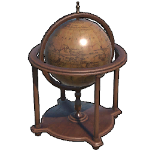
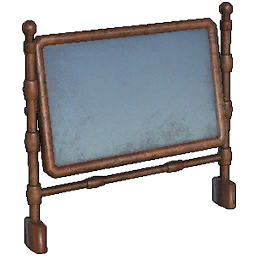
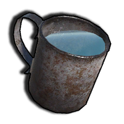

# Item list
All of the items currently in the game, with English localizations applied
This file is automatically generated from Sunkenland 0.5.12 using the SunkenDoc mod found on our GitHub.

|Item |Name |Item ID |Slot Type |Armor |Ammo Prefab |Description |
|---|---|---|---|---|---|---|
|50 Cal Ammo |50 Cal Ammo|6251|None|N/A|N/A|Ammunition for large-caliber machine guns and rifles.|
|B1_Black Powder |Black Powder|6252|None|N/A|N/A|Essential materials for making black powder bullets or smokeless gunpowder.|
|Black Powder Ammo |Black Powder Ammo|6253|None|N/A|N/A|Ammunition used in various types of black powder firearms.|
|Crude Grenade |Crude Grenade|6501|None|N/A|Crude Grenade|Improvised explosive made from scrap metal.|
|Military Grenade |Military Grenade|6502|None|N/A|Military Grenade|Powerful modern military grenade.|
|Molotov |Molotov|6503|None|N/A|Molotov|A glass bottle filled with gasoline, which can cause sustained area burning when exploded.|
|Pistol Ammo |Pistol Ammo|6254|None|N/A|N/A|Ammunition for modern pistols.|
|Rifle Ammo |Rifle Ammo|6255|None|N/A|N/A|Ammunition for modern rifles.|
|Shotgun Ammo |Shotgun Ammo|6256|None|N/A|N/A|Ammunition for modern shotguns.|
|Sniper Ammo |Sniper Ammo|6259|None|N/A|N/A|Ammunition used in sniper rifles.|
|SubCannon |SubCannon|0|None|N/A|N/A|No translation found for '' in Item Description|
|Broken Skull Crusher |Broken Serrated Axe|6834|None|N/A|N/A|It's already broken, either fix it or dismantle it.|
|Broken Combat Knife |Broken Combat Knife|6836|None|N/A|N/A|It's already broken, either fix it or dismantle it.|
|Broken Machete |Broken Machete|6835|None|N/A|N/A|It's already broken, either fix it or dismantle it.|
|Broken Double Barrel Shotgun |Broken Double Barrel Shotgun|6827|None|N/A|N/A|Disassemble damaged gun components that can be recycled on the advanced gun workbench.|
|Broken GP20 |Broken GP20|6811|None|N/A|N/A|Disassemble damaged gun components that can be recycled on the advanced gun workbench.|
|Broken Hunting Rifle |Broken Hunting Rifle|6812|None|N/A|N/A|Disassemble damaged gun components that can be recycled on the advanced gun workbench.|
|Broken M14 |Broken M14|6817|None|N/A|N/A|Disassemble damaged gun components that can be recycled on the advanced gun workbench.|
|Broken Mauser Pistol |Broken Mauser Pistol|6822|None|N/A|N/A|Disassemble damaged gun components that can be recycled on the advanced gun workbench.|
|Broken Old Bolt Action Rifle |Broken Old Bolt Action Rifle|6819|None|N/A|N/A|Disassemble damaged gun components that can be recycled on the advanced gun workbench.|
|Broken PM |Broken PM|6813|None|N/A|N/A|Disassemble damaged gun components that can be recycled on the advanced gun workbench.|
|Broken STG44 |Broken STG44|6825|None|N/A|N/A|Disassemble damaged gun components that can be recycled on the advanced gun workbench.|
|Broken Stun SMG |Broken Stun SMG|6821|None|N/A|N/A|Disassemble damaged gun components that can be recycled on the advanced gun workbench.|
|Broken AK47 |Broken AK47|6816|None|N/A|N/A|Disassemble damaged gun components that can be recycled on the advanced gun workbench.|
|Broken DE |Broken DEG 45|6820|None|N/A|N/A|Disassemble damaged gun components that can be recycled on the advanced gun workbench.|
|Broken LW 59 |Broken LW 59|6823|None|N/A|N/A|Disassemble damaged gun components that can be recycled on the advanced gun workbench.|
|Broken M16 |Broken M16|6818|None|N/A|N/A|Disassemble damaged gun components that can be recycled on the advanced gun workbench.|
|Broken Pump Shotgun |Broken Pump Shotgun|6814|None|N/A|N/A|Disassemble damaged gun components that can be recycled on the advanced gun workbench.|
|Broken SMG |Broken SMG|6815|None|N/A|N/A|Disassemble damaged gun components that can be recycled on the advanced gun workbench.|
|Broken SVD |SVD|6826|None|N/A|N/A|Disassemble damaged gun components that can be recycled on the advanced gun workbench.|
|Broken US45 SMG |Broken US45 SMG|6824|None|N/A|N/A|Disassemble damaged gun components that can be recycled on the advanced gun workbench.|
|A0_Stone Hatchet |Stone Hatchet|1006|None|N/A|N/A|A small hand axe tied together from scrap iron and wood strewn along the beach is barely good enough to cut a little bit of small shrubbery. Better grab another upgrade, this axe doesn't look too reliable.|
|A1_Crude Axe |Crude Axe|1001|None|N/A|N/A|Stone axe upgraded model, composed of scrap iron to form the axe face, sharpness greatly improved - but chopping trees is still a bit reluctant, chopping bushes is a lot more efficient. Fish are too short, so use a spear.|
|A2_Metal Axe |Twohand Axe|1002|None|N/A|N/A|A two-handed axe built at the anvil from iron ingots. Heavy feel and stable center of gravity brings leaps and bounds in chopping efficiency, slower, good for felling trees - and chopping people if you're happy with that.|
|A3_Wooden Spear |Wooden Spear|1003|None|N/A|N/A|A simple spear put together from twigs, crooked and not very strong, wins because it's easy to make, the materials are cheap, and mutants can build it. It can be used to poke crabs, sea fish and turtles - but don't touch the sharks.|
|C1_Bow |Bow|1004|None|N/A|C3_Arrow|A simple wooden bow made of planks and string spliced together to shoot enemies at long range. Use the same easy-to-make wooden arrows as projectiles to main a cost-effective one.|
|C2_Crossbow |Crossbow|1101|None|N/A|C3_Bolt|A crossbow assembled from pulleys and scrap iron, its performance has improved by leaps and bounds over a wooden bow. It is powerful and possesses the power to kill mutants with a single blow, but unfortunately it cannot be fired underwater.|
|C3_Arrow |Arrow|6257|None|N/A|N/A|Wooden arrows sharpened from wood and fired using a wooden bow. The primitive manufacturing techniques lead to a worrying quality that cannot be expected too much.|
|C3_Bolt |Crossbow Bolt|6258|None|N/A|N/A|Use of arrows made from scrap iron, ammunition used in crossbows and harpoon guns. Due to the improved materials, the performance is much better than wooden arrows.|
|Chainsaw |Chainsaw|1110|None|N/A|N/A|Using battery-powered advanced logging tools, the roaring electric-driven engine drives a chain saw so indestructible that all trees are cut in half - and so are people.|
|Harpoon Guns |Harpoon Guns|1109|None|N/A|C3_Bolt|Don't be fooled by the appearance of this seemingly haphazardly cobbled together weapon, it actually performs very reliably, and it's the only cold weapon that can be fired underwater!|
|Spiked Club |Spiked Club|1005|None|N/A|N/A||
|Wasteland Greataxe |Iron Axe|1111|None|N/A|N/A|A very sharp iron axe that is very efficient at cutting down trees, second only to a chainsaw in efficiency.|
|Wooden Knife |Wooden Knife|1007|None|N/A|N/A||
|A2C1_Skull Crusher |Serrated Axe|1108|None|N/A|N/A|The pirate-modified axe is a bit more for chopping people than for cutting down trees.|
|A2C2_Iron Axe |Iron Axe|1102|None|N/A|N/A|A very sharp iron axe that is very efficient at cutting down trees, second only to a chainsaw in efficiency.|
|A2C3_Iron Spear |Iron Spear|1103|None|N/A|N/A|A long, powerful spear of fine iron forged using iron ore.|
|A2C5_Iron Sword |Iron Sword|1106|None|N/A|N/A|Iron swords cobbled together from various industrial tools are unexpectedly powerful against slashing.|
|A2C6_Iron Mace |Iron Mace|1105|None|N/A|N/A|Adapted from a Savage's stick, it works unexpectedly well.|
|A2C7_Machete |Machete|1107|None|N/A|N/A|You can cut down both people and small trees, but efficiency-wise, it's better to cut down people.|
|A4_Scrap Metal Spear |Scrap Metal Spear|1008|None|N/A|N/A|Converted from a wooden spear, the scrap iron formed a less solid tip, fittingly its power was greatly enhanced. It can be used against mutants and pirates, but shark hunting with it is still difficult.|
|Antique Flintlock Pistol |Antique Flintlock Pistol|1201|None|N/A|Black Powder Ammo|A beautifully crafted black powder pistol, more powerful in a single shot than a cold weapon, but with a long reloading time, suitable for killing an enemy in a single blow in a time of crisis.|
|Combat Knife |Combat Knife|1104|None|N/A|N/A|Pre-apocalyptic military daggers with very fast attack speeds and very handy melee weapons.|
|Percussion Pistol |Percussion Pistol|1203|None|N/A|Black Powder Ammo|Much more powerful and a bit more practical than a black powder pistol, but still slow to load.|
|Tripple Barrel Pistol |Tripple Barrel Pistol|1204|None|N/A|Black Powder Ammo|Three rounds in one breath, and while the trajectory is erratic, the power at close range is outstanding - and the loading is slower that is.|
|A2_Scrap Pistol |Scrap Pistol|1205|None|N/A|Black Powder Ammo|A black powder weapon that can be fired in bursts, with stable ballistics and good versatility.|
|A3_Homemade Revolver |Homemade Revolver|1202|None|N/A|Black Powder Ammo|Powerful revolver that can be fired in bursts, but the trajectory is unstable and needs to be fired close to the target.|
|A4_Double Barrel Shotgun |Double Barrel Shotgun|1301|None|N/A|Shotgun Ammo|When you see a savage enemy charging up with a machete or combat dagger, you should pull out this shotgun and give him a taste of technological civilization.|
|A4_PM |PM|1302|None|N/A|Pistol Ammo|The classic Soviet semi-automatic pistol is as safe and reliable as that unbreakable union.|
|A5_GP20 |GP20|1401|None|N/A|Pistol Ammo|The classic American police pistol, ready to start patrolling like the sheriff?|
|A6 Mauser Pistol |Mauser Pistol|1307|None|N/A|Pistol Ammo|The classic pistol, which had been assembled in large numbers by the German army and even exported to Asia, was nicknamed the "box gun" by the Chinese army because of its high rate of fire - very fast indeed, but also very bad in terms of stability.|
|A7 DEG 45 |DEG 45|1406|None|N/A|Pistol Ammo|The classic representation of a high-powered pistol, the recoil can even fracture your wrist if not held correctly.|
|B2_Pump Shotgun |Pump Shotgun|1402|None|N/A|Shotgun Ammo||
|C1_SMG |SMG|1403|None|N/A|Pistol Ammo||
|C1_Stun SMG |Stun SMG|1306|None|N/A|Pistol Ammo||
|Crude Hunting Rifle |Hunting Rifle|1303|None|N/A|Sniper Ammo||
|E1_Old Bolt Action Rifle |Old Bolt Action Rifle|1304|None|N/A|Sniper Ammo||
|AK12 |AK12|1414|None|N/A|Rifle Ammo||
|AUG |AUG|1413|None|N/A|Rifle Ammo||
|FAMAS |FAMAS|1412|None|N/A|Rifle Ammo||
|G1_AK47 |AK47|1404|None|N/A|Rifle Ammo||
|LW 59 |LW 59|1407|None|N/A|Rifle Ammo||
|M14 |M14|1305|None|N/A|Sniper Ammo||
|M16 |M16|1405|None|N/A|Rifle Ammo||
|STG44 |STG44|1308|None|N/A|Rifle Ammo||
|Supernova |Supernova|1411|None|N/A|Shotgun Ammo||
|SVD |SVD|1409|None|N/A|Sniper Ammo||
|US45 SMG |US45 SMG|1408|None|N/A|Pistol Ammo||
|VSS |VSS|1410|None|N/A|Pistol Ammo||
|Claw |Claw|1009|None|N/A|N/A|No translation found for '' in Item Description|
|Broken Motorcycle Helmet |Motorcycle Helmet Skeleton|6806|None|N/A|N/A|Complete armor can be crafted at the armor crafting table.|
|Broken Vest3 Forest |Broken Vest3 Forest|6828|None|N/A|N/A|Complete armor can be crafted at the armor crafting table.|
|Broken Police Helmet |Police helmet skeleton|6807|None|N/A|N/A|Complete armor can be crafted at the armor crafting table.|
|Broken Police Vest |Semi-finished police body armor|6808|None|N/A|N/A|Complete armor can be crafted at the armor crafting table.|
|Broken Army Vest |Army undershirts, semi-finished|6804|None|N/A|N/A|Complete armor can be crafted at the armor crafting table.|
|Broken Metal Helme |Broken Metal Helmet|6803|None|N/A|N/A|Complete armor can be crafted at the armor crafting table.|
|Broken Special Force Armor |Semi-finished Special Forces Armor|6809|None|N/A|N/A|Complete armor can be crafted at the armor crafting table.|
|Broken Special Force Helmet |Special Forces Helmet Skeleton|6810|None|N/A|N/A|Complete armor can be crafted at the armor crafting table.|
|A2_Thick Cloth Armor |Leather Armor|4002|Armor|21|N/A|Lightweight armor tanned with leather that provides extremely limited defense against primitive weapons and is a lining material for scrap iron gauntlets.|
|A3_Thick Cloth Helmet |Leather Helmet|4003|Helmet|21|N/A|Helmets that go with leather armor provide protection that is better than nothing, and are mainly used as lining material for scrap iron helmets.|
|B1_Scrap Armor |Scrap Armor|4004|Armor|30|N/A|Armor made from scrap iron provides higher armor than leather armor - but the durability is still a concern due to the use of scrap iron for the main material, requiring frequent repairs.|
|B2_Scrap Helmet |Scrap Helmet|4005|Helmet|30|N/A|A helmet made of scrap iron provides some defense, determined that, like scrap iron armor, it is not very durable.|
|C1_Combat Armor |Combat Armor|4006|Armor|64|N/A|The Scrap Iron Armor upgrade replaces the scrap iron used as the main ingredient with molten iron ingots, providing a reliable defense that can even withstand the sharp teeth of sharks when worn.|
|D3 Helmet Football |Football Helmet|4009|Helmet|64|N/A|Don't underestimate it just because it's a previous sports gauntlet, the perfect curvature combined with the hardened fine iron material gives it very reliable protection against even the blasts of black powder weapons.|
|Vest A |Vest A|4501|Armor|2|N/A||
|Vest B |Vest B|4502|Armor|2|N/A||
|Vest Black |Vest Black|4503|Armor|2|N/A||
|Vest C |Vest C|4504|Armor|2|N/A||
|Vest1 Forest |Vest1 Forest|4505|Armor|2|N/A||
|Vest1 Navy |Navy Vest|0|Armor|15|N/A||
|Vest1 Sand |Vest1 Sand|4506|Armor|2|N/A||
|Vest3 Navy |Vest3 Navy|4507|Armor|2|N/A||
|A1 Vest3 Forest |Forest Combat Vest|4008|Armor|80|N/A||
|A2 P Tucked-SH Forest |Tucked-SH Forest|4020|Pants|20|N/A||
|A3 Motorcycle Helmet |Motorcycle Helmet|4010|Helmet|80|N/A||
|B1 Vest Police |Police Vest|4011|Armor|100|N/A||
|B2 Police Helmet |Police Helmet|4012|Helmet|100|N/A||
|B3 P Tucked-SH Sand |Tucked-SH Sand|4021|Pants|20|N/A||
|C1 Army Vest |Army Vest|4013|Armor|150|N/A||
|C2 Helmet Heavy2 |Iron Helmet|4007|Helmet|150|N/A||
|C3 Tucked-SH Navy |Tucked-SH Navy|4022|Pants|20|N/A||
|D1 Spetznaz Vest |Spetznaz Vest|4016|Armor|160|N/A||
|D2 Spetsnaz Helmet |Spetsnaz Helmet|4017|Helmet|160|N/A||
|A1_Sack |Sack|7004|Backpack|0|N/A|The simple bag made of coarse cloth and rope weighs little on the back and is very suitable for water expeditions.|
|A2_Backpack |Backpack|7011|Backpack|0|N/A|A larger backpack made of leather and cloth.|
|A3_Military Backpack |Military Backpack|7018|Backpack|0|N/A|The Ultimate Backpack, built using a large amount of materials, is a great improvement in item portability for expedition-level exploration, providing you with a reliable storage experience.|
|B1_Seawater Bucket |Seawater Bucket|7002|None|N/A|N/A|Iron drums made from scrap iron were used in conjunction with stills to obtain fresh water. Although inefficient, the process is simple and the materials are easily accessible.|
|B2_Diving Fins |Diving Fins|7008|Footgear|0|N/A|Ropes are simple flippers made of fish skin and leather, primitive yet reliable.|
|B2a_Scuba Diving Fins |Scuba Diving Fins|7019|Footgear|0|N/A|Upgraded from flippers, they are lighter and more useful, and are a must-have for underwater exploration.|
|B3_Fishing Rod |Fishing Rod|7009|None|N/A|N/A|A simple rod cobbled together using twigs, thin line and scrap iron is certainly not going to be able to hold up against a big fish tossing it around, but it will hold up for some smaller fish.|
|B3_Torch |Torch|7001|None|N/A|N/A|Suggested torches made of fabric and boards provide only a small patch of bright light to the holder.|
|C1_Pickaxe |Pickaxe|7005|None|N/A|N/A|Pieced together from scrap iron and wood, simple craftsmanship and cheap materials make up an unexpectedly reliable mining tool for all minerals, a must-have for miners.|
|C2_Reparing Hammer |Repair hammer|7006|None|N/A|N/A|Rough mallets held together with boards and string, but unexpectedly strong and durable, were used to dismantle and repair buildings and carriers.|
|C3_Packing Box |Packing Box|7021|None|N/A|N/A|Pack one piece of furniture at a time, regardless of size!|
|D5_Water Bottle |Water Bottle|7003|None|N/A|N/A|Bottles blown after the glass has been dissolved and corked to keep them sealed can be used to hold water.|
|DAQ Toolbox |Scavenging Toolbox|7029|Misc|N/A|N/A|The tiny bag is stuffed with all sorts of nifty gadgets for quickly dismantling various wrecks to get resources, which would be a lot less efficient if you had to collect them.|
|E0_Handcrafted Air tank |Handcrafted Air tank|7026|Rebreather|N/A|N/A|Handmade from scrap iron and rubber, the oxygen tanks look very unreliable and are really unreliable to use, they can only be used for exploring shallow water, you can't expect too much, let's just say that something is better than nothing.|
|E1_Small Air Tank |Small Air Tank|7020|Rebreather|N/A|N/A|The fine iron used to cast the bottle is much more reliable and airtight than scrap iron, and with it, the user can finally stay in the sea and explore for a longer period of time without having to go to the surface frequently to change the air.|
|E2 Big Air Tank |Big Air Tank|7023|Rebreather|N/A|N/A|A large oxygen tank made from two small oxygen tanks spliced together, deep-sea exploration depends on it.|
|E3 Portable Inflatable Bottle |Portable Inflatable Bottle|3041|None|N/A|N/A|A portable filling device consisting of a pressurized valve and compressed air, which allows the function of filling oxygen tanks underwater. Used in conjunction with a large oxygen tank, it can effectively extend the stay time underwater.|
|G1_Battery |Battery|7012|None|N/A|N/A|A homemade, high-capacity rechargeable battery, vital for surviving in the sunken world. Lightweight and rugged, it powers your gear for extended use.|
|G2_Metal Detector |Ore Detector|7015|None|N/A|N/A|Very handy metal detector to help you find the minerals you need, pay attention to its beeps and distances, and soon you'll be digging up pots of gold|
|G3_HeadLight |Headlight|7013|Misc|N/A|N/A|A strong headlamp with far-reaching light, perfect for illuminating the dark depths of the sea.|
|I1_Flare |Flare|7010|None|N/A|I1_Flare|Hand-mixed flares with illumination times proportional to the proficiency of the maker.|
|Kevlar armor plate |Kevlar armor plate|7032|Misc|20|N/A|High-tech fiber plates make up a reliable armor plate, making your survivability much improved. It is also difficult for modern weapons to do effective damage to this armor plate as long as you are not continuously bombarded.|
|Lithium Battery |Lithium battery|7025|None|N/A|N/A|The technicians call it a lithium battery, and it does have a much higher electrical capacity; no one knows if there is any lithium in the battery.|
|Night vision device |Night vision device|7028|Misc|N/A|N/A|Allows you to easily see objects at night.|
|Portable Repair Tools |Portable Repair Tools|3042|None|N/A|N/A|The gadget kit contains various materials for repairing guards, emergency sheet metal, wood pieces, leather, freshly removed car cushions ......|
|Precision iron armor plate |Iron Ballistic Plate|7031|Misc|10|N/A|The armor plate, made of fine iron, is an effective defense against black powder weapons and risks breaking if attacked by automatic weapons for an extended period of time.|
|SleepingBag |Sleeping Bag|7027|None|N/A|N/A|It can be placed anywhere, and when you die you can set off again from here - but the quality is bad, so you can only use it once, and you can only stuff one person down.|
|U2 UNDERWATER SCOOTER |Underwater Scooter|7030|None|N/A|N/A|By installing more powerful engines and parts on top of the underwater thrusters, the power is boosted to the limit and the battery drain is further increased.|
|Welding |Welding Tool|7022|None|N/A|N/A|The best option for repairing buildings and carriers.|
|Z_AmmunitionPouch |Ammunition Pouch|7033|Misc|N/A|N/A|A carry-on pouch made of canvas to store some extra ammo, a must-have for sea expeditions.|
|Z_GrenadePouch |Grenade Pouch|7034|Misc|N/A|N/A|Pockets made of canvas and latches to carry extra throws to support the fight.|
|Blueprint Blue Patterned Chair |Blueprint: Blue Patterned Chair|15009|None|N/A|N/A|Right-click on the Learning Blueprint.|
|Blueprint Concave Cabinet |Blueprint: Concave Cabinet|15010|None|N/A|N/A|Right-click on the Learning Blueprint.|
|Blueprint Desk |Blueprint: Desk|15011|None|N/A|N/A|Right-click on the Learning Blueprint.|
|Blueprint Floor Tile (Wooden) |Blueprint: Floor Tile (Wooden)|15038|None|N/A|N/A|Right-click on the Learning Blueprint.|
|Blueprint Plaid Couch |Blueprint: Plaid Couch|15012|None|N/A|N/A|Right-click on the Learning Blueprint.|
|Blueprint Red Cloth Sofa |Blueprint: Red Cloth Sofa|15013|None|N/A|N/A|Right-click on the Learning Blueprint.|
|Blueprint Solid Wood Cabinet |Blueprint: Solid Wood Cabinet|15014|None|N/A|N/A|Right-click on the Learning Blueprint.|
|Blueprint Square Table |Blueprint: Square Table|15015|None|N/A|N/A|Right-click on the Learning Blueprint.|
|Blueprint Wallpaper (Green) |Blueprint: Wallpaper (Green)|15051|None|N/A|N/A|Right-click on the Learning Blueprint.|
|Blueprint Armchair |Blueprint: Armchair|15016|None|N/A|N/A|Right-click on the Learning Blueprint.|
|Blueprint Backrest Chair |Blueprint: Backrest Chair|15017|None|N/A|N/A|Right-click on the Learning Blueprint.|
|Blueprint Black Leather Chair |Blueprint: Black Leather Chair|15018|None|N/A|N/A|Right-click on the Learning Blueprint.|
|Blueprint Black Leather Couch |Blueprint: Black Leather Couch|15019|None|N/A|N/A|Right-click on the Learning Blueprint.|
|Blueprint Collection Cabinet |Blueprint: Collection Cabinet|15020|None|N/A|N/A|Right-click on the Learning Blueprint.|
|Blueprint Counter |Blueprint: Counter|15021|None|N/A|N/A|Right-click on the Learning Blueprint.|
|Blueprint Double Door Wardrobe |Blueprint Double Door Wardrobe|15022|None|N/A|N/A|Right-click on the Learning Blueprint.|
|Blueprint Double Shelf |Blueprint: Double Shelf|15023|None|N/A|N/A|Right-click on the Learning Blueprint.|
|Blueprint Fireplace |Blueprint: Fireplace|15024|None|N/A|N/A|Right-click on the Learning Blueprint.|
|Blueprint Floor Tile (European) |Blueprint: Floor Tile (European)|15036|None|N/A|N/A|Right-click on the Learning Blueprint.|
|Blueprint Floor Tile (White Tiles) |Blueprint: Floor Tile (White Tiles)|15037|None|N/A|N/A|Right-click on the Learning Blueprint.|
|Blueprint Leather Suitcase |Blueprint: Leather Suitcase|15059|None|N/A|N/A|Right-click on the Learning Blueprint.|
|Blueprint Log Desk |Blueprint: Log Desk|15025|None|N/A|N/A|Right-click on the Learning Blueprint.|
|Blueprint Makeup Table |Blueprint: Makeup Table|15026|None|N/A|N/A|Right-click on the Learning Blueprint.|
|Blueprint Round Glass Table |Blueprint Round Glass Table|15027|None|N/A|N/A|Right-click on the Learning Blueprint.|
|Blueprint Round Table |Blueprint Round Table|15028|None|N/A|N/A|Right-click on the Learning Blueprint.|
|Blueprint Safe |Blueprint: Safe|15069|None|N/A|N/A|Right-click on the Learning Blueprint.|
|Blueprint Single bed |Blueprint: Single Bed|15029|None|N/A|N/A|Right-click on the Learning Blueprint.|
|Blueprint Wallpaper (Blue) |Blueprint: Wallpaper (Blue)|15050|None|N/A|N/A|Right-click on the Learning Blueprint.|
|Blueprint Wallpaper (Yellow) |Blueprint: Wallpaper (Yellow)|15052|None|N/A|N/A|Right-click on the Learning Blueprint.|
|Blueprint Chaise Leather Couch |Blueprint: Chaise Leather Couch|15030|None|N/A|N/A|Right-click on the Learning Blueprint.|
|Blueprint Crystal Chandelier |Blueprint: Crystal Chandelier|15031|None|N/A|N/A|Right-click on the Learning Blueprint.|
|Blueprint Double |Blueprint: Double Bed|15032|None|N/A|N/A|Right-click on the Learning Blueprint.|
|Blueprint European Chandelier |Blueprint: European Chandelier|15033|None|N/A|N/A|Right-click on the Learning Blueprint.|
|Blueprint European Leather Chair |Blueprint: European Leather Chair|15034|None|N/A|N/A|Right-click on the Learning Blueprint.|
|Blueprint Fish Tank |Blueprint: Fish Tank|15035|None|N/A|N/A|Right-click on the Learning Blueprint.|
|Blueprint French Sofa |Blueprint: French Sofa|15039|None|N/A|N/A|Right-click on the Learning Blueprint.|
|Blueprint Green Leather Couch |Blueprint: Green Leather Couch|15040|None|N/A|N/A|Right-click on the Learning Blueprint.|
|Blueprint Hanging Clocks |Blueprint: Hanging Clocks|15041|None|N/A|N/A|Right-click on the Learning Blueprint.|
|Blueprint Modern Floor Lamp |Blueprint: Modern Floor Lamp|15042|None|N/A|N/A|Right-click on the Learning Blueprint.|
|Blueprint Modern Garden Lamp |Blueprint: Modern Garden Lamp|15043|None|N/A|N/A|Right-click on the Learning Blueprint.|
|Blueprint Modern Lamp Post |Blueprint: Modern Lamp Post|15044|None|N/A|N/A|Right-click on the Learning Blueprint.|
|Blueprint Modern Wall Lamp |Blueprint: Modern Wall Lamp|15045|None|N/A|N/A|Right-click on the Learning Blueprint.|
|Blueprint Premium Fireplace |Blueprint: Premium Fireplace|15047|None|N/A|N/A|Right-click on the Learning Blueprint.|
|Blueprint Single Leather Couch |Blueprint: Single Leather Couch|184|None|N/A|N/A|Right-click on the Learning Blueprint.|
|Blueprint TV |Blueprint: TV|15048|None|N/A|N/A|Right-click on the Learning Blueprint.|
|Blueprint Vintage Leather Couch |Blueprint: Vintage Leather Couch|15049|None|N/A|N/A|Right-click on the Learning Blueprint.|
|Blueprint Glass Wall |Blueprint: Glass Wall|15062|None|N/A|N/A|Right-click on the Learning Blueprint.|
|Blueprint Advanced Purifier |Blueprint: Advanced Purifier|15065|None|N/A|N/A|Right-click on the Learning Blueprint.|
|Blueprint Crude Grenade |Blueprint Crude Grenade|15106|None|N/A|N/A|Right-click on the Learning Blueprint.|
|Blueprint Flare |Blueprint: Flare|15067|None|N/A|N/A|Right-click on the Learning Blueprint.|
|Blueprint Harpoon Guns |Blueprint Harpoon Guns|15104|None|N/A|N/A|Right-click on the Learning Blueprint.|
|Blueprint Homemade Revolver |Blueprint: Homemade Revolver|15091|None|N/A|N/A|Right-click on the Learning Blueprint.|
|Blueprint Motor Boat |Blueprint: Motor Boat|15001|None|N/A|N/A|Right-click on the Learning Blueprint.|
|Blueprint Underwater planting pot |Underwater planting pot|15120|None|N/A|N/A|Right-click on the Learning Blueprint.|
|Blueprint Anti-infantry mines |Blueprint: Anti-infantry mines|15119|None|N/A|N/A|Right-click on the Learning Blueprint.|
|Blueprint Big Air Tank |Blueprint: Big Air Tank|15087|None|N/A|N/A|Right-click on the Learning Blueprint.|
|Blueprint Fishpond |Fishpond|15118|None|N/A|N/A|Right-click on the Learning Blueprint.|
|Blueprint Jetski |Blueprint: Jetski|15004|None|N/A|N/A|Right-click on the Learning Blueprint.|
|Blueprint Molotov |Blueprint Molotov|15109|None|N/A|N/A|Right-click on the Learning Blueprint.|
|Blueprint Precision iron armor plate |Blueprint Iron Armor Plate|15111|None|N/A|N/A|Right-click on the Learning Blueprint.|
|Blueprint Scuba Diving Fins |Blueprint:  Scuba Diving Fins|15056|None|N/A|N/A|Right-click on the Learning Blueprint.|
|Blueprint Z_AmmunitionPouch |Blueprint Ammunition Pouch|15112|None|N/A|N/A|Right-click on the Learning Blueprint.|
|Blueprint Z_GrenadePouch |Blueprint Grenade Pouch|15113|None|N/A|N/A|Right-click on the Learning Blueprint.|
|Blueprint BIG UNDERWATER SCOOTER |Blueprint BIG UNDERWATER SCOOTER|15110|None|N/A|N/A|Right-click on the Learning Blueprint.|
|Blueprint Chainsaw |Blueprint Chainsaw|15108|None|N/A|N/A|Right-click on the Learning Blueprint.|
|Blueprint Jetstream Bowrider |Blueprint: Jetstream Bowrider|15054|None|N/A|N/A|Right-click on the Learning Blueprint.|
|Blueprint Military Backpack |Blueprint: Military Backpack|15055|None|N/A|N/A|Right-click on the Learning Blueprint.|
|Blueprint Night vision device |Blueprint Night vision device|15107|None|N/A|N/A|Right-click on the Learning Blueprint.|
|Blueprint Auto Turret |Blueprint Auto Turret|15115|None|N/A|N/A|Right-click on the Learning Blueprint.|
|Blueprint Kevlar armor plate |Blueprint Kevlar armor plate|15117|None|N/A|N/A|Right-click on the Learning Blueprint.|
|Blueprint Large Generator |Blueprint: Large Generator|15057|None|N/A|N/A|Right-click on the Learning Blueprint.|
|Blueprint Marine Fast Boat |Blueprint: Marine Fast Boat|15006|None|N/A|N/A|Right-click on the Learning Blueprint.|
|Blueprint Military Grenade |Blueprint: Military Grenade|15058|None|N/A|N/A|Right-click on the Learning Blueprint.|
|Blueprint Solar panel |Blueprint Solar panel|15102|None|N/A|N/A|Right-click on the Learning Blueprint.|
|Blueprint Big Fish Basket |Blueprint: Big Fish Basket|15088|None|N/A|N/A|Right-click on the Learning Blueprint.|
|Blueprint Masonry |Blueprints: Masonry Buildings|15121|None|N/A|N/A|Right-click on the Learning Blueprint.|
|Blueprint Searchlight |Blueprint: Searchlight|15078|None|N/A|N/A|Right-click on the Learning Blueprint.|
|BuildingContainer||544|None|N/A|N/A|Decoration. Right click to place it.|
|2Layer TShirt A | 2Layer TShirt A|4508|Clothes|1|N/A||
|2Layer TShirt B |2Layer TShirt B|4509|Clothes|1|N/A||
|2Layer TShirt E |2Layer TShirt E|4510|Clothes|1|N/A||
|A1 Warm Jacket |Warm Jacket|4001|Clothes|1|N/A|Apart from hunger and thirst, cold is also a hidden killer in these waters. Nothing warms the heart like leaning over a fire in the middle of the night with a cotton jacket.|
|A1_1a 2Layer TShirt C |Crude TShirt|4511|Clothes|2|N/A||
|A2 Baggy Pants |Baggy Pants|4512|Pants|2|N/A||
|A3 Zip Shoes |Zip Shoes|4513|Shoes|1|N/A||
|Anime T Shirt |Anime T Shirt|4638|Clothes|1|N/A||
|Bandage Boots |Bandage Boots|4514|Shoes|2|N/A||
|Bandana Mouth Black |Bandana Mouth Black|4515|Mask|3|N/A||
|Bandana Mouth Olive |Bandana Mouth Olive|4516|Mask|3|N/A||
|Bandana Neck Black |Bandana Neck Black|4517|Mask|1|N/A||
|Bandana Neck Sand |Bandana Neck Sand|4518|Mask|1|N/A||
|Blue Scrub Shirt |Blue Scrub Shirt|4646|Clothes|1|N/A||
|Boots D |Boots D|4519|Shoes|2|N/A||
|Boots Forest |Boots Forest|4520|Shoes|3|N/A||
|Boots Navy |Boots Navy|4521|Shoes|3|N/A||
|Boots1 A |Boots1 A|4522|Shoes|2|N/A||
|Boots2 A |Boots2 A|4523|Shoes|2|N/A||
|Bracer |Bracer|4525|Gloves|1|N/A||
|Bracer C |Bracer C|4524|Gloves|1|N/A||
|Breechcloth Pants |Breechcloth Pants|4526|Pants|1|N/A||
|Camisole |Camisole|4530|Clothes|1|N/A||
|Camisole A |Camisole A|4527|Clothes|1|N/A||
|Camisole B |Camisole B|4528|Clothes|1|N/A||
|Camisole D |Camisole D|4529|Clothes|1|N/A||
|Canvas Shoes B |Canvas Shoes B|4531|Shoes|1|N/A||
|Canvas Shoes C |Canvas Shoes C|4532|Shoes|1|N/A||
|Canvas Shoes D |Canvas Shoes D|4533|Shoes|1|N/A||
|Cargo Pants B |Cargo Pants B|4534|Pants|1|N/A||
|Cargo Pants C |Cargo Pants C|4535|Pants|1|N/A||
|Cargo Shorts A |Cargo Shorts A|4536|Pants|1|N/A||
|Cargo Shorts B |Cargo Shorts B|4537|Pants|1|N/A||
|Cargo Shorts C |Cargo Shorts C|4538|Pants|1|N/A||
|Close collar longsleeves shirt C |Close collar longsleeves shirt C|4539|Clothes|1|N/A||
|Close collar longsleeves shirt D |Close collar longsleeves shirt D|4540|Clothes|1|N/A||
|Close collar short sleeves shirt E |Close collar short sleeves shirt E|4541|Clothes|1|N/A||
|Corset B |Corset B|4542|Clothes|1|N/A||
|Corset C |Corset C|4543|Clothes|1|N/A||
|D1 Shorts Kneedpads |Combat Kneepads|4018|Pants|1|N/A||
|Fingerless Gloves Black |Fingerless Gloves Black|4544|Gloves|5|N/A||
|Fingerless Gloves Brown |Fingerless Gloves Brown|4545|Gloves|5|N/A||
|Flip-flops A |Flip-flops A|4546|Shoes|1|N/A||
|Flip-flops C |Flip-flops C|4547|Shoes|1|N/A||
|Flip-flops D |Flip-flops D|4548|Shoes|1|N/A||
|Gas Mask A |Gas Mask A|4549|Mask|6|N/A||
|Gas Mask B |Gas Mask B|4550|Mask|6|N/A||
|Googles A |Googles A|4551|Mask|3|N/A||
|Green Scrub Shirt |Green Scrub Shirt|4647|Clothes|1|N/A||
|Henley Longsleeve A |Henley Longsleeve A|4552|Clothes|1|N/A||
|Henley Longsleeve B |Henley Longsleeve B|4553|Clothes|1|N/A||
|Henley Longsleeve D |Henley Longsleeve D|4554|Clothes|1|N/A||
|High-heels A |High-heels A|4555|Shoes|1|N/A||
|High-heels B |High-heels B|4556|Shoes|1|N/A||
|High-heels C |High-heels C|4557|Shoes|1|N/A||
|High-heels D |High-heels D|4558|Shoes|1|N/A||
|Jeans B |Jeans B|4559|Pants|1|N/A||
|Jeans C |Jeans C|4560|Pants|1|N/A||
|Jeans E |Jeans E|4561|Pants|1|N/A||
|Jeans Rivets |Jeans Rivets|4562|Pants|1|N/A||
|Knee Boots B |Knee Boots B|4563|Shoes|2|N/A||
|Knee Boots C |Knee Boots C|4564|Shoes|2|N/A||
|Knee Boots D |Knee Boots D|4565|Shoes|2|N/A||
|Leather Jeans |Leather Jeans|4566|Pants|1|N/A||
|Lobster Hood |Lobster Hood|4644|Helmet|2|N/A||
|Low-rise Shorts B |Low-rise Shorts B|4567|Pants|1|N/A||
|Low-rise Shorts C |Low-rise Shorts C|4568|Pants|1|N/A||
|Low-rise Shorts D |Low-rise Shorts D|4569|Pants|1|N/A||
|Mini Skirt A |Mini Skirt (Red)|4570|Pants|1|N/A||
|Mini Skirt D |Mini Skirt D|4571|Pants|1|N/A||
|Moccasins Boots |Moccasins Boots|4572|Shoes|1|N/A||
|Open collar longsleeves shirt C |Open collar longsleeves shirt C|4573|Clothes|1|N/A||
|Open collar longsleeves shirt F |Open collar longsleeves shirt F|4574|Clothes|1|N/A||
|Open collar longsleeves shirt H |Open collar longsleeves shirt H|4575|Clothes|1|N/A||
|Open collar longsleeves shirt I |Open collar longsleeves shirt I|4576|Clothes|1|N/A||
|P Tucked-SH Forest |Tucked-SH Forest|4577|Pants|3|N/A||
|P Tucked-SH Navy |Tucked-SH Navy|4578|Pants|3|N/A||
|P Tucked-SH Sand |Tucked-SH Sand|4579|Pants|3|N/A||
|Pants1 A |Pants1 A|4580|Pants|2|N/A||
|Pants1 B |Pants1 B|4581|Pants|2|N/A||
|Pants2 A |Pants2 A|4582|Pants|2|N/A||
|Pants2 B |Pants2 B|4583|Pants|2|N/A||
|Patched Pants |Patched Pants|4584|Pants|2|N/A||
|Pencil Skirt A |Pencil Skirt A|4585|Pants|1|N/A||
|Pencil Skirt D |Pencil Skirt D|4586|Pants|1|N/A||
|Pencil Skirt E |Pencil Skirt E|4587|Pants|1|N/A||
|Pink Scrub Shirt |Pink Scrub Shirt|4649|Clothes|1|N/A||
|Rocker Jeans |Rocker Jeans|4588|Pants|1|N/A||
|S-Rolled Up Forest |Forest Camouflage Top|4589|Clothes|3|N/A||
|S-Rolled Up Navy |Navy Camouflage Top|4590|Clothes|3|N/A||
|S-Rolled Up Sand |Desert Camouflage Top|4591|Clothes|3|N/A||
|Scrub Pants A |Scrub Pants A|4592|Pants|1|N/A||
|Scrub Pants B |Scrub Pants B|4593|Pants|1|N/A||
|Scrub Pants C |Scrub Pants C|4594|Pants|1|N/A||
|Scrub Pants E |Scrub Pants E|4595|Pants|1|N/A||
|Shirt B |Shirt B|4596|Clothes|1|N/A||
|Shirt E |Shirt E|4597|Clothes|1|N/A||
|Shirt-Standart Forest |Shirt-Standard Forest|4598|Clothes|3|N/A||
|Shirt-Standart Navy |Shirt-Standard Navy|4599|Clothes|3|N/A||
|Shirt-Standart Sand |Shirt-Standard Sand|4600|Clothes|3|N/A||
|Shirt-Tactical Forest |Shirt-Tactical Forest|4601|Clothes|3|N/A||
|Shirt-Tactical Navy |Shirt-Tactical Navy|4602|Clothes|3|N/A||
|Shirt-Tactical Sand |Shirt-Tactical Sand|4603|Clothes|3|N/A||
|Ski Mask A |Ski Mask A|4604|Mask|2|N/A||
|Ski Mask B |Ski Mask B|4605|Mask|2|N/A||
|Skinny Pants C |Skinny Pants C|4606|Pants|1|N/A||
|Skinny Pants D |Skinny Pants D|4607|Pants|1|N/A||
|Slacks B |Slacks B|4608|Pants|1|N/A||
|Slacks C |Slacks C|4609|Pants|1|N/A||
|Sleeves Tops B |Sleeves Top B|4610|Clothes|1|N/A||
|Sleeves Tops C |Sleeves Top C|4611|Clothes|1|N/A||
|Sleeves Tops D |Sleeves Top D|4612|Clothes|1|N/A||
|Slip-ons A |Slip-ons A|4613|Shoes|1|N/A||
|Slip-ons B |Slip-ons B|4614|Shoes|1|N/A||
|Slip-ons C |Slip-ons C|4615|Shoes|1|N/A||
|Slit Skirt B |Slit Skirt B|4616|Pants|1|N/A||
|Slit Skirt C |Slit Skirt C|4617|Pants|1|N/A||
|Slit Skirt D |Slit Skirt D|4618|Pants|1|N/A||
|Sneakers B |Sneakers B|4619|Shoes|1|N/A||
|Sneakers C |Sneakers C|4620|Shoes|1|N/A||
|Sneakers D |Sneakers D|4621|Shoes|1|N/A||
|Squirrel Hood |Squirrel Hood|4645|Helmet|2|N/A||
|Style 2 |Style 2|4622|Clothes|1|N/A||
|Style 3 |Style 3|4623|Clothes|1|N/A||
|Style 5 |Style 5|4624|Clothes|1|N/A||
|Style 6 |Style 6|4625|Clothes|1|N/A||
|T-shirt A |T-shirt A|4626|Clothes|1|N/A||
|T-shirt C |T-shirt C|4627|Clothes|1|N/A||
|T-shirt D |T-shirt D|4628|Clothes|1|N/A||
|Tank Top Anime |Anime Tank Top|4633|Clothes|1|N/A||
|Tank Top B |Tank Top B|4629|Clothes|1|N/A||
|Tank Top C |Tank Top C|4630|Clothes|1|N/A||
|Tank Top D |Tank Top D|4631|Clothes|1|N/A||
|Tank-Top Black |Tank-Top Black|4632|Clothes|1|N/A||
|TShirt Black |T-Shirt Black|4634|Clothes|1|N/A||
|TShirt Coyote |T-Shirt Coyote|4635|Clothes|1|N/A||
|Tucked Pants |Tucked Pants|4636|Pants|1|N/A||
|V Scrub Shirt A |V Scrub Shirt A|4637|Clothes|1|N/A||
|White Gloves C |Gloves C|4639|Gloves|1|N/A||
|White Gloves D |Gloves D|4640|Gloves|1|N/A||
|Work Gloves A |Work Gloves A|4641|Gloves|3|N/A||
|Work Gloves B |Work Gloves B|4642|Gloves|3|N/A||
|Work Gloves C |Work Gloves C|4643|Gloves|3|N/A||
|Yellow Scrub Shirt |Yellow Scrub Shirt|4648|Clothes|1|N/A||
|Algal Rug |Algal Rug|22001|None|N/A|N/A|Decoration. Right click to place it.|
|Ballons Halloween |Balloons Halloween|22097|None|N/A|N/A|Decoration. Right click to place it.|
|Ballons Happy |Balloons Happy|22098|None|N/A|N/A|Decoration. Right click to place it.|
|Black Cat Statue |Black Cat Statue|22099|None|N/A|N/A|Decoration. Right click to place it.|
|Broken Tombstone |Broken Tombstone|22100|None|N/A|N/A|Decoration. Right click to place it.|
|Candles |Candles|22101|None|N/A|N/A|Decoration. Right click to place it.|
|Coffin |Coffin|22102|None|N/A|N/A|Decoration. Right click to place it.|
|Creepy Hand |Creepy Hand|22103|None|N/A|N/A|Decoration. Right click to place it.|
|Death Statue |Death Statue|22104|None|N/A|N/A|Decoration. Right click to place it.|
|Dragon Statue |Dragon Statue|22105|None|N/A|N/A|Decoration. Right click to place it.|
|Goest Decor |Ghost Decor|22106|None|N/A|N/A|Decoration. Right click to place it.|
|HauntedHalloween |HauntedHalloween|22107|None|N/A|N/A|Decoration. Right click to place it.|
|Large Spider |Large Spider|22108|None|N/A|N/A|Decoration. Right click to place it.|
|Neon Ghost |Neon Ghost|22109|None|N/A|N/A|Decoration. Right click to place it.|
|Neon Pumpkin |Neon Pumpkin|22110|None|N/A|N/A|Decoration. Right click to place it.|
|Old Candle Holder |Old Candle Holder|22111|None|N/A|N/A|Decoration. Right click to place it.|
|Pumpkin Dead |Pumpkin Dead|22112|None|N/A|N/A|Decoration. Right click to place it.|
|Pumpkin Dead Helmet |Pumpkin Dead Helmet|4650|Helmet|10|N/A||
|Pumpkin Evil |Evil Pumpkin|22113|None|N/A|N/A|Decoration. Right click to place it.|
|Pumpkin Grin |Pumpkin Grin|22114|None|N/A|N/A|Decoration. Right click to place it.|
|Pumpkin Malice |Pumpkin Malice|22115|None|N/A|N/A|Decoration. Right click to place it.|
|Pumpkin Round |Pumpkin Round|22116|None|N/A|N/A|Decoration. Right click to place it.|
|Pumpkin Sad |Sad Pumpkin|22117|None|N/A|N/A|Decoration. Right click to place it.|
|Pumpkin Short |Pumpkin Short|22118|None|N/A|N/A|Decoration. Right click to place it.|
|Pumpkin Tall |Pumpkin Tall|22119|None|N/A|N/A|Decoration. Right click to place it.|
|Small Spider |Small Spider|22120|None|N/A|N/A|Decoration. Right click to place it.|
|Square Tombstone |Square Tombstone|22121|None|N/A|N/A|Decoration. Right click to place it.|
|Vampire Statue |Vampire Statue|22122|None|N/A|N/A|Decoration. Right click to place it.|
|Voodoo Doll |Voodoo Doll|22123|None|N/A|N/A|Decoration. Right click to place it.|
|Witch Cauldron |Witch Cauldron|22124|None|N/A|N/A|Decoration. Right click to place it.|
|Bike Toy |Toy Bike|22002|None|N/A|N/A|Decoration. Right click to place it.|
|Blue Oil Bottle |Blue Oil Bottle|22003|None|N/A|N/A|Decoration. Right click to place it.|
|Candlestick |Candlestick|22004|None|N/A|N/A|Decoration. Right click to place it.|
|Carpet |Carpet|22005|None|N/A|N/A|Decoration. Right click to place it.|
|Ceramic Bottle |Ceramic Bottle|22006|None|N/A|N/A|Decoration. Right click to place it.|
|Colored Rug |Colored Rug|22007|None|N/A|N/A|Decoration. Right click to place it.|
|Cooling Chair |Cooling Chair|22008|None|N/A|N/A|Decoration. Right click to place it.|
|Darts Target |Darts Target|22009|None|N/A|N/A|Decoration. Right click to place it.|
|Decorative Plate Stand |Decorative Plate Stand|22010|None|N/A|N/A|Decoration. Right click to place it.|
|Delicate Chandelier |Delicate Chandelier|22011|None|N/A|N/A|Decoration. Right click to place it.|
|Desk Clock |Desk Clock|22012|None|N/A|N/A|Decoration. Right click to place it.|
|Easel Covered |Covered Easel|22013|None|N/A|N/A|Decoration. Right click to place it.|
|Exquisite Wooden Shelf |Exquisite Wooden Shelf|22014|None|N/A|N/A|Decoration. Right click to place it.|
|Exquisite Wooden Table |Exquisite Wooden Table|22015|None|N/A|N/A|Decoration. Right click to place it.|
|Figure Rug |Figure Rug|22016|None|N/A|N/A|Decoration. Right click to place it.|
|Fish Statue |Fish Statue|22017|None|N/A|N/A|Decoration. Right click to place it.|
|Floor Mirror |Floor Mirror|22018|None|N/A|N/A|Decoration. Right click to place it.|
|Game Console |Game Console|22019|None|N/A|N/A|Decoration. Right click to place it.|
|Globe |Globe|22020|None|N/A|N/A|Decoration. Right click to place it.|
|Skeleton Duck |Skeleton Duck|575|None|N/A|N/A|Decoration. Right click to place it.|
|Handbag |Handbag|22021|None|N/A|N/A|Decoration. Right click to place it.|
|Hanger |Hanger|22022|None|N/A|N/A|Decoration. Right click to place it.|
|Horse Statue |Horse Statue|22023|None|N/A|N/A|Decoration. Right click to place it.|
|Horse Toy |Horse Toy|22024|None|N/A|N/A|Decoration. Right click to place it.|
|Household Desk Lamp |Household Desk Lamp|22025|None|N/A|N/A|Decoration. Right click to place it.|
|Jewelry Casket |Jewelry Casket|22026|None|N/A|N/A|Decoration. Right click to place it.|
|Lamp Table |Table Lamp|22027|None|N/A|N/A|Decoration. Right click to place it.|
|Lamp Wall |Wall Lamp|22028|None|N/A|N/A|Decoration. Right click to place it.|
|Lantern |Flashlight|22029|None|N/A|N/A|Decoration. Right click to place it.|
|Large Vase |Large Vase|22030|None|N/A|N/A|Decoration. Right click to place it.|
|Mirror |Mirror|22031|None|N/A|N/A|Decoration. Right click to place it.|
|Model Train |Model Train|22032|None|N/A|N/A|Decoration. Right click to place it.|
|Moire |Moire|22034|None|N/A|N/A|Decoration. Right click to place it.|
|Moire Ceramic |Moire Ceramic|22033|None|N/A|N/A|Decoration. Right click to place it.|
|Neon Bestdayever |Neon Bestdayever|22035|None|N/A|N/A|Decoration. Right click to place it.|
|Neon Cat |Neon Cat|22036|None|N/A|N/A|Decoration. Right click to place it.|
|Neon Gamer |Neon Gamer|22037|None|N/A|N/A|Decoration. Right click to place it.|
|Neon Guitar |Neon Guitar|22038|None|N/A|N/A|Decoration. Right click to place it.|
|Neon Hotel |Neon Hotel|22039|None|N/A|N/A|Decoration. Right click to place it.|
|Neon Money |Neon Money|22040|None|N/A|N/A|Decoration. Right click to place it.|
|Neon Nightclub |Neon Nightclub|22041|None|N/A|N/A|Decoration. Right click to place it.|
|Neon Peace |Neon Peace|22042|None|N/A|N/A|Decoration. Right click to place it.|
|Neon Route66 |Neon Route66|22043|None|N/A|N/A|Decoration. Right click to place it.|
|Neon Woman 1 |Neon Woman 1|22044|None|N/A|N/A|Decoration. Right click to place it.|
|Neon Woman 2 |Neon Woman 2|22045|None|N/A|N/A|Decoration. Right click to place it.|
|Oil Painting(Birds Singing and Flowers Fragrant) |Oil Painting(Birds Singing and Flowers Fragrant)|22046|None|N/A|N/A|Decoration. Right click to place it.|
|Oil Painting(Comfortable) |Oil Painting(Comfortable)|22047|None|N/A|N/A|Decoration. Right click to place it.|
|Oil Painting(Deep in the Valley) |Oil Painting(Deep in the Valley)|22048|None|N/A|N/A|Decoration. Right click to place it.|
|Oil Painting(Desert Oasis) |Oil Painting(Desert Oasis)|22049|None|N/A|N/A|Decoration. Right click to place it.|
|Oil Painting(Divine Tree) |Oil Painting (Divine Tree)|22050|None|N/A|N/A|Decoration. Right click to place it.|
|Oil Painting(Forgotten Castle) |Oil Painting(Forgotten Castle)|22051|None|N/A|N/A|Decoration. Right click to place it.|
|Oil Painting(Fox in Birch Forest) |Oil Painting (Fox in Birch Forest)|22052|None|N/A|N/A|Decoration. Right click to place it.|
|Oil Painting(Happy Childhood) |Oil Painting(Happy Childhood)|22053|None|N/A|N/A|Decoration. Right click to place it.|
|Oil Painting(King Castle) |Oil Painting(King Castle)|22054|None|N/A|N/A|Decoration. Right click to place it.|
|Oil Painting(Landscape Dusk) |Oil Painting(Landscape Dusk)|22055|None|N/A|N/A|Decoration. Right click to place it.|
|Oil Painting(Lotus) |Oil Painting(Lotus)|22056|None|N/A|N/A|Decoration. Right click to place it.|
|Oil Painting(Rural Life) |Oil Painting (Rural Life)|22057|None|N/A|N/A|Decoration. Right click to place it.|
|Oil Painting(Small Stream in the Forest) |Oil Painting (Small Stream in the Forest)|22058|None|N/A|N/A|Decoration. Right click to place it.|
|Oil Painting(Valley Dusk) |Oil Painting(Valley Dusk)|22059|None|N/A|N/A|Decoration. Right click to place it.|
|Oil Painting(Wilderness Scenery) |Oil Painting(Wilderness Scenery)|22060|None|N/A|N/A|Decoration. Right click to place it.|
|Old Clock |Old Clock|22061|None|N/A|N/A|Decoration. Right click to place it.|
|Old Desk Lamp |Old Desk Lamp|22062|None|N/A|N/A|Decoration. Right click to place it.|
|Old Style Storage Shelf |Old Style Storage Shelf|22063|None|N/A|N/A|Decoration. Right click to place it.|
|Owl Toy |Owl Toy|22064|None|N/A|N/A|Decoration. Right click to place it.|
|Pan |Pan|22065|None|N/A|N/A|Decoration. Right click to place it.|
|Patterned Blue and White Pottery |Patterned Blue and White Pottery|22066|None|N/A|N/A|Decoration. Right click to place it.|
|Patterned Bronze Ware |Patterned Bronze Ware|22067|None|N/A|N/A|Decoration. Right click to place it.|
|Patterned Circular Porcelain |Patterned Circular Porcelain|20010|None|N/A|N/A|Decoration. Right click to place it.|
|Plane Toy |Toy Plane|22069|None|N/A|N/A|Decoration. Right click to place it.|
|Racing Model |Racing Model|22070|None|N/A|N/A|Decoration. Right click to place it.|
|Radio |Radio|22071|None|N/A|N/A|Decoration. Right click to place it.|
|Record Player Disk 1 |Record Player Disk 1|22072|None|N/A|N/A|Decoration. Right click to place it.|
|Record Player Disk 2 |Record Player Disk 2|22073|None|N/A|N/A|Decoration. Right click to place it.|
|Record Player Disk 3 |Record Player Disk 3|22074|None|N/A|N/A|Decoration. Right click to place it.|
|Red Rug |Red Rug|22075|None|N/A|N/A|Decoration. Right click to place it.|
|Red Sofa Chair |Red Sofa Chair|22076|None|N/A|N/A|Decoration. Right click to place it.|
|Retro Rug |Retro Rug|22077|None|N/A|N/A|Decoration. Right click to place it.|
|Rubber Duck |Rubber Duck|22068|None|N/A|N/A|Decoration. Right click to place it.|
|Rug |Rug|22078|None|N/A|N/A|Decoration. Right click to place it.|
|Sand Watch |Sand Watch|22079|None|N/A|N/A|Decoration. Right click to place it.|
|Scales |Scales|22080|None|N/A|N/A|Decoration. Right click to place it.|
|Silly Cookies |Silly Cookies|3039|None|N/A|N/A|Decoration. Right click to place it.|
|Small Globe |Small Globe|22081|None|N/A|N/A|Decoration. Right click to place it.|
|Sofa Chair |Sofa Chair|22082|None|N/A|N/A|Decoration. Right click to place it.|
|Solid Wood Shelf |Solid Wood Shelf|22083|None|N/A|N/A|Decoration. Right click to place it.|
|Stone Elephant |Stone Elephant|22084|None|N/A|N/A|Decoration. Right click to place it.|
|Striped Rug |Striped Rug|22085|None|N/A|N/A|Decoration. Right click to place it.|
|Sword Wall |Decorative Sword|22086|None|N/A|N/A|Decoration. Right click to place it.|
|Telephone Old |Old Telephone |22087|None|N/A|N/A|Decoration. Right click to place it.|
|Toy Bear |Toy Bear|22088|None|N/A|N/A|Decoration. Right click to place it.|
|Vanity Mirror |Vanity Mirror|22089|None|N/A|N/A|Decoration. Right click to place it.|
|Vinyl Machine |Vinyl Machine|22090|None|N/A|N/A|Decoration. Right click to place it.|
|Violin |Violin|22091|None|N/A|N/A|Decoration. Right click to place it.|
|Wall Clock |Wall Clock|22092|None|N/A|N/A|Decoration. Right click to place it.|
|Wallet |Wallet|22093|None|N/A|N/A|Decoration. Right click to place it.|
|Wanghai Reef |Wanghai Reef|22094|None|N/A|N/A|Decoration. Right click to place it.|
|Weighing Scale |Weighing Scale|22095|None|N/A|N/A|Decoration. Right click to place it.|
|Wooden Chair |Wooden Chair|22096|None|N/A|N/A|Decoration. Right click to place it.|
|Baked Beans |Baked Beans|3006|None|N/A|N/A||
|Candy Bar |Candy Bar|3007|None|N/A|N/A||
|Energy Drink |Energy Drink|3008|None|N/A|N/A||
|Food Can |Food Can|3009|None|N/A|N/A||
|Gummy Duck |Gummy Ducky|3038|None|N/A|N/A||
|Instant Ramen |Instant Ramen|3010|None|N/A|N/A||
|Pudding |Pudding|3011|None|N/A|N/A||
|Soda |Soda|3012|None|N/A|N/A||
|Bird Meat |Bird Meat|2001|None|N/A|N/A||
|Cabbage |Cabbage|2002|None|N/A|N/A||
|Coffee Bean |Coffee Bean|2003|None|N/A|N/A||
|Copra |copra|2017|None|N/A|N/A||
|Crab Meat |Crab Meat|2004|None|N/A|N/A||
|F3_Tarpon |Tarpon|2005|None|N/A|N/A||
|F4_Wahoo |Wahoo|2006|None|N/A|N/A||
|F7_Red Snapper |Red Snapper|2007|None|N/A|N/A||
|F8_Bream |Bream|2008|None|N/A|N/A||
|Large Fish Meat |Large Fish Meat|2009|None|N/A|N/A||
|Lemon |Lemon|2010|None|N/A|N/A||
|Mushroom |Mushroom|2011|None|N/A|N/A||
|Potato |Potato|2012|None|N/A|N/A||
|Raw Meat |Raw Meat|2013|None|N/A|N/A||
|Red Algae |red algae|6008|None|N/A|N/A||
|Scallop |Scallop|2014|None|N/A|N/A||
|Strawberry |Strawberry|2015|None|N/A|N/A||
|Bottle Of Water |Bottle Of Water|3013|None|N/A|N/A||
|F3_Roasted Tarpon |Roasted Tarpon|3014|None|N/A|N/A||
|F4_Roasted Wahoo |Roasted Wahoo|3015|None|N/A|N/A||
|F7_Roasted Red Snapper |Roasted Red Snapper|3016|None|N/A|N/A||
|F8_Roasted Bream |Roasted Bream|3017|None|N/A|N/A||
|Roasted Bird Meat |Roasted Bird Meat|3018|None|N/A|N/A||
|Roasted Cabbage |Roasted Cabbage|3019|None|N/A|N/A||
|Roasted Crab |Roasted Crab|3020|None|N/A|N/A||
|Roasted Fish |Roasted Fish|3021|None|N/A|N/A||
|Roasted Meat |Roasted Meat|3022|None|N/A|N/A||
|Roasted Mushroom |Roasted Mushroom|3023|None|N/A|N/A||
|Roasted Potato |Roasted Potato|3024|None|N/A|N/A||
|Roasted Scallop |Roasted Scallop|3025|None|N/A|N/A||
|Water |Water|2016|None|N/A|N/A||
|Bush Seed |Bush Seed|6701|None|N/A|N/A||
|Cabbage Seed |Cabbage Seed|6702|None|N/A|N/A||
|Cotton Seeds |Cotton Seeds|6703|None|N/A|N/A||
|Fishing Bait |Fishing Bait|7017|None|N/A|N/A||
|Lemon Seeds |Lemon Seeds|6704|None|N/A|N/A||
|Strawberry Seeds |Strawberry Seeds|6705|None|N/A|N/A||
|A1 Salad |Salad|3026|None|N/A|N/A|Increases hunger and thirst by 30 and greatly increases the speed of life recovery after using the potion.|
|A2 Seafood Platter |Seafood Platter|3027|None|N/A|N/A|Completely restores food level and increases maximum health by 50.|
|A3 Fish Stew |Fish Stew|3028|None|N/A|N/A|Completely restores hydration and food level, and enhances swimming and diving abilities.|
|A4 Bird Meat Mushroom Soup |Mushroom Bird Soup|3029|None|N/A|N/A|Slowly regenerates health automatically.|
|A5 Alcohol |Alcohol|3030|None|N/A|N/A|Used for crafting molotov cocktails.|
|Baked Fish with Lemon |Baked Fish with Lemon|3031|None|N/A|N/A||
|Coffee |Coffee|3032|None|N/A|N/A||
|Coral Smoothie |Coral Smoothie|3033|None|N/A|N/A||
|Crab Cakes |Crab Cakes|3034|None|N/A|N/A||
|Roasted Lemon Bird |Roasted Lemon Bird|3035|None|N/A|N/A||
|Steak Meal |Steak Meal|3036|None|N/A|N/A|Restores full hunger and thirst, increases melee damage by 30%|
|Strawberry And Lemon Smoothie |Strawberry And Lemon Smoothie|3037|None|N/A|N/A||
|Blueprint modern pistols with grenades underneath |Blueprint: modern pistols with grenades underneath|16118|None|N/A|N/A|Right-click on the Learning Blueprint.|
|Blueprint shotgun under automatic rifle |Blueprint: shotgun under automatic rifle|16117|None|N/A|N/A|Right-click on the Learning Blueprint.|
|Blueprint Triple Shotgun Barrels |Blueprint: Triple Shotgun Barrels|16101|None|N/A|N/A|Right-click on the Learning Blueprint.|
|Modern Weapons Kit |Modern Weapons Kit|7035|None|N/A|N/A|Open it to get some random weapon accessories, including but not limited to scopes, grips, magazines, barrels, and more.|
|Compressor |Compressor|10018|None|N/A|N/A|Crafted on heavy machinery workshop, it is used to make advanced parts for carriers.|
|Control Panel |Control Panel|10015|None|N/A|N/A|Crafted on heavy machinery workshop, it is used to make advanced parts for carriers.|
|Gasoline Engine |Gasoline Engine|10020|None|N/A|N/A|Crafted on heavy machinery workshop, it is used to make advanced parts for carriers.|
|High-efficiency alloy motor |Highspeed Electric Motor|6154|None|N/A|N/A|Crafted on heavy machinery workshop. A Highspeed Electric Motor delivers rapid rotation speeds, ideal for precision applications in industries like robotics, aerospace, and automotive, where efficiency and performance are critical.|
|Hydraulic system |Hydraulic system|10019|None|N/A|N/A|Crafted on heavy machinery workshop, it is used to make advanced parts for carriers.|
|Power Supply Unit |Power Supply Unit|10016|None|N/A|N/A|Crafted on heavy machinery workshop, it is used to make advanced parts for carriers.|
|Turbocharger |Turbocharger|10017|None|N/A|N/A|Crafted on heavy machinery workshop. A Highspeed Electric Motor delivers rapid rotation speeds, ideal for precision applications in industries like robotics, aerospace, and automotive, where efficiency and performance are critical.|
|Orange Coral |Orange Coral|36|None|N/A|N/A||
|Purple Flower |Purple Flower|6052|None|N/A|N/A||
|Red Flower |Red Flower|6053|None|N/A|N/A||
|White Flower |White Flower|6054|None|N/A|N/A||
|A1_Rope |Rope|10001|None|N/A|N/A|It's used to connect things.|
|A2_Cloth |Cloth|6001|None|N/A|N/A|Basic material used for crafting armor, ropes, and some furniture.|
|A3_Components |Components|6055|None|N/A|N/A|Items like bolts, wires, nails, and the like.|
|Advanced Alloy |Advanced Alloy|10009|None|N/A|N/A|Advanced crafting material.|
|Advanced Parts |Advanced Parts|6103|None|N/A|N/A|Used for advanced machinery.|
|Anatase |Anatase|6105|None|N/A|N/A|High grade minerals converted into titanium bars in an electrolytic furnace.|
|B1_Smokeless Powder |Smokeless Powder|10004|None|N/A|N/A|Ingredient for modern ammo making.|
|Ballistic Fiber |Ballistic Fiber|6102|None|N/A|N/A|Used to craft advanced armor.|
|Charcoal |Charcoal|6202|None|N/A|N/A|Mainly used for crafting black powder ammunition.|
|Combustible Ice |Combustible Ice|6153|None|N/A|N/A|Burning ice cubes, completely clean energy.|
|D_Gun Parts |Gun Parts|6101|None|N/A|N/A|Used for crafting modern firearms, and can also be used in the workshop to print basic WWII gun components.|
|E_Electronic Parts |Electronic Parts|6060|None|N/A|N/A|Required for crafting electronic devices.|
|Fine Wood Plank |Fine Wood Plank|10005|None|N/A|N/A|Used for crafting luxury furniture.|
|Fish Skin |Fish Skin|6057|None|N/A|N/A|Fish skins that can be obtained from sharks and marlin are used to make leather.|
|Glass |Glass|6056|None|N/A|N/A|Used to craft bottles and some structures.|
|H_Copper Ingot |Copper Ingot|10006|None|N/A|N/A|Mainly used for making advanced bullets, but also for other industrial purposes.|
|H_Copper Ore |Copper Ore|6062|None|N/A|N/A|Can be melted in a furnace to create copper ingots.|
|H_Cotton |Cotton|6002|None|N/A|N/A|Raw material for crafting fabric.|
|H_Duct Tape |Duct Tape|6003|None|N/A|N/A|Might be used in crafting certain items.|
|Hide |Hide|6005|None|N/A|N/A|Obtained from animals and can be processed into leather.|
|I_Gasoline |Gasoline|6201|None|N/A|N/A|Used to provide engine power for boats and can also be used for generating electricity.|
|Iron Ingot |Iron Ingot|10003|None|N/A|N/A|Used for crafting modern ammo and electronic devices.|
|Iron Ore |Iron Ore|6061|None|N/A|N/A|Can be melted in a furnace to create iron ingots.|
|J_Chemical Substance |Chemical Substance|6152|None|N/A|N/A|Used for making ammo, producing gas, and more.|
|Marble |Marble|6007|None|N/A|N/A|Used for home decoration.|
|Modern Gun Parts |Modern Gun Parts|10013|None|N/A|N/A|Used for crafting parts for modern and contemporary firearms, and can also be used in the workshop to print basic modern gun components.|
|Modern Parts |Modern Parts|10012|None|N/A|N/A|Parts made using modern craftsmanship.|
|Paint |Paint|10007|None|N/A|N/A|Used for creating wallpapers and floors.|
|Plastic |Plastic|10014|None|N/A|N/A|A material with excellent ductility, hard and brittle in texture.|
|Polymer |Polymer|10010|None|N/A|N/A|Advanced crafting material.|
|Q_Leather |Leather|6006|None|N/A|N/A|Versatile leather, synthesized from fish skin.|
|Quartz |Quartz|6104|None|N/A|N/A|High-grade material, high hardness with good transparency|
|Rubber |Rubber|6058|None|N/A|N/A|Obtained from a car or tire, it has a variety of uses.|
|Scrap Metal |Scrap Metal|6004|None|N/A|N/A|Usually found underwater.|
|Shark Skin |Shark Skin|6059|None|N/A|N/A|The skin of a shark, might be able to be used to make certain props|
|Steel Igot |Steel Ingot|10008|None|N/A|N/A|Harder than iron.|
|Sulfur |Sulfur|6151|None|N/A|N/A|Used to make black powder.|
|Titanium Strip |Titanium Strip|10011|None|N/A|N/A|Anatase is melted to produce strip-shaped metals.|
|Wood Plank |Wood Plank|6200|None|N/A|N/A|Has a wide range of uses. Obtained by chopping down trees or wooden furniture.|
|A1_Bandage |Bandage|3001|None|N/A|N/A|In this age of extreme antibiotic scarcity, stopping the bleeding quickly is good for keeping you alive.|
|A2_Herbal Medicine |Herbal Medicine|3002|None|N/A|N/A|Red algae can be effective in helping wounds return to health, the only downside is that the stuff is harder to find underwater.|
|A3_Lung Capacity Booster |fast-track pellet|3003|None|N/A|N/A|Temporary increase in breath-holding time and swimming speed|
|A3_Stamina Mix |Stamina Herbal Mix|3004|None|N/A|N/A|A favorite local casual food of the Border Seas, mushrooms and strawberries are blended together in a marvelous flavor that leaves the eater feeling refreshed and fit in a small amount of time.|
|Antibiotics |Antibiotics|3005|None|N/A|N/A|Restores a significant amount of health points.|
|Froninga |Froninga|3040|None|N/A|N/A|Used for quickly eliminating damage caused by radiation.|
|Orange Coral |Orange Coral|6051|None|N/A|N/A||
|Converter|No translation found for '' in Interactable|78|None|N/A|N/A||
|MainBoard|No translation found for '' in Interactable|79|None|N/A|N/A||
|MotorCoil|No translation found for '' in Interactable|80|None|N/A|N/A||
|Note1||81|None|N/A|N/A||
|PDA#1|No translation found for '' in Interactable|82|None|N/A|N/A||
|Pirate Hideout Key||83|None|N/A|N/A||
|SwipeCard|No translation found for '' in Interactable|84|None|N/A|N/A||
|Catamaran Controller |Catamaran Controller|497|None|N/A|N/A|Used to unlock boats on the research table.|
|Catamaran Hull |Catamaran Hull|498|None|N/A|N/A|Used to unlock boats on the research table.|
|Catamaran Sail |Catamaran Sail|499|None|N/A|N/A|Used to unlock boats on the research table.|
|Helicopter Console |Helicopter Console|500|None|N/A|N/A|Used to unlock boats on the research table.|
|Helicopter Empennage |Helicopter Stabilizer|501|None|N/A|N/A|Used to unlock boats on the research table.|
|Helicopter Engine |Helicopter Engine|502|None|N/A|N/A|Used to unlock boats on the research table.|
|Helicopter Gas Tank |Helicopter Gas Tank|503|None|N/A|N/A|Used to unlock boats on the research table.|
|Helicopter Propeller |Helicopter Propeller|504|None|N/A|N/A|Used to unlock boats on the research table.|
|Jetski Controls |Jetski Controls|505|None|N/A|N/A|Used to unlock boats on the research table.|
|Jetski Engine |Jetski Engine|506|None|N/A|N/A|Used to unlock boats on the research table.|
|Jetski Gas Tank |Jetski Gas Tank|507|None|N/A|N/A|Used to unlock boats on the research table.|
|Jetski Jet Pump |Jetski Jet Pump|508|None|N/A|N/A|Used to unlock boats on the research table.|
|Jetstream Bowrider Console |Jetstream Bowrider Console|509|None|N/A|N/A|Used to unlock boats on the research table.|
|Jetstream Bowrider Engine |Jetstream Bowrider Engine|510|None|N/A|N/A|Used to unlock boats on the research table.|
|Jetstream Bowrider Hull |Jetstream Bowrider Hull|511|None|N/A|N/A|Used to unlock boats on the research table.|
|Marine Fast Boat Console |Marine Fast Boat Console|512|None|N/A|N/A|Used to unlock boats on the research table.|
|Marine Fast Boat Engine |Marine Fast Boat Engine|513|None|N/A|N/A|Used to unlock boats on the research table.|
|Marine Fast Boat Hull |Marine Fast Boat Hull|514|None|N/A|N/A|Used to unlock boats on the research table.|
|Motorboat Engine |Motorboat Engine|515|None|N/A|N/A|Used to unlock boats on the research table.|
|Motorboat Gas Tank |Motorboat Gas Tank|516|None|N/A|N/A|Used to unlock boats on the research table.|
|Motorboat Hull |Motorboat Hull|517|None|N/A|N/A|Used to unlock boats on the research table.|
|Blueprint calibrated barrel of capitalist timess pistol |Damaged blueprints|16011|None|N/A|N/A|A blueprint that has been completely destroyed, completely unrecognizable from its original use, and will have to be put into Dredwell's machine for recycling.|
|Blueprint calibrated barrel of modern pistol |Damaged blueprints|16031|None|N/A|N/A|A blueprint that had been completely damaged and was completely unrecognizable from its original use would have to go to the trading post for some silver coins.|
|Blueprint capitalist timess alloy barrel |Damaged blueprints|16037|None|N/A|N/A|A blueprint that had been completely damaged and was completely unrecognizable from its original use would have to go to the trading post for some silver coins.|
|Blueprint capitalist timess high-tech barrel |Damaged blueprints|16038|None|N/A|N/A|A blueprint that had been completely damaged and was completely unrecognizable from its original use would have to go to the trading post for some silver coins.|
|Blueprint capitalist timess iron barrel |Damaged blueprints|16004|None|N/A|N/A|A blueprint that had been completely damaged and was completely unrecognizable from its original use would have to go to the trading post for some silver coins.|
|Blueprint capitalist timess scrap iron barrel |Damaged blueprints|16003|None|N/A|N/A|A blueprint that had been completely damaged and was completely unrecognizable from its original use would have to go to the trading post for some silver coins.|
|Blueprint full autocontinuous fire mode |Blueprints: fully automatic/continuous-fire machine guns|16120|None|N/A|N/A|A blueprint that has been completely destroyed, completely unrecognizable from its original use, and will have to be put into Dredwell's machine for recycling.|
|Blueprint full automatic fire mode |Damaged blueprints|16122|None|N/A|N/A|A blueprint that has been completely destroyed, completely unrecognizable from its original use, and will have to be put into Dredwell's machine for recycling.|
|Blueprint Fully automaticsemi-automatic firing modes |Damaged blueprints|16119|None|N/A|N/A|A blueprint that has been completely destroyed, completely unrecognizable from its original use, and will have to be put into Dredwell's machine for recycling.|
|Blueprint long barrel of capitalist timess pistol |Damaged blueprints|16010|None|N/A|N/A|A blueprint that had been completely damaged and was completely unrecognizable from its original use would have to go to the trading post for some silver coins.|
|Blueprint modern alloy barrel |Damaged blueprints|16072|None|N/A|N/A|A blueprint that had been completely damaged and was completely unrecognizable from its original use would have to go to the trading post for some silver coins.|
|Blueprint modern high-tech barrel |Damaged blueprints|16073|None|N/A|N/A|A blueprint that had been completely damaged and was completely unrecognizable from its original use would have to go to the trading post for some silver coins.|
|Blueprint modern iron barrel |Damaged blueprints|16071|None|N/A|N/A|A blueprint that had been completely damaged and was completely unrecognizable from its original use would have to go to the trading post for some silver coins.|
|Blueprint modern scrap iron barrel |Damaged blueprints|16070|None|N/A|N/A|A blueprint that had been completely damaged and was completely unrecognizable from its original use would have to go to the trading post for some silver coins.|
|Blueprint semi-automatic fire mode |Damaged blueprints|16123|None|N/A|N/A|A blueprint that has been completely destroyed, completely unrecognizable from its original use, and will have to be put into Dredwell's machine for recycling.|
|Blueprint Semi-automaticContinuous Fire Mode |Damaged blueprints|16121|None|N/A|N/A|A blueprint that has been completely destroyed, completely unrecognizable from its original use, and will have to be put into Dredwell's machine for recycling.|
|Blueprint short barrel of a modern pistol |Damaged blueprints|16029|None|N/A|N/A|A blueprint that had been completely damaged and was completely unrecognizable from its original use would have to go to the trading post for some silver coins.|
|Blueprint short barrel of capitalist timess pistol |Damaged blueprints|16009|None|N/A|N/A|A blueprint that had been completely damaged and was completely unrecognizable from its original use would have to go to the trading post for some silver coins.|
|Blueprint WWII alloy barrel |Damaged blueprints|16063|None|N/A|N/A|A blueprint that had been completely damaged and was completely unrecognizable from its original use would have to go to the trading post for some silver coins.|
|Blueprint WWII iron barrel |Damaged blueprints|16053|None|N/A|N/A|A blueprint that had been completely damaged and was completely unrecognizable from its original use would have to go to the trading post for some silver coins.|
|Blueprint WWII pistol calibrated barrel |Damaged blueprints|16023|None|N/A|N/A|A blueprint that had been completely damaged and was completely unrecognizable from its original use would have to go to the trading post for some silver coins.|
|Blueprint WWII pistol long barrel |Damaged blueprints|16022|None|N/A|N/A|A blueprint that had been completely damaged and was completely unrecognizable from its original use would have to go to the trading post for some silver coins.|
|Blueprint WWII pistol short barrel |Damaged blueprints|16021|None|N/A|N/A|A blueprint that had been completely damaged and was completely unrecognizable from its original use would have to go to the trading post for some silver coins.|
|Blueprint WWII scrap iron barrel |Damaged blueprints|16052|None|N/A|N/A|A blueprint that had been completely damaged and was completely unrecognizable from its original use would have to go to the trading post for some silver coins.|
|calibrated barrel of capitalist timess pistol |Damaged components|24011|None|N/A|N/A|Components that have been completely destroyed, completely useless to repair, can only go to the trading post for some silver coins.	|
|calibrated barrel of modern pistol |Damaged components|24031|None|N/A|N/A|Components that have been completely destroyed, completely useless to repair, can only go to the trading post for some silver coins.	|
|capitalist timess alloy barrel |Damaged components|24037|None|N/A|N/A|Components that have been completely destroyed, completely useless to repair, can only go to the trading post for some silver coins.	|
|capitalist timess high-tech barrel |Damaged components|24038|None|N/A|N/A|Components that have been completely destroyed, completely useless to repair, can only go to the trading post for some silver coins.	|
|capitalist timess iron barrel |Damaged components|24004|None|N/A|N/A|Components that have been completely destroyed, completely useless to repair, can only go to the trading post for some silver coins.	|
|capitalist timess scrap iron barrel |Damaged components|24003|None|N/A|N/A|Components that have been completely destroyed, completely useless to repair, can only go to the trading post for some silver coins.	|
|Full AutoContinuous Fire Mode |Damaged components|24120|None|N/A|N/A|Components that have been completely destroyed, completely useless to repair, can only go to the trading post for some silver coins.	|
|Fullsemi-automatic firing mode |Damaged components|24119|None|N/A|N/A|Components that have been completely destroyed, completely useless to repair, can only go to the trading post for some silver coins.	|
|Fully automatic firing mode |Damaged components|24122|None|N/A|N/A|Components that have been completely destroyed, completely useless to repair, can only go to the trading post for some silver coins.	|
|long barrel of a modern pistol |Damaged components|24030|None|N/A|N/A|Components that have been completely destroyed, completely useless to repair, can only go to the trading post for some silver coins.	|
|long barrel of capitalist timess pistol |Damaged components|24010|None|N/A|N/A|Components that have been completely destroyed, completely useless to repair, can only go to the trading post for some silver coins.	|
|modern alloy barrel |Damaged components|24072|None|N/A|N/A|Components that have been completely destroyed, completely useless to repair, can only go to the trading post for some silver coins.	|
|modern high-tech barrel |Damaged components|24073|None|N/A|N/A|Components that have been completely destroyed, completely useless to repair, can only go to the trading post for some silver coins.	|
|modern iron barrel |Damaged components|24071|None|N/A|N/A|Components that have been completely destroyed, completely useless to repair, can only go to the trading post for some silver coins.	|
|modern scrap iron barrel |Damaged components|24070|None|N/A|N/A|Components that have been completely destroyed, completely useless to repair, can only go to the trading post for some silver coins.	|
|Semi-automatic fire mode |Damaged components|24123|None|N/A|N/A|Components that have been completely destroyed, completely useless to repair, can only go to the trading post for some silver coins.	|
|Semi-automaticContinuous Fire Mode |Damaged components|24121|None|N/A|N/A|Components that have been completely destroyed, completely useless to repair, can only go to the trading post for some silver coins.	|
|short barrel of a modern pistol |Damaged components|24029|None|N/A|N/A|Components that have been completely destroyed, completely useless to repair, can only go to the trading post for some silver coins.	|
|short barrel of capitalist timess pistol |Damaged components|24009|None|N/A|N/A|Components that have been completely destroyed, completely useless to repair, can only go to the trading post for some silver coins.	|
|WWII alloy barrel |Damaged components|24063|None|N/A|N/A|Components that have been completely destroyed, completely useless to repair, can only go to the trading post for some silver coins.	|
|WWII iron barrel |Damaged components|24053|None|N/A|N/A|Components that have been completely destroyed, completely useless to repair, can only go to the trading post for some silver coins.	|
|WWII pistol calibrated barrel |Damaged components|24023|None|N/A|N/A|Components that have been completely destroyed, completely useless to repair, can only go to the trading post for some silver coins.	|
|WWII pistol long barrel |Damaged components|24022|None|N/A|N/A|Components that have been completely destroyed, completely useless to repair, can only go to the trading post for some silver coins.	|
|WWII pistol short barrel |Damaged components|24021|None|N/A|N/A|Components that have been completely destroyed, completely useless to repair, can only go to the trading post for some silver coins.	|
|WWII scrap iron barrel |Damaged components|24052|None|N/A|N/A|Components that have been completely destroyed, completely useless to repair, can only go to the trading post for some silver coins.	|
|C3_Binocular |Binocular|7007|None|N/A|N/A|Use it to observe distant areas.|
|Cigar |Cigar|20001|None|N/A|N/A|Quite valuable, selling to traders might yield a significant profit.|
|Expensive Wine |Expensive Wine|20002|None|N/A|N/A|Quite valuable, selling to traders might yield a significant profit.|
|High-end  Perfume |High-end  Perfume|20003|None|N/A|N/A|Quite valuable, selling to traders might yield a significant profit.|
|High-end Watch |High-end Watch|20004|None|N/A|N/A|Quite valuable, selling to traders might yield a significant profit.|
|Jewelry |Diamond Ring|20005|None|N/A|N/A|Quite valuable, selling to traders might yield a significant profit.|
|Magazine |Magazine|20006|None|N/A|N/A|Quite valuable, selling to traders might yield a significant profit.|
|Mobile Phone |Mobile Phone|20007|None|N/A|N/A|Quite valuable, selling to traders might yield a significant profit.|
|Silver Coins |Silver Coins|1|None|N/A|N/A|Quite valuable, selling to traders might yield a significant profit.|
|Zippo |Zippo|20009|None|N/A|N/A|Quite valuable, selling to traders might yield a significant profit.|
|TradeContractItem|Simple Grill|2|None|N/A|N/A|Right-click for details.|
|Alternative Gun Sight |Reddot Gun Sight|7014|Misc|N/A|N/A|Can target enemies further away.|
|Blueprint Reinforced Structures |Blueprint: Reinforced Structures|15003|None|N/A|N/A|Right-click on the Learning Blueprint.|
|AK alloy receiver |AK Alloy Receiver|24078|None|N/A|N/A|Alloy-crafted receiver, increases damage by 32.25%.|
|AK high-tech receiver |AK High-Tech Receiver|24079|None|N/A|N/A|Receiver forged from high-tech materials, increases damage by 52%.|
|AK iron receiver |AK Iron Receiver|24077|None|N/A|N/A|Precision-crafted receiver, increases damage by 15%.|
|AK scrap iron receiver |AK Scrap Metal Receiver|24076|None|N/A|N/A|Default component, primary material is readily available scrap metal from the seabed.|
|AK12 receiver |AK12 receiver|24129|None|N/A|N/A|AK12 automatic rifle magazine|
|alloy stock |Premium stock|24041|None|N/A|N/A|Alloy cast buttstock, moderate recoil reduction.|
|AUG receiver |AUG receiver|24128|None|N/A|N/A|Magazine for AUG automatic rifle|
|automatic rifle drum |Automatic Rifle Drum|24082|None|N/A|N/A|Super Large Drum, Provides Abundant Ammunition|
|automatic rifle short magazine |Automatic Rifle Short Magazine|24080|None|N/A|N/A|Default magazine, provides bullets for the firearm to fire.|
|Basic Barrels |Basic Barrels|24098|None|N/A|N/A|The most basic barrels can be fitted to any modern firearm.|
|bolt-action rifle alloy receiver |Bolt-Action Rifle Alloy Receiver|24059|None|N/A|N/A|Alloy-crafted receiver, increases damage by 32.25%.|
|bolt-action rifle iron receiver |Bolt-Action Rifle  Iron Receiver|24058|None|N/A|N/A|Precision-crafted receiver, increases damage by 15%.|
|bolt-action rifle scrap iron receiver |Bolt-Action Rifle Scrap Metal Receiver|24057|None|N/A|N/A|Default component, primary material is readily available scrap metal from the seabed.|
|Built-in calibration barrel |Calibrate the gun barrel|24102|None|N/A|N/A|Increased accuracy of firearms.|
|Desert Eagle alloy receiver |Desert Eagle Alloy Receiver|24027|None|N/A|N/A|Alloy-crafted receiver, increases damage by 32.25%.|
|Desert Eagle high-tech receiver |Desert Eagle High-Tech Receiver|24028|None|N/A|N/A|Receiver forged from high-tech materials, increases damage by 52%.|
|Desert Eagle Iron Receiver |Desert Eagle Iron Receiver|24026|None|N/A|N/A|Precision-crafted receiver, increases damage by 15%.|
|Desert Eagle scrap iron receiver |Desert Eagle Scrap Metal Receiver|24025|None|N/A|N/A|Default component, the main material is waste metal commonly found on the seabed.|
|double-barreled fine iron receiver |Double-Barreled Fine Iron Receiver|24002|None|N/A|N/A|Precision-crafted receiver, increases damage by 15%.|
|double-pipe scrap iron casing |Double-barreled Scrap Metal Receiver|24001|None|N/A|N/A|Default component, the main material is waste metal commonly found on the seabed.|
|doubles |2x Scope|24064|None|N/A|N/A|Scope specifically for sniper rifles, provides a 2x magnified field of view.|
|FAMAS receiver |FAMAS receiver|24127|None|N/A|N/A|Magazine for FAMAS automatic rifles|
|GP20 alloy receiver |GP20 Alloy Receiver|24017|None|N/A|N/A|Alloy-crafted receiver, increases damage by 32.25%.|
|GP20 iron receiver |GP20  Iron Receiver|24016|None|N/A|N/A|Precision-crafted receiver, increases damage by 15%.|
|GP20 scrap iron casing |GP20 Scrap Metal Receiver|24015|None|N/A|N/A|Default component, the main material is waste metal commonly found on the seabed.|
|Grenades under automatic rifles |Grenades under automatic rifles|24116|None|N/A|N/A|The most basic barrels can be fitted to any modern firearm.|
|High precision quadruple scope |High precision quadruple scope|24124|None|N/A|N/A|A specialized sight for advanced sniper rifles that provides a 4x magnified field of view and increased accuracy.|
|high-powered pistol magazine |High-Powered Pistol Magazine|24032|None|N/A|N/A|Desert Eagle Special Magazine, Loaded with High-Power Rounds, Only 2 Rounds Capacity, but Each Shot Deals 500% Damage|
|high-tech stock |Perfect Stock|24042|None|N/A|N/A|Buttstock cast from high-tech materials, significantly reduced recoil.|
|Horizontal flame arrester |Horizontal flame arrester|24108|None|N/A|N/A|Reduces lateral recoil and increases firearm accuracy.|
|huntingrifle iron receiver |Hunting Rifle Iron Receiver|24055|None|N/A|N/A|Precision-crafted receiver, increases damage by 15%.|
|huntingrifle scrap iron receiver |Hunting Rifle Scrap Metal Receiver|24054|None|N/A|N/A|Default component, primary material is readily available scrap metal from the seabed.|
|infrared sight |infrared sight|24111|None|N/A|N/A|Increased accuracy and increased aiming time.|
|iron stock |Advanced Stocks|24040|None|N/A|N/A|Cast iron buttstock, moderate recoil reduction.|
|Lightweight barrel built in |Lightweight material|24105|None|N/A|N/A|Slightly reduces the time required for aiming.|
|long gun barrel |long gun barrel|24100|None|N/A|N/A|The initial velocity of the bullet increases.|
|long magazine for automatic rifle |Automatic Rifle Long Magazine |24081|None|N/A|N/A|Longer Magazine, Provides Extra Ammunition|
|long magazine for submachine gun |SMG Long Magazine|24047|None|N/A|N/A|Longer Magazine, Provides Extra Ammunition|
|long magazines for pistol |Long Magazines for Pistol|24014|None|N/A|N/A| Longer Magazine, Provides Additional Ammunition|
|long magazines for sniper rifle |Sniper Rifle Long Magazines|24065|None|N/A|N/A|Longer Magazine, Provides Extra Ammunition|
|longitudinal flame arrester |longitudinal flame arrester|24109|None|N/A|N/A|Reduces vertical recoil and increases firearm accuracy.|
|LW59 alloy casing |LW59 Alloy Receiver|24085|None|N/A|N/A|Alloy-crafted receiver, increases damage by 32.25%.|
|LW59 high-tech receiver |LW59 High-Tech Receiver|24086|None|N/A|N/A|Receiver forged from high-tech materials, increases damage by 52%.|
|LW59 iron casing |LW59  Iron Receiver|24084|None|N/A|N/A|Receiver made of fine iron, damage increased by 15%.|
|LW59 scrap iron casing |LW59 Scrap Metal Receiver|24083|None|N/A|N/A|Default component, primary material is readily available scrap metal from the seabed.|
|M14 alloy receiver |M14 Alloy Receiver|24062|None|N/A|N/A|Alloy-crafted receiver, increases damage by 32.25%.|
|M14 scrap iron receiver |M14 Scrap Metal Receiver|24060|None|N/A|N/A|Default component, primary material is readily available scrap metal from the seabed.|
|M14 stainless iron receiver |M14 Stainless Iron Receiver|24061|None|N/A|N/A|Precision-crafted receiver, increases damage by 15%.|
|M16 alloy receiver |M16 Alloy Receiver|24089|None|N/A|N/A|Alloy-crafted receiver, increases damage by 32.25%.|
|M16 high-tech receiver |M16 High-Tech Receiver|24090|None|N/A|N/A|Receiver forged from high-tech materials, increases damage by 52%.|
|M16 iron receiver |M16  Iron Receiver|24088|None|N/A|N/A|Precision-crafted receiver, increases damage by 15%.|
|M16 scrap iron casing |M16 Scrap Metal Receiver|24087|None|N/A|N/A|Default component, primary material is readily available scrap metal from the seabed.|
|magazines of hollow-point bullets for submachine gun |SMG Hollow Point Bullet Magazine|24049|None|N/A|N/A|Special ammunition greatly increases stability and accuracy. Significantly reduces recoil.|
|Main weapon grip type 1 |Main weapon grip type 1|24112|None|N/A|N/A|Reduced aiming time.|
|Main weapon grip type 2 |Main weapon grip type 2|24113|None|N/A|N/A|Gun recoil is reduced.|
|Main weapon grip type 3 |Main weapon grip type 3|24114|None|N/A|N/A|Aiming time is less drastically reduced and recoil is less drastically reduced.|
|Main weapon grip type 4 |Main weapon grip type 4|24115|None|N/A|N/A|The accuracy of the firearm is increased.|
|Mauser iron receiver |Mauser Iron Receiver|24020|None|N/A|N/A|Precision-crafted receiver, increases damage by 15%.|
|Mauser scrap iron receiver |Mauser Scrap Metal Receiver|24019|None|N/A|N/A|Default component, the main material is waste metal commonly found on the seabed.|
|Modern pistol with grenade underneath |Modern pistol with grenade underneath|24118|None|N/A|N/A||
|omnidirectional flame arrester |omnidirectional flame arrester|24110|None|N/A|N/A|A small reduction in recoil and an increase in firearm accuracy.|
|pistol drums |Pistol Drums|24018|None|N/A|N/A|Small Pistol Drum, Provides Abundant Ammunition|
|pistol magazine |Pistol Magazine|24013|None|N/A|N/A|Default magazine, provides bullets that can be fired from the firearm.|
|PM alloy receiver |PM Alloy Receiver|24008|None|N/A|N/A|Alloy-crafted receiver, increases damage by 32.25%.|
|PM iron casing |PM Iron Receiver|24007|None|N/A|N/A|Receiver made of fine iron, damage increased by 15%.|
|PM scrap iron receiver |PM Scrap Metal Receiver|24006|None|N/A|N/A|Default component, the main material is waste metal commonly found on the seabed.|
|pump-type alloy casing |Pump Action Shotgun Alloy Receiver|24035|None|N/A|N/A|Alloy-crafted receiver, increases damage by 32.25%.|
|pump-type fine iron casing |Pump Action Shotgun Iron Receiver|24034|None|N/A|N/A|Receiver made of fine iron, damage increased by 15%.|
|pump-type high-tech casing |Pump Action Shotgun High-Tech Receiver|24036|None|N/A|N/A|High-tech material cast gun receiver, damage increased by 52%.|
|pump-type scrap iron casing |Pump Action Shotgun Scrap Metal Receiver|24033|None|N/A|N/A|Default component, the main material is waste metal commonly found on the seabed.|
|quadruple |Sniper rifle 4x scope|24074|None|N/A|N/A|Scope designed for sniper rifles, provides a 4x magnified field of view.|
|Rapid-fire barrel Built-in |Lightweight trigger|24103|None|N/A|N/A|The rate of fire of firearms is increased.|
|red dot sight |Red Dot Sight|24012|None|N/A|N/A|More advanced sight, provides a wider field of view, with a red dot in the center for easy aiming.|
|Rifled barrel built in |Rifled barrel built in|24106|None|N/A|N/A|Bullet muzzle velocity increases and downrange decreases.|
|scrap iron sight |Scrap Metal Sight|24005|None|N/A|N/A|Default component, the main material is waste metal commonly found on the seabed.|
|scrap iron stock |Basic stock|24039|None|N/A|N/A|Default component, the main material is waste metal commonly found on the seabed.|
|Short barrels |Short barrels|24099|None|N/A|N/A|The time required to aim is reduced.|
|Shotgun under automatic rifle |Shotgun under automatic rifle|24117|None|N/A|N/A||
|silencers |silencers|24107|None|N/A|N/A|The sound of firing is reduced and does not easily attract the attention of the enemy.|
|Slow Firing Barrel Built-In |Low power spring|24104|None|N/A|N/A|The rate of fire of the gun is reduced.|
|SMG alloy casing |SMG Alloy Receiver|24045|None|N/A|N/A|Alloy-crafted receiver, increases damage by 32.25%.|
|SMG fine iron casing |SMG Fine Iron Receiver|24044|None|N/A|N/A|Receiver made of fine iron, damage increased by 15%.|
|SMG scrap iron casing |SMG Scrap Metal Receiver|24043|None|N/A|N/A|Default component, the main material is waste metal commonly found on the seabed.|
|sniper rifle armor-piercing magazine |Sniper Rifle Armor-Piercing Magazine|24075|None|N/A|N/A|Magazine loaded with special ammunition, can ignore 50% of the target's armor when attacking.|
|sniper rifle standard magazine |Sniper Rifle Standard Magazine|24056|None|N/A|N/A|Default magazine, provides bullets for the firearm to fire.|
|Stern iron receiver |Stern Iron Receiver|24051|None|N/A|N/A|Precision-crafted receiver, increases damage by 15%.|
|Stern scrap metal receiver |Stern Scrap Metal Receiver|24050|None|N/A|N/A|Default component, primary material is readily available scrap metal from the seabed.|
|STG44 alloy receiver |STG44 Alloy Receiver|24093|None|N/A|N/A|Alloy-crafted receiver, increases damage by 32.25%.|
|STG44 fine iron receiver |STG44 Fine Iron Receiver|24092|None|N/A|N/A|Precision-crafted receiver, increases damage by 15%.|
|STG44 scrap iron receiver |STG44 Scrap Metal Receiver|24091|None|N/A|N/A|Default component, primary material is readily available scrap metal from the seabed.|
|submachine gun drum |SMG Drum|24048|None|N/A|N/A|Medium-Sized SMG Drum, Provides Abundant Ammunition|
|submachine gun magazine |SMG Magazine|24046|None|N/A|N/A|Default magazine, provides bullets for firearm to fire.|
|Supernova receiver |Supernova receiver|24126|None|N/A|N/A|Supernova Shotgun Magazine|
|SVD sniper rifle alloy receiver |SVD Sniper Rifle  Alloy Receiver|24068|None|N/A|N/A|Alloy-crafted receiver, increases damage by 32.25%.|
|SVD sniper rifle high-tech receiver |SVD Sniper Rifle High-Tech Receiver|24069|None|N/A|N/A|Receiver forged from high-tech materials, increases damage by 52%.|
|SVD sniper rifle iron receiver |SVD Sniper Rifle  Iron Receiver|24067|None|N/A|N/A|Precision-crafted receiver, increases damage by 15%.|
|SVD sniper rifle scrap iron receiver |SVD Sniper Rifle Scrap Metal Receiver|24066|None|N/A|N/A|Default component, primary material is readily available scrap metal from the seabed.|
|Triple shotgun barrels |Shotgun under automatic rifle|24101|None|N/A|N/A|Double-barreled shotgun specialized barrels with +1 bullet count.|
|US45 alloy receiver |US45 Alloy Receiver|24096|None|N/A|N/A|Alloy-crafted receiver, increases damage by 32.25%.|
|US45 high-tech receiver |US45 High-Tech Receiver|24097|None|N/A|N/A|Receiver forged from high-tech materials, increases damage by 52%.|
|US45 scrap iron receiver |US45 Scrap Metal Receiver|24094|None|N/A|N/A|Default component, primary material is readily available scrap metal from the seabed.|
|US45 stainless iron receiver |US45 Stainless Iron Receiver|24095|None|N/A|N/A|Precision-crafted receiver, increases damage by 15%.|
|VSS receiver |VSS receiver|24125|None|N/A|N/A|Magazine for VSS sniper rifle|
|Blueprint AK alloy receiver |Blueprint: AK Alloy Receiver|16078|None|N/A|N/A|Right-click on the Learning Blueprint.|
|Blueprint AK high-tech receiver |Blueprint: AK High-Tech Receiver|16079|None|N/A|N/A|Right-click on the Learning Blueprint.|
|Blueprint AK iron receiver |Blueprint: AK Iron Receiver|16077|None|N/A|N/A|Right-click on the Learning Blueprint.|
|Blueprint AK scrap iron receiver |Blueprint: AK Scrap Metal Receiver|16076|None|N/A|N/A|Right-click on the Learning Blueprint.|
|Blueprint alloy stock |Blueprint: Advanced Stocks|16041|None|N/A|N/A|Right-click on the Learning Blueprint.|
|Blueprint automatic rifle drum |Blueprint: Automatic Rifle Drum|16082|None|N/A|N/A|Right-click on the Learning Blueprint.|
|Blueprint automatic rifle short magazine |Blueprint: Automatic Rifle Short Magazine|16080|None|N/A|N/A|Right-click on the Learning Blueprint.|
|Blueprint Basic Barrel |Blueprint: Basic Barrel|16098|None|N/A|N/A|Right-click on the Learning Blueprint.|
|Blueprint bolt-action rifle alloy receiver |Blueprint: Bolt-Action Rifle Alloy Receiver|16059|None|N/A|N/A|Right-click on the Learning Blueprint.|
|Blueprint bolt-action rifle iron receiver |Blueprint: Bolt-Action Rifle Iron Receiver|16058|None|N/A|N/A|Right-click on the Learning Blueprint.|
|Blueprint bolt-action rifle scrap iron receiver |Blueprint: Bolt-Action Rifle Scrap Metal Receiver|16057|None|N/A|N/A|Right-click on the Learning Blueprint.|
|Blueprint calibration of barrel internals |Blueprint: Calibrate the gun barrel|16102|None|N/A|N/A|Right-click on the Learning Blueprint.|
|Blueprint Desert Eagle alloy receiver |Blueprint: Desert Eagle Alloy Receiver|16027|None|N/A|N/A|Right-click on the Learning Blueprint.|
|Blueprint Desert Eagle high-tech receiver |Blueprint: Desert Eagle High-Tech Receiver|16028|None|N/A|N/A|Right-click on the Learning Blueprint.|
|Blueprint Desert Eagle Iron Receiver |Blueprint: Desert Eagle Iron Receiver|16026|None|N/A|N/A|Right-click on the Learning Blueprint.|
|Blueprint Desert Eagle scrap iron receiver | Blueprint: Desert Eagle Scrap Metal Receiver|16025|None|N/A|N/A|Right-click on the Learning Blueprint.|
|Blueprint double-barreled fine iron receiver |Blueprint: Double-Barreled Fine Iron Receiver|16002|None|N/A|N/A|Right-click on the Learning Blueprint.|
|Blueprint double-pipe scrap iron casing |Blueprint: Double-Pipe Scrap Metal Receiver|16001|None|N/A|N/A|Right-click on the Learning Blueprint.|
|Blueprint doubles |Blueprint: 2x Scope|16064|None|N/A|N/A|Right-click on the Learning Blueprint.|
|Blueprint GP20 alloy receiver |Blueprint: GP20 Alloy Receiver|16017|None|N/A|N/A|Right-click on the Learning Blueprint.|
|Blueprint GP20 iron receiver |Blueprint: GP20 Iron Receiver|16016|None|N/A|N/A|Right-click on the Learning Blueprint.|
|Blueprint GP20 scrap iron casing |Blueprint: GP20 Scrap Metal Receiver|16015|None|N/A|N/A|Right-click on the Learning Blueprint.|
|Blueprint grenades under automatic rifles |Blueprint: grenades under automatic rifles|16116|None|N/A|N/A|Right-click on the Learning Blueprint.|
|Blueprint high-powered pistol magazine |Blueprint: High-Powered Pistol Magazine|16032|None|N/A|N/A|Right-click on the Learning Blueprint.|
|Blueprint High-precision sniper rifle quadruple scope |Blueprint: High-precision sniper rifle quadruple scope|16124|None|N/A|N/A|Right-click on the Learning Blueprint.|
|Blueprint high-tech stock |Blueprint: The Perfect Stock|16042|None|N/A|N/A|Right-click on the Learning Blueprint.|
|Blueprint Horizontal flame arrester |Blueprint: Horizontal flame arrester|16108|None|N/A|N/A|Right-click on the Learning Blueprint.|
|Blueprint huntingrifle iron receiver |Blueprint: HuntingRifle Iron Receiver|16055|None|N/A|N/A|Right-click on the Learning Blueprint.|
|Blueprint huntingrifle scrap iron receiver |Blueprint: HuntingRifle Scrap Metal Receiver|16054|None|N/A|N/A|Right-click on the Learning Blueprint.|
|Blueprint infrared sighting |Blueprint: infrared sighting|16111|None|N/A|N/A|Right-click on the Learning Blueprint.|
|Blueprint iron stock |Blueprint: Progressive Stock|16040|None|N/A|N/A|Right-click on the Learning Blueprint.|
|Blueprint lightweight barrel built-in |Blueprint: lightweight materials|16105|None|N/A|N/A|Right-click on the Learning Blueprint.|
|Blueprint Long Barrel |Blueprint: Long Barrel|16100|None|N/A|N/A|Right-click on the Learning Blueprint.|
|Blueprint long barrel of a modern pistol |Damaged blueprints|16030|None|N/A|N/A|A blueprint that had been completely damaged and was completely unrecognizable from its original use would have to go to the trading post for some silver coins.|
|Blueprint long magazine for automatic rifle |Blueprint: Automatic Rifle Long Magazine|16081|None|N/A|N/A|Right-click on the Learning Blueprint.|
|Blueprint long magazine for submachine gun |Blueprint: SMG Long Magazine|16047|None|N/A|N/A|Right-click on the Learning Blueprint.|
|Blueprint long magazines for pistol |Blueprint: Long Magazines for Pistol|16014|None|N/A|N/A|Right-click on the Learning Blueprint.|
|Blueprint long magazines for sniper rifle |Blueprint: Sniper Rifle Long Magazine|16065|None|N/A|N/A|Right-click on the Learning Blueprint.|
|Blueprint Longitudinal Flame Arrester |Blueprint: Longitudinal Flame Arrester|16109|None|N/A|N/A|Right-click on the Learning Blueprint.|
|Blueprint LW59 alloy casing |Blueprint: LW59 Alloy Receiver|16085|None|N/A|N/A|Right-click on the Learning Blueprint.|
|Blueprint LW59 high-tech receiver |Blueprint: LW59 High-Tech Receiver|16086|None|N/A|N/A|Right-click on the Learning Blueprint.|
|Blueprint LW59 iron casing |Blueprint: LW59 Iron Receiver|16084|None|N/A|N/A|Right-click on the Learning Blueprint.|
|Blueprint LW59 scrap iron casing |Blueprint: LW59 Scrap Metal Receiver|16083|None|N/A|N/A|Right-click on the Learning Blueprint.|
|Blueprint M14 alloy receiver |Blueprint: M14 Alloy Receiver|16062|None|N/A|N/A|Right-click on the Learning Blueprint.|
|Blueprint M14 scrap iron receiver |Blueprint: M14 Scrap Metal Receiver|16060|None|N/A|N/A|Right-click on the Learning Blueprint.|
|Blueprint M14 stainless iron receiver |Blueprint: M14 Iron Receiver|16061|None|N/A|N/A|Right-click on the Learning Blueprint.|
|Blueprint M16 alloy receiver |Blueprint: M16 Alloy Receiver|16089|None|N/A|N/A|Right-click on the Learning Blueprint.|
|Blueprint M16 high-tech receiver |Blueprint: M16 High-Tech Receiver|16090|None|N/A|N/A|Right-click on the Learning Blueprint.|
|Blueprint M16 iron receiver |Blueprint: M16 Iron Receiver|16088|None|N/A|N/A|Right-click on the Learning Blueprint.|
|Blueprint M16 scrap iron casing |Blueprint: M16 Scrap Metal Receiver|16087|None|N/A|N/A|Right-click on the Learning Blueprint.|
|Blueprint magazines of hollow-point bullets for submachine gun |Blueprint: SMG Hollow Point Bullet Magazine|16049|None|N/A|N/A|Right-click on the Learning Blueprint.|
|Blueprint Main Weapon Grip Type 1 |Blueprint: Main Weapon Grip Type 1|16112|None|N/A|N/A|Right-click on the Learning Blueprint.|
|Blueprint Main Weapon Grip Type 2 |Blueprint Main Weapon Grip Type 2|16113|None|N/A|N/A|Right-click on the Learning Blueprint.|
|Blueprint Main Weapon Grip Type 3 |Blueprint: Main Weapon Grip Type 3|16114|None|N/A|N/A|Right-click on the Learning Blueprint.|
|Blueprint Main Weapon Grip Type 4 |Blueprint: Main Weapon Grip Type 4|16115|None|N/A|N/A|Right-click on the Learning Blueprint.|
|Blueprint Mauser iron receiver |Blueprint: Mauser Iron Receiver|16020|None|N/A|N/A|Right-click on the Learning Blueprint.|
|Blueprint Mauser scrap iron receiver |Blueprint: Mauser Scrap Metal Receiver|16019|None|N/A|N/A|Right-click on the Learning Blueprint.|
|Blueprint Omni-directional flame arrester |Blueprint: Omni-directional flame arrester|16110|None|N/A|N/A|Right-click on the Learning Blueprint.|
|Blueprint pistol drums |Blueprint: Pistol Drums|16018|None|N/A|N/A|Right-click on the Learning Blueprint.|
|Blueprint pistol magazine |Blueprint: Pistol Magazine|16013|None|N/A|N/A|Right-click on the Learning Blueprint.|
|Blueprint PM alloy receiver |Blueprint: PM Alloy Receiver|16008|None|N/A|N/A|Right-click on the Learning Blueprint.|
|Blueprint PM iron casing |Blueprint: PM Iron Receiver|16007|None|N/A|N/A|Right-click on the Learning Blueprint.|
|Blueprint PM scrap iron receiver |Blueprint: PM Scrap Metal Receiver|16006|None|N/A|N/A|Right-click on the Learning Blueprint.|
|Blueprint pump-type alloy casing |Blueprint: Pump-Type Alloy Receiver|16035|None|N/A|N/A|Right-click on the Learning Blueprint.|
|Blueprint pump-type fine iron casing |Blueprint: Pump-Type Iron Receiver|16034|None|N/A|N/A|Right-click on the Learning Blueprint.|
|Blueprint pump-type high-tech casing |Blueprint: Pump-Type High-Tech Receiver|16036|None|N/A|N/A|Right-click on the Learning Blueprint.|
|Blueprint pump-type scrap iron casing |Blueprint: Pump-Type Scrap Metal Receiver|16033|None|N/A|N/A|Right-click on the Learning Blueprint.|
|Blueprint quadruple |Blueprint: Sniper Rifle Quadruple Scope|16074|None|N/A|N/A|Right-click on the Learning Blueprint.|
|Blueprint rapid-fire barrel internals |Blueprint: Lightweight Trigger|16103|None|N/A|N/A|Right-click on the Learning Blueprint.|
|Blueprint red dot sight |Blueprint: Red Dot Sight|16012|None|N/A|N/A|Right-click on the Learning Blueprint.|
|Blueprint rifled barrel built-in |Blueprint: rifled barrel built-in|16106|None|N/A|N/A|Right-click on the Learning Blueprint.|
|Blueprint scrap iron sight |Blueprint: Scrap Metal Sight|16005|None|N/A|N/A|Right-click on the Learning Blueprint.|
|Blueprint scrap iron stock |Blueprint: Basic Stock|16039|None|N/A|N/A|Right-click on the Learning Blueprint.|
|Blueprint short barrel |short barrel|16099|None|N/A|N/A|Right-click on the Learning Blueprint.|
|Blueprint Silencer |Blueprint: Silencer|16107|None|N/A|N/A|Right-click on the Learning Blueprint.|
|Blueprint slow-fire barrel built-in |Blueprint: Low Power Spring|16104|None|N/A|N/A|Right-click on the Learning Blueprint.|
|Blueprint SMG alloy casing |Blueprint: SMG Alloy Receiver|16045|None|N/A|N/A|Right-click on the Learning Blueprint.|
|Blueprint SMG fine iron casing |Blueprint: SMG Iron Receiver|16044|None|N/A|N/A|Right-click on the Learning Blueprint.|
|Blueprint SMG scrap iron casing |Blueprint: SMG Scrap Metal Receiver|16043|None|N/A|N/A|Right-click on the Learning Blueprint.|
|Blueprint sniper rifle armor-piercing magazine |Blueprint: Sniper Rifle Armor-Piercing Magazine|16075|None|N/A|N/A|Right-click on the Learning Blueprint.|
|Blueprint sniper rifle standard magazine |Blueprint: Sniper Rifle Standard Magazine|16056|None|N/A|N/A|Right-click on the Learning Blueprint.|
|Blueprint Stern iron receiver |Blueprint: Sten Iron Receiver|16051|None|N/A|N/A|Right-click on the Learning Blueprint.|
|Blueprint Stern scrap metal receiver |Blueprint: Sten Scrap Metal Receiver|16050|None|N/A|N/A|Right-click on the Learning Blueprint.|
|Blueprint STG44 alloy receiver |Blueprint: STG44 Alloy Receiver|16093|None|N/A|N/A|Right-click on the Learning Blueprint.|
|Blueprint STG44 fine iron receiver |Blueprint: STG44 Fine Iron Receiver|16092|None|N/A|N/A|Right-click on the Learning Blueprint.|
|Blueprint STG44 scrap iron receiver |Blueprint: STG44 Scrap Metal Receiver|16091|None|N/A|N/A|Right-click on the Learning Blueprint.|
|Blueprint submachine gun drum |Blueprint: SMG Drum|16048|None|N/A|N/A|Right-click on the Learning Blueprint.|
|Blueprint submachine gun magazine |Blueprint: SMG Magazine|16046|None|N/A|N/A|Right-click on the Learning Blueprint.|
|Blueprint SVD sniper rifle alloy receiver |Blueprint: SVD Sniper Rifle Alloy Receiver|16068|None|N/A|N/A|Right-click on the Learning Blueprint.|
|Blueprint SVD sniper rifle high-tech receiver |Blueprint: SVD Sniper Rifle High-Tech Receiver|16069|None|N/A|N/A|Right-click on the Learning Blueprint.|
|Blueprint SVD sniper rifle iron receiver |Blueprint: SVD Sniper Rifle Fine Iron Receiver|16067|None|N/A|N/A|Right-click on the Learning Blueprint.|
|Blueprint SVD sniper rifle scrap iron receiver |Blueprint: SVD Sniper Rifle Scrap Metal Receiver|16066|None|N/A|N/A|Right-click on the Learning Blueprint.|
|Blueprint US45 alloy receiver |Blueprint: US45 Alloy Receiver|16096|None|N/A|N/A|Right-click on the Learning Blueprint.|
|Blueprint US45 high-tech receiver |Blueprint: US45 High-Tech Receiver|16097|None|N/A|N/A|Right-click on the Learning Blueprint.|
|Blueprint US45 scrap iron receiver |Blueprint: US45 Scrap Metal Receiver|16094|None|N/A|N/A|Right-click on the Learning Blueprint.|
|Blueprint US45 stainless iron receiver |Blueprint: US45 Iron Receiver|16095|None|N/A|N/A|Right-click on the Learning Blueprint.|
|RepairMe |RepairMe|1205135499|Misc|N/A|N/A|Azu's Cool Shit|
