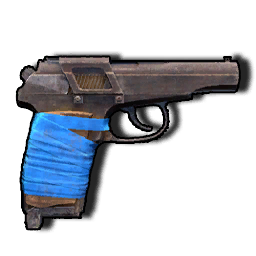
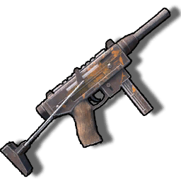
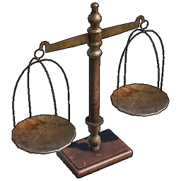
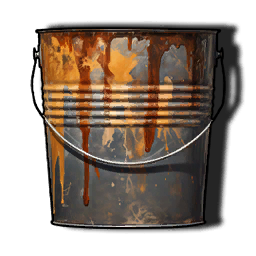

# Item list
All of the items currently in the game, with English localizations applied
This file is automatically generated from Sunkenland 0.1.34 using the SunkenDoc mod found on our GitHub.

|Item |Name |Item ID |Slot Type |Description |
|---|---|---|---|---|
|50 Cal Ammo |50 Cal Ammo|1|None|Ammunition for large-caliber machine guns and rifles.|
|B1_Black Powder |Black Powder|2|None|No translation found for '' in Item Description|
|Black Powder Ammo |Black Powder Ammo|3|None|Ammunition used in various types of black powder firearms.|
|Crude Grenade |Crude Grenade|4|None|Improvised explosive made from scrap metal.|
|Military Grenade |Military Grenade|5|None|Powerful modern military grenade.|
|Molotov |Molotov|6|None|A glass bottle filled with gasoline, which can cause sustained area burning when exploded.|
|Pistol Ammo |Pistol Ammo|7|None|Ammunition for modern pistols.|
|Rifle Ammo |Rifle Ammo|8|None|Ammunition for modern rifles.|
|Shotgun Ammo |Shotgun Ammo|9|None|Ammunition for modern shotguns.|
|Broken GP20 |Broken GP20|200|None|Can be crafted into a functional gun in a gun workshop.|
|Broken Hunting Rifle |Broken Hunting Rifle|201|None|Can be crafted into a functional gun in a gun workshop.|
|Broken PM |Broken PM|202|None|Can be crafted into a functional gun in a gun workshop.|
|Broken DE |Broken DEG 45|529|None|Can be crafted into a functional gun in a gun workshop.|
|Broken Old Bolt Action Rifle |Broken Old Bolt Action Rifle|208|None|Can be crafted into a functional gun in a gun workshop.|
|Broken Pump Shotgun |Broken Pump Shotgun|203|None|Can be crafted into a functional gun in a gun workshop.|
|Broken SMG |Broken SMG|204|None|Can be crafted into a functional gun in a gun workshop.|
|Broken Stun SMG |Broken Stun SMG|530|None|Can be crafted into a functional gun in a gun workshop.|
|Broken AK47 |Broken AK47|205|None|Can be crafted into a functional gun in a gun workshop.|
|Broken M14 |Broken M14|206|None|Can be crafted into a functional gun in a gun workshop.|
|Broken M16 |Broken M16|207|None|Can be crafted into a functional gun in a gun workshop.|
|A1_Crude Axe |Crude Axe|102|None||
|A2_Metal Axe |Twohand Axe|103|None||
|A3_Wooden Spear |Wooden Spear|104|None||
|C1_Bow |Bow|105|None||
|C2_Crossbow |Crossbow|106|None||
|C3_Arrow |Arrow|107|None||
|C3_Bolt |Crossbow Bolt|108|None|Ammo for crossbow.|
|Spiked Club |Spiked Club|109|None||
|Stone Hatchet |Stone Hatchet|110|None||
|Wooden Knife |Wooden Knife|111|None||
|A2B_Iron Axe |Iron Axe|112|None||
|A4_Iron Spear |Iron Spear|113|None||
|A4_Scrap Metal Spear |Scrap Metal Spear|114|None||
|Antique Flintlock Pistol |Antique Flintlock Pistol|115|None||
|Combat Knife |Combat Knife|116|None||
|Iron Mace |Iron Mace|117|None||
|Iron Sword |Iron Sword|118|None||
|Machete |Machete|119|None||
|Percussion Pistol |Percussion Pistol|120|None||
|Skull Crusher |Skull Crusher|121|None||
|Tripple Barrel Pistol |Tripple Barrel Pistol|122|None||
|A2_Scrap Pistol |Scrap Pistol|123|None||
|A3_Homemade Revolver |Homemade Revolver|124|None||
|A4_Double Barrel Shotgun |Double Barrel Shotgun|125|None||
|A4_PM |PM|126|None||
|A5_GP20 |GP20|127|None||
|B2_Pump Shotgun |Pump Shotgun|128|None||
|C1_SMG |SMG|129|None||
|C1_Stun SMG |Stun SMG|527|None||
|Crude Hunting Rifle |Hunting Rifle|130|None||
|DEG 45 |DEG 45|528|None||
|E1_Old Bolt Action Rifle |Old Bolt Action Rifle|131|None||
|G1_AK47 |AK47|132|None||
|M14 |M14|133|None||
|M16 |M16|134|None||
|Claw |Claw|135|None|N/A|
|Broken Footbal Helmet |Broken Football Helmet|190|None|Can be crafted into a new armor in an armor workshop.|
|Broken Tactical Vest |Broken Tactical Vest|191|None|Can be crafted into a new armor in an armor workshop.|
|Broken Army Helmet |Broken Tactical Helmet|192|None|Can be crafted into a new armor in an armor workshop.|
|Broken Army Vest |Broken Army Vest|193|None|Can be crafted into a new armor in an armor workshop.|
|Broken Motorcycle Helmet |Broken Motorcycle Helmet|195|None|Can be crafted into a new armor in an armor workshop.|
|Broken Police Helmet |Broken Police Helmet|196|None|Can be crafted into a new armor in an armor workshop.|
|Broken Police Vest |Broken Police Vest|197|None|Can be crafted into a new armor in an armor workshop.|
|Broken Special Force Armor |Broken Special Force Armor|198|None|Can be crafted into a new armor in an armor workshop.|
|Broken Special Force Helmet |Broken Special Force Helmet|199|None|Can be crafted into a new armor in an armor workshop.|
|Broken Tactical Armor |Broken Military Vest|194|None|Can be crafted into a new armor in an armor workshop.|
|A1 Warm Jacket |Warm Jacket|10|Clothes||
|A2_Thick Cloth Armor |Leather Armor|11|Armor||
|A3_Thick Cloth Helmet |Leather Helmet|12|Helmet||
|B1_Scrap Armor |Scrap Armor|13|Armor||
|B2_Scrap Helmet |Scrap Helmet|14|Helmet||
|C1_Combat Armor |Combat Armor|15|Armor||
|C2 Helmet Heavy2 |Iron Helmet|16|Helmet||
|D1 Shorts Kneedpads |Combat Kneepads|17|Pants||
|D2 TShirt_Pads |Iron Armor|18|Armor||
|Vest A |Vest A|19|Armor||
|Vest B |Vest B|20|Armor||
|Vest Black |Vest Black|21|Armor||
|Vest C |Vest C|22|Armor||
|Vest1 Forest |Vest1 Forest|23|Armor||
|Vest1 Sand |Vest1 Sand|24|Armor||
|Vest3 Navy |Vest3 Navy|25|Armor||
|A1 Vest3 Forest |Forest Combat Vest|26|Armor||
|A2 Helmet Football |Football Helmet|27|Helmet||
|A3 Motorcycle Helmet |Motorcycle Helmet|28|Helmet||
|B1 Vest Police |Police Vest|29|Armor||
|B2 Police Helmet |Police Helmet|30|Helmet||
|B6 Army Vest |Army Vest|31|Armor||
|C1 Tactical Vest |Tactical Vest|32|Armor||
|C2 Army Helmet |Tactical Helmet|33|Helmet||
|D1 Spetznaz Vest |Spetznaz Vest|34|Armor||
|D2 Spetsnaz Helmet |Spetsnaz Helmet|35|Helmet||
|A1_Sack |Sack|88|Backpack|Can increase some backpack capacity|
|A2_Backpack |Backpack|96|Backpack|Add more backpack capacity|
|A3_Military Backpack |Military Backpack|531|Backpack|Add more backpack capacity|
|B1_Seawater Bucket |Seawater Bucket|86|None|A bucket to hold seawater.|
|B2_Diving Fins |Diving Fins|92|Misc|Swim rapidly like a fish.|
|B2a_Scuba Diving Fins |Scuba Diving Fins|532|Misc|Swim rapidly like a fish.|
|B3_Fishing Rod |Fishing Rod|93|None|Used for catching small fish. Requires bait.|
|B3_Torch |Torch|85|None|Simple lighting tool that can illuminate a small area.|
|C1_Pickaxe |Pickaxe|89|None|Used for mining ores.|
|C2_Reparing Hammer |Reparing Hammer|90|None|Used for repairing and demolishing buildings.|
|C3_Packing Box |Packing Box|543|None|Used to pack placed objects back into your inventory.|
|D5_Water Bottle |Water Bottle|87|None|The container for fresh water.|
|E1_Small Air Tank |Small Air Tank|541|Rebreather|Increases diving time.|
|G1_Battery |Battery|97|None|Provides power for mobile electronic devices. scooters. Drag it to install. |
|G2_Metal Detector |Ore Detector|100|None|It detects anything metallic.|
|G3_HeadLight |Headlight|98|Misc|A strong headlamp with far-reaching light, perfect for illuminating the dark depths of the sea.|
|I1_Flare |Flare|94|None|Thrown to illuminate a wide area of land or even the pitch-black seabed.|
|Blueprint Blue Patterned Chair |Blueprint: Blue Patterned Chair|145|None|Right click to study this blueprint|
|Blueprint Concave Cabinet |Blueprint: Concave Cabinet|146|None|Right click to study this blueprint|
|Blueprint Desk |Blueprint: Desk|147|None|Right click to study this blueprint|
|Blueprint Floor Tile (Wooden) |Blueprint: Floor Tile (Wooden)|175|None|Right click to study this blueprint|
|Blueprint Plaid Couch |Blueprint: Plaid Couch|148|None|Right click to study this blueprint|
|Blueprint Red Cloth Sofa |Blueprint: Red Cloth Sofa|149|None|Right click to study this blueprint|
|Blueprint Solid Wood Cabinet |Blueprint: Solid Wood Cabinet|150|None|Right click to study this blueprint|
|Blueprint Square Table |Blueprint: Square Table|151|None|Right click to study this blueprint|
|Blueprint Wallpaper (Green) |Blueprint: Wallpaper (Green)|188|None|Right click to study this blueprint|
|Blueprint Armchair |Blueprint: Armchair|152|None|Right click to study this blueprint|
|Blueprint Backrest Chair |Blueprint: Backrest Chair|153|None|Right click to study this blueprint|
|Blueprint Black Leather Chair |Blueprint: Black Leather Chair|154|None|Right click to study this blueprint|
|Blueprint Black Leather Couch |Blueprint: Black Leather Couch|155|None|Right click to study this blueprint|
|Blueprint Collection Cabinet |Blueprint: Collection Cabinet|157|None|Right click to study this blueprint|
|Blueprint Counter |Blueprint: Counter|158|None|Right click to study this blueprint|
|Blueprint Double Door Wardrobe |Blueprint Double Door Wardrobe|159|None|Right click to study this blueprint|
|Blueprint Double Shelf |Blueprint: Double Shelf|160|None|Right click to study this blueprint|
|Blueprint Fireplace |Blueprint: Fireplace|161|None|Right click to study this blueprint|
|Blueprint Floor Tile (European) |Blueprint: Floor Tile (European)|173|None|Right click to study this blueprint|
|Blueprint Floor Tile (White Tiles) |Blueprint: Floor Tile (White Tiles)|174|None|Right click to study this blueprint|
|Blueprint Log Desk |Blueprint: Log Desk|162|None|Right click to study this blueprint|
|Blueprint Makeup Table |Blueprint: Makeup Table|163|None|Right click to study this blueprint|
|Blueprint Round Glass Table |Blueprint Round Glass Table|164|None|Right click to study this blueprint|
|Blueprint Round Table |Blueprint Round Table|165|None|Right click to study this blueprint|
|Blueprint Single bed |Blueprint: Single Bed|166|None|Right click to study this blueprint|
|Blueprint Wallpaper (Blue) |Blueprint: Wallpaper (Blue)|187|None|Right click to study this blueprint|
|Blueprint Wallpaper (Yellow) |Blueprint: Wallpaper (Yellow)|189|None|Right click to study this blueprint|
|Blueprint Chaise Leather Couch |Blueprint: Chaise Leather Couch|167|None|Right click to study this blueprint|
|Blueprint Crystal Chandelier |Blueprint: Crystal Chandelier|168|None|Right click to study this blueprint|
|Blueprint Double |Blueprint: Double Bed|169|None|Right click to study this blueprint|
|Blueprint European Chandelier |Blueprint: European Chandelier|170|None|Right click to study this blueprint|
|Blueprint European Leather Chair |Blueprint: European Leather Chair|171|None|Right click to study this blueprint|
|Blueprint Fish Tank |Blueprint: Fish Tank|172|None|Right click to study this blueprint|
|Blueprint French Sofa |Blueprint: French Sofa|176|None|Right click to study this blueprint|
|Blueprint Green Leather Couch |Blueprint: Green Leather Couch|177|None|Right click to study this blueprint|
|Blueprint Hanging Clocks |Blueprint: Hanging Clocks|178|None|Right click to study this blueprint|
|Blueprint Modern Floor Lamp |Blueprint: Modern Floor Lamp|179|None|Right click to study this blueprint|
|Blueprint Modern Garden Lamp |Blueprint: Modern Garden Lamp|180|None|Right click to study this blueprint|
|Blueprint Modern Lamp Post |Blueprint: Modern Lamp Post|181|None|Right click to study this blueprint|
|Blueprint Modern Wall Lamp |Blueprint: Modern Wall Lamp|182|None|Right click to study this blueprint|
|Blueprint Premium Fireplace |Blueprint: Premium Fireplace|183|None|Right click to study this blueprint|
|Blueprint Single Leather Couch |Blueprint: Single Leather Couch|184|None|Right click to study this blueprint|
|Blueprint TV |Blueprint: TV|185|None|Right click to study this blueprint|
|Blueprint Vintage Leather Couch |Blueprint: Vintage Leather Couch|186|None|Right click to study this blueprint|
|Blueprint Motor Boat |Blueprint: Motor Boat|136|None|Right click to study this blueprint|
|Blueprint Antique Flintlock Pistol |Blueprint: Antique Flintlock Pistol|137|None|Right click to study this blueprint|
|Blueprint Ore Detector |Blueprint: Ore Detector|534|None|Right click to study this blueprint|
|Blueprint Reinforced Structures |Blueprint: Reinforced Structures|138|None|Right click to study this blueprint|
|Blueprint Jetski |Blueprint: Jetski|139|None|Right click to study this blueprint|
|Blueprint Jetstream Bowrider |Blueprint: Jetstream Bowrider|535|None|Right click to study this blueprint|
|Blueprint Military Backpack |Blueprint: Military Backpack|536|None|Right click to study this blueprint|
|Blueprint Paint |Blueprint: Paint|144|None|Right click to study this blueprint|
|Blueprint Scuba Diving Fins |Blueprint:  Scuba Diving Fins|537|None|Right click to study this blueprint|
|Blueprint Helicopter |Blueprint: Light Helicopter|141|None|Right click to study this blueprint|
|Blueprint Large Generator |Blueprint: Large Generator|538|None|Right click to study this blueprint|
|Blueprint Marine Fast Boat |Blueprint: Marine Fast Boat|142|None|Right click to study this blueprint|
|Blueprint Military Grenade |Blueprint: Military Grenade|539|None|Right click to study this blueprint|
|Blueprint 50 Cal Ammo |Blueprint: 50 Cal Ammo|143|None|Right click to study this blueprint|
|BuildingItem||544|None|Decoration. Right click to place it.|
|2Layer TShirt A |Iron Armor|209|Clothes||
|2Layer TShirt B |2Layer TShirt B|210|Clothes||
|2Layer TShirt E |2Layer TShirt E|211|Clothes||
|A1_1a 2Layer TShirt C |Crude TShirt|212|Clothes||
|A2 Baggy Pants |Baggy Pants|213|Pants||
|A3 Zip Shoes |Zip Shoes|214|Shoes||
|Anime T Shirt |Anime T Shirt|339|Clothes||
|Bandage Boots |Bandage Boots|215|Shoes||
|Bandana Mouth Black |Bandana Mouth Black|216|Mask||
|Bandana Mouth Olive |Bandana Mouth Olive|217|Mask||
|Bandana Neck Black |Bandana Neck Black|218|Mask||
|Bandana Neck Sand |Bandana Neck Sand|219|Mask||
|Boots D |Boots D|220|Shoes||
|Boots Forest |Boots Forest|221|Shoes||
|Boots Navy |Boots Navy|222|Shoes||
|Boots1 A |Boots1 A|223|Shoes||
|Boots2 A |Boots2 A|224|Shoes||
|Bracer |Bracer|226|Gloves||
|Bracer C |Bracer C|225|Gloves||
|Breechcloth Pants |Breechcloth Pants|227|Pants||
|Camisole |Camisole|231|Clothes||
|Camisole A |Camisole A|228|Clothes||
|Camisole B |Camisole B|229|Clothes||
|Camisole D |Camisole D|230|Clothes||
|Canvas Shoes B |Canvas Shoes B|232|Shoes||
|Canvas Shoes C |Canvas Shoes C|233|Shoes||
|Canvas Shoes D |Canvas Shoes D|234|Shoes||
|Cargo Pants B |Cargo Pants B|235|Pants||
|Cargo Pants C |Cargo Pants C|236|Pants||
|Cargo Shorts A |Cargo Shorts A|237|Pants||
|Cargo Shorts B |Cargo Shorts B|238|Pants||
|Cargo Shorts C |Cargo Shorts C|239|Pants||
|Close collar longsleeves shirt C |Close collar longsleeves shirt C|240|Clothes||
|Close collar longsleeves shirt D |Close collar longsleeves shirt D|241|Clothes||
|Close collar short sleeves shirt E |Close collar short sleeves shirt E|242|Clothes||
|Corset B |Corset B|243|Clothes||
|Corset C |Corset C|244|Clothes||
|Fingerless Gloves Black |Fingerless Gloves Black|245|Gloves||
|Fingerless Gloves Brown |Fingerless Gloves Brown|246|Gloves||
|Flip-flops A |Flip-flops A|247|Shoes||
|Flip-flops C |Flip-flops C|248|Shoes||
|Flip-flops D |Flip-flops D|249|Shoes||
|Gas Mask A |Gas Mask A|250|Mask||
|Gas Mask B |Gas Mask B|251|Mask||
|Googles A |Googles A|252|Mask||
|Henley Longsleeve A |Henley Longsleeve A|253|Clothes||
|Henley Longsleeve B |Henley Longsleeve B|254|Clothes||
|Henley Longsleeve D |Henley Longsleeve D|255|Clothes||
|High-heels A |High-heels A|256|Shoes||
|High-heels B |High-heels B|257|Shoes||
|High-heels C |High-heels C|258|Shoes||
|High-heels D |High-heels D|259|Shoes||
|Jeans B |Jeans B|260|Pants||
|Jeans C |Jeans C|261|Pants||
|Jeans E |Jeans E|262|Pants||
|Jeans Rivets |Jeans Rivets|263|Pants||
|Knee Boots B |Knee Boots B|264|Shoes||
|Knee Boots C |Knee Boots C|265|Shoes||
|Knee Boots D |Knee Boots D|266|Shoes||
|Leather Jeans |Leather Jeans|267|Pants||
|Lobster Hood |Lobster Hood|546|Helmet||
|Low-rise Shorts B |Low-rise Shorts B|268|Pants||
|Low-rise Shorts C |Low-rise Shorts C|269|Pants||
|Low-rise Shorts D |Low-rise Shorts D|270|Pants||
|Mini Skirt A |Mini Skirt (Red)|271|Pants||
|Mini Skirt D |Mini Skirt D|272|Pants||
|Moccasins Boots |Moccasins Boots|273|Shoes||
|Open collar longsleeves shirt C |Open collar longsleeves shirt C|274|Clothes||
|Open collar longsleeves shirt F |Open collar longsleeves shirt F|275|Clothes||
|Open collar longsleeves shirt H |Open collar longsleeves shirt H|276|Clothes||
|Open collar longsleeves shirt I |Open collar longsleeves shirt I|277|Clothes||
|P Tucked-SH Forest |Tucked-SH Forest|278|Pants||
|P Tucked-SH Navy |Tucked-SH Navy|279|Pants||
|P Tucked-SH Sand |Tucked-SH Sand|280|Pants||
|Pants1 A |Pants1 A|281|Pants||
|Pants1 B |Pants1 B|282|Pants||
|Pants2 A |Pants2 A|283|Pants||
|Pants2 B |Pants2 B|284|Pants||
|Patched Pants |Patched Pants|285|Pants||
|Pencil Skirt A |Pencil Skirt A|286|Pants||
|Pencil Skirt D |Pencil Skirt D|287|Pants||
|Pencil Skirt E |Pencil Skirt E|288|Pants||
|Rocker Jeans |Rocker Jeans|289|Pants||
|S-Rolled Up Forest |Forest Camouflage Top|290|Clothes||
|S-Rolled Up Navy |Navy Camouflage Top|291|Clothes||
|S-Rolled Up Sand |Desert Camouflage Top|292|Clothes||
|Scrub Pants A |Scrub Pants A|293|Pants||
|Scrub Pants B |Scrub Pants B|294|Pants||
|Scrub Pants C |Scrub Pants C|295|Pants||
|Scrub Pants E |Scrub Pants E|296|Pants||
|Shirt B |Shirt B|297|Clothes||
|Shirt E |Shirt E|298|Clothes||
|Shirt-Standart Forest |Shirt-Standard Forest|299|Clothes||
|Shirt-Standart Navy |Shirt-Standard Navy|300|Clothes||
|Shirt-Standart Sand |Shirt-Standard Sand|301|Clothes||
|Shirt-Tactical Forest |Shirt-Tactical Forest|302|Clothes||
|Shirt-Tactical Navy |Shirt-Tactical Navy|303|Clothes||
|Shirt-Tactical Sand |Shirt-Tactical Sand|304|Clothes||
|Ski Mask A |Ski Mask A|305|Mask||
|Ski Mask B |Ski Mask B|306|Mask||
|Skinny Pants C |Skinny Pants C|307|Pants||
|Skinny Pants D |Skinny Pants D|308|Pants||
|Slacks B |Slacks B|309|Pants||
|Slacks C |Slacks C|310|Pants||
|Sleeves Tops B |Sleeves Top B|311|Clothes||
|Sleeves Tops C |Sleeves Top C|312|Clothes||
|Sleeves Tops D |Sleeves Top D|313|Clothes||
|Slip-ons A |Slip-ons A|314|Shoes||
|Slip-ons B |Slip-ons B|315|Shoes||
|Slip-ons C |Slip-ons C|316|Shoes||
|Slit Skirt B |Slit Skirt B|317|Pants||
|Slit Skirt C |Slit Skirt C|318|Pants||
|Slit Skirt D |Slit Skirt D|319|Pants||
|Sneakers B |Sneakers B|320|Shoes||
|Sneakers C |Sneakers C|321|Shoes||
|Sneakers D |Sneakers D|322|Shoes||
|Squirrel Hood |Squirrel Hood|547|Helmet||
|Style 2 |Style 2|323|Clothes||
|Style 3 |Style 3|324|Clothes||
|Style 5 |Style 5|325|Clothes||
|Style 6 |Style 6|326|Clothes||
|T-shirt A |T-shirt A|327|Clothes||
|T-shirt C |T-shirt C|328|Clothes||
|T-shirt D |T-shirt D|329|Clothes||
|Tank Top Anime |Anime Tank Top|334|Clothes||
|Tank Top B |Tank Top B|330|Clothes||
|Tank Top C |Tank Top C|331|Clothes||
|Tank Top D |Tank Top D|332|Clothes||
|Tank-Top Black |Tank-Top Black|333|Clothes||
|TShirt Black |T-Shirt Black|335|Clothes||
|TShirt Coyote |T-Shirt Coyote|336|Clothes||
|Tucked Pants |Tucked Pants|337|Pants||
|V Scrub Shirt A |V Scrub Shirt A|338|Clothes||
|White Gloves C |White Gloves C|340|Gloves||
|White Gloves D |White Gloves D|341|Gloves||
|Work Gloves A |Work Gloves A|342|Gloves||
|Work Gloves B |Work Gloves B|343|Gloves||
|Work Gloves C |Work Gloves C|344|Gloves||
|Algal Rug |Algal Rug|345|None|Decoration. Right click to place it.|
|Bike Toy |Toy Bike|346|None|Decoration. Right click to place it.|
|Blue Oil Bottle |Blue Oil Bottle|347|None|Decoration. Right click to place it.|
|Candlestick |Candlestick|348|None|Decoration. Right click to place it.|
|Carpet |Carpet|349|None|Decoration. Right click to place it.|
|Ceramic Bottle |Ceramic Bottle|350|None|Decoration. Right click to place it.|
|Colored Rug |Colored Rug|351|None|Decoration. Right click to place it.|
|Cooling Chair |Cooling Chair|352|None|Decoration. Right click to place it.|
|Darts Target |Darts Target|353|None|Decoration. Right click to place it.|
|Decorative Plate Stand |Decorative Plate Stand|354|None|Decoration. Right click to place it.|
|Delicate Chandelier |Delicate Chandelier|355|None|Decoration. Right click to place it.|
|Desk Clock |Desk Clock|356|None|Decoration. Right click to place it.|
|Easel Covered |Covered Easel|357|None|Decoration. Right click to place it.|
|Exquisite Wooden Shelf |Exquisite Wooden Shelf|358|None|Decoration. Right click to place it.|
|Exquisite Wooden Table |Exquisite Wooden Table|359|None|Decoration. Right click to place it.|
|Figure Rug |Figure Rug|360|None|Decoration. Right click to place it.|
|Fish Statue |Fish Statue|361|None|Decoration. Right click to place it.|
|Floor Mirror |Floor Mirror|362|None|Decoration. Right click to place it.|
|Game Console |Game Console|363|None|Decoration. Right click to place it.|
|Globe |Globe|364|None|Decoration. Right click to place it.|
|Handbag |Handbag|365|None|Decoration. Right click to place it.|
|Hanger |Hanger|366|None|Decoration. Right click to place it.|
|Horse Statue |Horse Statue|367|None|Decoration. Right click to place it.|
|Horse Toy |Horse Toy|368|None|Decoration. Right click to place it.|
|Household Desk Lamp |Household Desk Lamp|369|None|Decoration. Right click to place it.|
|Jewelry Casket |Jewelry Casket|370|None|Decoration. Right click to place it.|
|Lamp Table |Table Lamp|371|None|Decoration. Right click to place it.|
|Lamp Wall |Wall Lamp|372|None|Decoration. Right click to place it.|
|Lantern |Flashlight|373|None|Decoration. Right click to place it.|
|Large Vase |Large Vase|374|None|Decoration. Right click to place it.|
|Leather Suitcase |Leather Suitcase|375|None|Decoration. Right click to place it.|
|Mirror |Mirror|376|None|Decoration. Right click to place it.|
|Model Train |Model Train|377|None|Decoration. Right click to place it.|
|Moire |Moire|379|None|Decoration. Right click to place it.|
|Moire Ceramic |Moire Ceramic|378|None|Decoration. Right click to place it.|
|Neon Bestdayever |Neon Bestdayever|380|None|Decoration. Right click to place it.|
|Neon Cat |Neon Cat|381|None|Decoration. Right click to place it.|
|Neon Gamer |Neon Gamer|382|None|Decoration. Right click to place it.|
|Neon Guitar |Neon Guitar|383|None|Decoration. Right click to place it.|
|Neon Hotel |Neon Hotel|384|None|Decoration. Right click to place it.|
|Neon Money |Neon Money|385|None|Decoration. Right click to place it.|
|Neon Nightclub |Neon Nightclub|386|None|Decoration. Right click to place it.|
|Neon Peace |Neon Peace|387|None|Decoration. Right click to place it.|
|Neon Route66 |Neon Route66|388|None|Decoration. Right click to place it.|
|Neon Woman 1 |Neon Woman 1|389|None|Decoration. Right click to place it.|
|Neon Woman 2 |Neon Woman 2|390|None|Decoration. Right click to place it.|
|Oil Painting(Birds Singing and Flowers Fragrant) |Oil Painting(Birds Singing and Flowers Fragrant)|391|None|Decoration. Right click to place it.|
|Oil Painting(Comfortable) |Oil Painting(Comfortable)|392|None|Decoration. Right click to place it.|
|Oil Painting(Deep in the Valley) |Oil Painting(Deep in the Valley)|393|None|Decoration. Right click to place it.|
|Oil Painting(Desert Oasis) |Oil Painting(Desert Oasis)|394|None|Decoration. Right click to place it.|
|Oil Painting(Divine Tree) |Oil Painting (Divine Tree)|395|None|Decoration. Right click to place it.|
|Oil Painting(Forgotten Castle) |Oil Painting(Forgotten Castle)|396|None|Decoration. Right click to place it.|
|Oil Painting(Fox in Birch Forest) |Oil Painting (Fox in Birch Forest)|397|None|Decoration. Right click to place it.|
|Oil Painting(Happy Childhood) |Oil Painting(Happy Childhood)|398|None|Decoration. Right click to place it.|
|Oil Painting(King Castle) |Oil Painting(King Castle)|399|None|Decoration. Right click to place it.|
|Oil Painting(Landscape Dusk) |Oil Painting(Landscape Dusk)|400|None|Decoration. Right click to place it.|
|Oil Painting(Lotus) |Oil Painting(Lotus)|401|None|Decoration. Right click to place it.|
|Oil Painting(Rural Life) |Oil Painting (Rural Life)|402|None|Decoration. Right click to place it.|
|Oil Painting(Small Stream in the Forest) |Oil Painting (Small Stream in the Forest)|403|None|Decoration. Right click to place it.|
|Oil Painting(Valley Dusk) |Oil Painting(Valley Dusk)|404|None|Decoration. Right click to place it.|
|Oil Painting(Wilderness Scenery) |Oil Painting(Wilderness Scenery)|405|None|Decoration. Right click to place it.|
|Old Clock |Old Clock|406|None|Decoration. Right click to place it.|
|Old Desk Lamp |Old Desk Lamp|407|None|Decoration. Right click to place it.|
|Old Style Storage Shelf |Old Style Storage Shelf|408|None|Decoration. Right click to place it.|
|Owl Toy |Owl Toy|409|None|Decoration. Right click to place it.|
|Pan |Pan|410|None|Decoration. Right click to place it.|
|Patterned Blue and White Pottery |Patterned Blue and White Pottery|411|None|Decoration. Right click to place it.|
|Patterned Bronze Ware |Patterned Bronze Ware|412|None|Decoration. Right click to place it.|
|Patterned Circular Porcelain |Patterned Circular Porcelain|540|None|Decoration. Right click to place it.|
|Plane Toy |Toy Plane|414|None|Decoration. Right click to place it.|
|Racing Model |Racing Model|415|None|Decoration. Right click to place it.|
|Radio |Radio|416|None|Decoration. Right click to place it.|
|Record Player Disk 1 |Record Player Disk 1|417|None|Decoration. Right click to place it.|
|Record Player Disk 2 |Record Player Disk 2|418|None|Decoration. Right click to place it.|
|Record Player Disk 3 |Record Player Disk 3|419|None|Decoration. Right click to place it.|
|Red Rug |Red Rug|420|None|Decoration. Right click to place it.|
|Red Sofa Chair |Red Sofa Chair|421|None|Decoration. Right click to place it.|
|Retro Rug |Retro Rug|422|None|Decoration. Right click to place it.|
|Rubber Duck |Rubber Duck|413|None|Decoration. Right click to place it.|
|Rug |Rug|423|None|Decoration. Right click to place it.|
|Sand Watch |Sand Watch|424|None|Decoration. Right click to place it.|
|Scales |Scales|425|None|Decoration. Right click to place it.|
|Silly Cookies |Silly Cookies|545|None|Decoration. Right click to place it.|
|Small Globe |Small Globe|426|None|Decoration. Right click to place it.|
|Sofa Chair |Sofa Chair|427|None|Decoration. Right click to place it.|
|Solid Wood Shelf |Solid Wood Shelf|428|None|Decoration. Right click to place it.|
|Stone Elephant |Stone Elephant|429|None|Decoration. Right click to place it.|
|Striped Rug |Striped Rug|430|None|Decoration. Right click to place it.|
|Sword Wall |Decorative Sword|431|None|Decoration. Right click to place it.|
|Telephone Old |Old Telephone |432|None|Decoration. Right click to place it.|
|Toy Bear |Toy Bear|433|None|Decoration. Right click to place it.|
|Vanity Mirror |Vanity Mirror|434|None|Decoration. Right click to place it.|
|Vinyl Machine |Vinyl Machine|435|None|Decoration. Right click to place it.|
|Violin |Violin|436|None|Decoration. Right click to place it.|
|Wall Clock |Wall Clock|437|None|Decoration. Right click to place it.|
|Wallet |Wallet|438|None|Decoration. Right click to place it.|
|Wanghai Reef |Wanghai Reef|439|None|Decoration. Right click to place it.|
|Weighing Scale |Weighing Scale|440|None|Decoration. Right click to place it.|
|Wooden Chair |Wooden Chair|441|None|Decoration. Right click to place it.|
|Baked Beans |Baked Beans|442|None||
|Candy Bar |Candy Bar|443|None||
|Energy Drink |Energy Drink|444|None||
|Food Can |Food Can|445|None||
|Gummy Duck |Gummy Ducky|542|None||
|Instant Ramen |Instant Ramen|446|None||
|Pudding |Pudding|447|None||
|Soda |Soda|448|None||
|Bird Meat |Bird Meat|449|None||
|Cabbage |Cabbage|450|None||
|Coffee Bean |Coffee Bean|451|None||
|Crab Meat |Crab Meat|452|None||
|F3_Tarpon |Tarpon|453|None||
|F4_Wahoo |Wahoo|454|None||
|F7_Red Snapper |Red Snapper|455|None||
|F8_Bream |Bream|456|None||
|Large Fish Meat |Large Fish Meat|457|None||
|Lemon |Lemon|458|None||
|Mushroom |Mushroom|459|None||
|Potato |Potato|460|None||
|Raw Meat |Raw Meat|461|None||
|Red Algae |Red Algae|462|None||
|Scallop |Scallop|463|None||
|Strawberry |Strawberry|464|None||
|Bottle Of Water |Bottle Of Water|465|None||
|F3_Roasted Tarpon |Roasted Wahoo|466|None||
|F4_Roasted Wahoo |Roasted Wahoo|467|None||
|F7_Roasted Red Snapper |Roasted Red Snapper|468|None||
|F8_Roasted Bream |Roasted Bream|469|None||
|Roasted Bird Meat |Roasted Bird Meat|470|None||
|Roasted Cabbage |Roasted Cabbage|471|None||
|Roasted Crab |Roasted Crab|472|None||
|Roasted Fish |Roasted Fish|473|None||
|Roasted Meat |Roasted Meat|474|None||
|Roasted Mushroom |Roasted Mushroom|475|None||
|Roasted Potato |Roasted Potato|476|None||
|Roasted Scallop |Roasted Scallop|477|None||
|Water |Water|478|None||
|Bush Seed |Bush Seed|479|None||
|Cabbage Seed |Cabbage Seed|480|None||
|Cotton Seeds |Cotton Seeds|481|None||
|Fishing Bait |Fishing Bait|482|None||
|Lemon Seeds |Lemon Seeds|483|None||
|Strawberry Seeds |Strawberry Seeds|484|None||
|A1 Salad |Salad|485|None|+30 hydration and food level, increases stamina recovery speed.|
|A2 Seafood Platter |Seafood Platter|486|None|Completely restores food level and increases maximum health by 50.|
|A3 Fish Stew |Fish Stew|487|None|Completely restores hydration and food level, and enhances swimming and diving abilities.|
|A4 Bird Meat Mushroom Soup |Mushroom Bird Soup|488|None|No translation found for 'Description Bird Meat Mushroom Soup' in Item Description|
|A5 Alcohol |Alcohol|489|None|Used for crafting molotov cocktails.|
|Baked Fish with Lemon |Baked Fish with Lemon|490|None||
|Coffee |Coffee|491|None||
|Coral Smoothie |Coral Smoothie|492|None||
|Crab Cakes |Crab Cakes|493|None||
|Roasted Lemon Bird |Roasted Lemon Bird|494|None||
|Steak Meal |Steak Meal|495|None||
|Strawberry And Lemon Smoothie |Strawberry And Lemon Smoothie|496|None||
|Orange Coral |Orange Coral|36|None||
|Purple Flower |Purple Flower|37|None||
|Red Flower |Red Flower|38|None||
|White Flower |White Flower|39|None||
|A1_Rope |Rope|40|None|It's used to connect things.|
|A2_Cloth |Cloth|41|None|Basic material used for crafting armor, ropes, and some furniture.|
|A3_Components |Components|42|None|Items like bolts, wires, nails, and the like.|
|Advanced Alloy |Advanced Alloy|70|None|Advanced crafting material.|
|Advanced Parts |Advanced Parts|67|None|Used for advanced machinery.|
|B1_Smokeless Powder |Smokeless Powder|60|None|Ingredient for modern ammo making.|
|Ballistic Fiber |Ballistic Fiber|61|None|Used for crafting advanced armor.|
|Charcoal |Charcoal|43|None|Mainly used for crafting black powder ammunition.|
|D_Gun Parts |Gun Parts|53|None|Used for crafting modern firearms.|
|E_Electronic Parts |Electronic Parts|54|None|Required for crafting electronic devices.|
|Fine Wood Plank |Fine Wood Plank|62|None|Used for crafting luxury furniture.|
|Glass |Glass|44|None|Used to craft bottles and some structures.|
|H_Copper Ingot |Copper Ingot|63|None|No translation found for '' in Item Description|
|H_Copper Ore |Copper Ore|64|None|Can be melted in a furnace to create copper ingots.|
|H_Cotton |Cotton|45|None|Raw material for crafting fabric.|
|H_Duct Tape |Duct Tape|46|None|Might be used in crafting certain items.|
|Hide |Hide|55|None|Obtained from animals and can be processed into leather.|
|I_Gasoline |Gasoline|56|None|Used to provide engine power for boats and can also be used for generating electricity.|
|Iron Ingot |Iron Ingot|57|None|Used for crafting modern ammo and electronic devices.|
|Iron Ore |Iron Ore|58|None|Can be melted in a furnace to create iron ingots.|
|J_Chemical Substance |Chemical Substance|65|None|Used for making ammo, producing gas, and more.|
|Leather |Leather|59|None|Used for building home decorations.|
|Marble |Marble|68|None|Used for home decoration.|
|Marlin Fish Skin |Marlin Fish Skin|47|None|Can be used to craft various items such as diving fins, armor, and more.|
|Paint |Paint|66|None|Used for creating wallpapers and floors.|
|Polymer |Polymer|71|None|Advanced crafting material.|
|Rubber |Rubber|48|None|Has multiple uses.|
|Scrap Metal |Scrap Metal|49|None|Usually found underwater.|
|Shark Skin |Shark Skin|50|None|Perhaps could be used to craft some props.|
|Steel Igot |Steel Ingot|69|None|Harder than iron.|
|Sulfur |Sulfur|51|None|Used to make black powder.|
|Wood Plank |Wood Plank|52|None|Has a wide range of uses. Obtained by chopping down trees or wooden furniture.|
|A1_Bandage |Bandage|72|None|Used for stopping bleeding.|
|A2_Herbal Medicine |Herbal Medicine|73|None|Restores a small amount of health points.|
|A3_Lung Capacity Booster |Lung Function Booster|74|None|Increases diving time temporarily|
|A3_Stamina Mix |Stamina Herbal Mix|75|None|Temporarily increases stamina recovery speed.|
|Antibiotics |Antibiotics|76|None|Restores a significant amount of health points.|
|Orange Coral |Orange Coral|77|None||
|Converter|No translation found for '' in Interactable|78|None||
|MainBoard|No translation found for '' in Interactable|79|None||
|MotorCoil|No translation found for '' in Interactable|80|None||
|Note1||81|None||
|PDA#1|No translation found for '' in Interactable|82|None||
|Pirate Hideout Key||83|None||
|SwipeCard|No translation found for '' in Interactable|84|None||
|Catamaran Controller |Catamaran Controller|497|None|Used to unlock boats on the research table.|
|Catamaran Hull |Catamaran Hull|498|None|Used to unlock boats on the research table.|
|Catamaran Sail |Catamaran Sail|499|None|Used to unlock boats on the research table.|
|Helicopter Console |Helicopter Console|500|None|Used to unlock boats on the research table.|
|Helicopter Empennage |Helicopter Stabilizer|501|None|Used to unlock boats on the research table.|
|Helicopter Engine |Helicopter Engine|502|None|Used to unlock boats on the research table.|
|Helicopter Gas Tank |Helicopter Gas Tank|503|None|Used to unlock boats on the research table.|
|Helicopter Propeller |Helicopter Propeller|504|None|Used to unlock boats on the research table.|
|Jetski Controls |Jetski Controls|505|None|Used to unlock boats on the research table.|
|Jetski Engine |Jetski Engine|506|None|Used to unlock boats on the research table.|
|Jetski Gas Tank |Jetski Gas Tank|507|None|Used to unlock boats on the research table.|
|Jetski Jet Pump |Jetski Jet Pump|508|None|Used to unlock boats on the research table.|
|Jetstream Bowrider Console |Jetstream Bowrider Console|509|None|Used to unlock boats on the research table.|
|Jetstream Bowrider Engine |Jetstream Bowrider Engine|510|None|Used to unlock boats on the research table.|
|Jetstream Bowrider Hull |Jetstream Bowrider Hull|511|None|Used to unlock boats on the research table.|
|Marine Fast Boat Console |Marine Fast Boat Console|512|None|Used to unlock boats on the research table.|
|Marine Fast Boat Engine |Marine Fast Boat Engine|513|None|Used to unlock boats on the research table.|
|Marine Fast Boat Hull |Marine Fast Boat Hull|514|None|Used to unlock boats on the research table.|
|Motorboat Engine |Motorboat Engine|515|None|Used to unlock boats on the research table.|
|Motorboat Gas Tank |Motorboat Gas Tank|516|None|Used to unlock boats on the research table.|
|Motorboat Hull |Motorboat Hull|517|None|Used to unlock boats on the research table.|
|C3_Binocular |Binocular|91|None|Use it to observe distant areas.|
|Cigar |Cigar|518|None|Quite valuable, selling to traders might yield a significant profit.|
|Expensive Wine |Expensive Wine|519|None|Quite valuable, selling to traders might yield a significant profit.|
|High-end  Perfume |High-end  Perfume|520|None|Quite valuable, selling to traders might yield a significant profit.|
|High-end Watch |High-end Watch|521|None|Quite valuable, selling to traders might yield a significant profit.|
|Jewelry |Diamond Ring|522|None|Quite valuable, selling to traders might yield a significant profit.|
|Magazine |Magazine|523|None|Quite valuable, selling to traders might yield a significant profit.|
|Mobile Phone |Mobile Phone|524|None|Quite valuable, selling to traders might yield a significant profit.|
|Silver Coins |Silver Coins|525|None|Quite valuable, selling to traders might yield a significant profit.|
|Zippo |Zippo|526|None|Quite valuable, selling to traders might yield a significant profit.|
|Alternative Gun Sight |Reddot Gun Sight|99|Misc|Can target enemies further away.|
|UNDERWATER SCOOTER |Underwater Scooter|101|None|Can increase swimming speed.|
