# Piece list
All of the pieces currently in the game.
This file is automatically generated from Sunkenland 0.1.34 using the SunkenDoc mod found on our GitHub.
# Building List

|Piece |Building ID |Name |Description |Resources required |
|---|---|---|---|---|
|D1_Gridiron 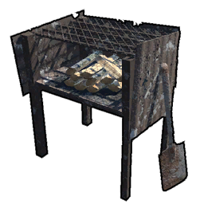|1|Simple Grill|Cooks raw foods for more nutrition.|<ul><li>15 Scrap Metal</li></ul>|
|D3_Simple Purifier |2|Simple Purifier|Converts seawater into fresh water.|<ul><li>10 Wood Plank</li><li>10 Scrap Metal</li><li>3 A3_Components</li></ul>|
|F1_Stove 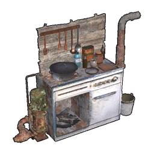|3|Stove|Can be used to cook more nutritious meals.|<ul><li>15 Scrap Metal</li><li>8 A3_Components</li><li>4 Iron Ingot</li></ul>|
|G1_Fishnet 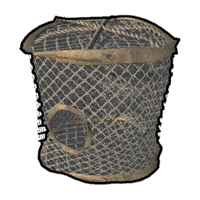|4|Fishnet|It automatically catches small fish.|<ul><li>3 A1_Rope</li><li>2 A3_Components</li></ul>|
|G2_Planter 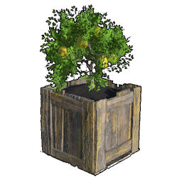|5|Planter|Used for planting various types of fruits, vegetables, and shrubs.|<ul><li>12 Wood Plank</li><li>2 A2_Cloth</li></ul>|
|D2_Improved Gridiron |6|Improved Grill|Faster cooking, saving wood, more charcoal.|<ul><li>15 Scrap Metal</li><li>8 A3_Components</li><li>5 Rubber</li></ul>|
|D4_Advanced Purifier |7|Advanced Purifier|Pumps and distills seawater, accelerates purification.|<ul><li>5 Iron Ingot</li><li>8 A3_Components</li><li>8 Rubber</li><li>8 Glass</li></ul>|
|Fish Tank |8|Fish Tank|No translation found for '' in Item Description|<ul><li>30 Glass</li><li>20 Scrap Metal</li><li>10 E_Electronic Parts</li></ul>|
|A1_Research Table |9|Research Table|Used to unlock more constructible items and base facilities.|<ul><li>15 Wood Plank</li><li>10 Scrap Metal</li><li>4 A3_Components</li></ul>|
|AirFillingStation 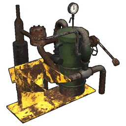|10|Air Filling Station|Manually refills your air tanks.|<ul><li>12 Scrap Metal</li><li>4 Iron Ingot</li><li>8 Rubber</li></ul>|
|B1_Furnace |11|Furnace|Can be used to convert ores into metal ingots.|<ul><li>15 Wood Plank</li><li>15 Scrap Metal</li><li>8 Rubber</li></ul>|
|B2_Avil 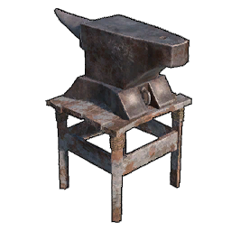|12|Anvil|Used for crafting advanced metal weapons.|<ul><li>13 Scrap Metal</li><li>4 Iron Ingot</li></ul>|
|Battery Charger |13|Battery Charger|Used to charge batteries. Requires power source.|<ul><li>2 H_Copper Ingot</li><li>5 A3_Components</li><li>3 E_Electronic Parts</li></ul>|
|C1_Gun Workshop |14|Gun Workshop|Workshop used for crafting modern firearms.|<ul><li>15 Scrap Metal</li><li>10 A3_Components</li><li>4 Iron Ingot</li></ul>|
|C2_Ammo Workshop |15|Ammo Workshop|Used for crafting modern ammunition.|<ul><li>15 Scrap Metal</li><li>10 Rubber</li><li>5 H_Copper Ingot</li></ul>|
|C3_Armor Workshop |16|Armor Workshop|Used for crafting modern helmets and bulletproof vests.|<ul><li>15 Wood Plank</li><li>10 Scrap Metal</li><li>6 A2_Cloth</li></ul>|
|C5 Small Generator |17|Small Generator|Provides power to various electrical devices. Consumes fuel.|<ul><li>6 Iron Ingot</li><li>6 A3_Components</li><li>6 E_Electronic Parts</li></ul>|
|C8_Sawmill 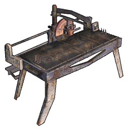|18|Sawmill|Process regular wooden planks into refined wooden planks.|<ul><li>15 Scrap Metal</li><li>5 A3_Components</li><li>5 E_Electronic Parts</li></ul>|
|C9 Decompose Table |19|Recycler|Drag unused items into it to dismantle and obtain partial raw materials.|<ul><li>15 Scrap Metal</li><li>5 A3_Components</li><li>5 E_Electronic Parts</li></ul>|
|H_Biofuel Lab |20|Biofuel Lab|Used for crafting fuel.|<ul><li>8 Iron Ingot</li><li>15 Glass</li><li>10 Rubber</li></ul>|
|Large Generator |21|Large Generator|A larger generator that can connect more electrical devices and is more fuel-efficient.|<ul><li>10 Steel Igot</li><li>5 Advanced Parts</li><li>10 E_Electronic Parts</li></ul>|
|RepairStation |149|Repair Station|Can be used to repair equipment.|<ul><li>8 Scrap Metal</li><li>3 A3_Components</li></ul>|
|Steel Furnace |22|Steel Furnace|Can be used to convert ores into metal ingots.|<ul><li>15 Iron Ingot</li><li>10 E_Electronic Parts</li><li>5 Advanced Parts</li></ul>|
|A1_Wooden Foundation |23|Wooden Foundation|The foundation of base construction.|<ul><li>6 Wood Plank</li></ul>|
|A2_Metal Foundation |24|Metal Foundation|The foundation of base construction.|<ul><li>6 Scrap Metal</li></ul>|
|B2_Reinforced Foundation |25|Reinforced Foundation|The foundation of base construction.|<ul><li>1 Iron Ingot</li></ul>|
|E1_WoodenWall 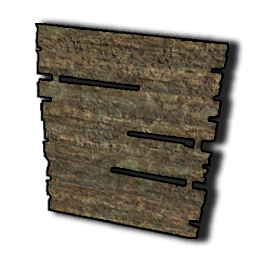|26|Wooden Wall|Can only be built on foundations and floors.|<ul><li>3 Wood Plank</li></ul>|
|E2_WoodenWallWithDoorSlot 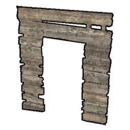|27|Wooden Wall With Door Slot|Can only be built on foundations and floors.|<ul><li>3 Wood Plank</li></ul>|
|E3_WoodenWallWithWindow 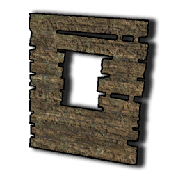|28|Wooden Wall With Window|Can only be built on foundations and floors.|<ul><li>3 Wood Plank</li></ul>|
|E4_Wooden Floor |29|Wooden Floor|Can only be built on pillars.|<ul><li>3 Wood Plank</li></ul>|
|E5_Wooden Column |30|Wooden Pillar|Used to support upper structures.|<ul><li>3 Wood Plank</li></ul>|
|E6_Wooden Roof |31|Wooden Roof|Can only be built on pillars.|<ul><li>3 Wood Plank</li></ul>|
|E7_WoodenDoor |53|Wooden Door|Can be attached to door frames.|<ul><li>3 Wood Plank</li></ul>|
|E8_WoodenWindow 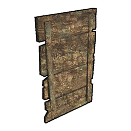|54|Wooden Window|Can be attached to window frames.|<ul><li>3 Wood Plank</li></ul>|
|F1_Metal Wall |32|Metal Wall|Can only be built on foundations and floors.|<ul><li>3 Scrap Metal</li></ul>|
|F2_Metal Wall WIth Door |33|Metal Wall With Door|Can only be built on foundations and floors.|<ul><li>3 Scrap Metal</li></ul>|
|F3_Metal Wall With Window |34|Metal Wall With Window|Can only be built on foundations and floors.|<ul><li>3 Scrap Metal</li></ul>|
|F4_Metal Floor |35|Metal Floor|Can only be built on pillars.|<ul><li>3 Scrap Metal</li></ul>|
|F5_Metal Door |46|Metal Door|Can be attached to door frames.|<ul><li>3 Scrap Metal</li></ul>|
|F6_Metal Window |47|Metal Window|Can be attached to window frames.|<ul><li>3 Scrap Metal</li></ul>|
|G1_Glass Wall |39|Glass Wall|Can only be built on foundations and floors.|<ul><li>2 Scrap Metal</li><li>2 Glass</li></ul>|
|G1_Reinforced Wall |40|Reinforced Wall|Can only be built on foundations and floors.|<ul><li>1 Iron Ingot</li></ul>|
|G2_Reinforced Wall With Door |41|Reinforced Wall With Door|Can only be built on foundations and floors.|<ul><li>1 Iron Ingot</li></ul>|
|G3_Reinforced Wall With Window |42|Reinforced Wall With Window|Can only be built on foundations and floors.|<ul><li>1 Iron Ingot</li></ul>|
|G4_Reinforced Door |48|Reinforced Door|Can be attached to door frames.|<ul><li>1 Iron Ingot</li></ul>|
|G5_Reinforced Window |49|Reinforced Window|Can be attached to window frames.|<ul><li>1 Iron Ingot</li></ul>|
|H4_Metal Column |43|Metal Column|Used to support upper structures.|<ul><li>2 Scrap Metal</li></ul>|
|J1_Wooden Stairs |150|Wooden Stairs|No translation found for 'New Entry 1' in Building|<ul><li>6 Wood Plank</li></ul>|
|J2_Wooden Ladder |44|Wooden Ladder|Can be attached to foundations and floors.|<ul><li>4 Wood Plank</li></ul>|
|J3_Metal Stairs |151|Metal Stairs|No translation found for 'New Entry 1' in Building|<ul><li>6 Scrap Metal</li></ul>|
|J4_Metal Ledder |45|Metal Ladder|Can be attached to foundations and floors.|<ul><li>4 Scrap Metal</li></ul>|
|K1_Wallpaper (Blue) |50|Wallpaper (Blue)|Can be built on any wall.|<ul><li>5 Wood Plank</li><li>1 Paint</li></ul>|
|K2_Metal Roof |141|Metal Roof|Can only be built on pillars.|<ul><li>2 Scrap Metal</li></ul>|
|K2_Wallpaper (Green) |51|Wallpaper (Green)|Can be built on any wall.|<ul><li>5 Wood Plank</li><li>1 Paint</li></ul>|
|K3_Wallpaper (Yellow) |52|Wallpaper (Yellow)|Can be built on any wall.|<ul><li>5 Wood Plank</li><li>1 Paint</li></ul>|
|L1_Floor Tile (European) |36|Floor Tile (European)|Can be attached to foundations and floors.|<ul><li>5 Wood Plank</li><li>1 Paint</li></ul>|
|L2_Floor Tile (White Tiles) |37|Floor Tile (White Tiles)|Can be attached to foundations and floors.|<ul><li>5 Wood Plank</li><li>1 Paint</li></ul>|
|L3_Floor Tile (Wooden) |38|Floor Tile (Wooden)|Can be attached to foundations and floors.|<ul><li>5 Wood Plank</li><li>1 Paint</li></ul>|
|Wallpaper With Door |142|Wallpaper (Blue)|Can be built on any wall.|<ul><li>2 Wood Plank</li></ul>|
|Wallpaper With Door_1 |143|Wallpaper (Green)|Can be built on any wall.|<ul><li>2 Wood Plank</li></ul>|
|Wallpaper With Door_2 |144|Wallpaper (Yellow)|Can be built on any wall.|<ul><li>2 Wood Plank</li></ul>|
|Wallpaper With Window |145|Wallpaper (Blue)|Can be built on any wall.|<ul><li>2 Wood Plank</li></ul>|
|Wallpaper With Window_1 |146|Wallpaper (Green)|Can be built on any wall.|<ul><li>2 Wood Plank</li></ul>|
|Wallpaper With Window_2 |147|Wallpaper (Yellow)|Can be built on any wall.|<ul><li>2 Wood Plank</li></ul>|
|A1_Wooden Defensive Wall |55|Wooden Defensive Wall|Wooden defensive wall that can be used to enclose your base.|<ul><li>10 Wood Plank</li></ul>|
|A2_Wooden Gate |56|Wooden Gate|Wooden door that can be opened and closed.|<ul><li>15 Wood Plank</li></ul>|
|B1_Metal Defensive Wall |57|Metal Defensive Wall|Even sturdier defensive wall.|<ul><li>10 Scrap Metal</li></ul>|
|B2_Metal Gate |58|Metal Gate|Even sturdier metal door that can be opened and closed.|<ul><li>15 Scrap Metal</li></ul>|
|C1_Wooden Barricade |59|Wooden Barricade|Simple barricade that can obstruct invaders.|<ul><li>5 Wood Plank</li></ul>|
|C2_Barbed Wire |60|Barbed Wire|Simple barricade that can obstruct invaders.|<ul><li>6 Scrap Metal</li></ul>|
|D1_Barricade 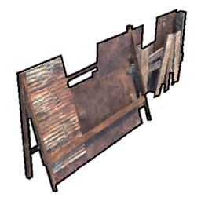|61|Barricade|Simple wooden cover that can be crouched behind for shooting.|<ul><li>6 Scrap Metal</li><li>4 Wood Plank</li></ul>|
|D2_Reinforced Barricade |62|Reinforced Barricade|Sturdy metal cover that can withstand gunfire, providing you with maximum protection.|<ul><li>4 Scrap Metal</li><li>1 Iron Ingot</li></ul>|
|E1_Metal Armor Plate |63|Metal Armor Plate|Small armor plates that can be attached anywhere to reinforce and provide protection.|<ul><li>2 Scrap Metal</li></ul>|
|E1_Tire Stack |64|Tire Stack|A pile of discarded tires for creating makeshift cover.|<ul><li>4 Rubber</li></ul>|
|F1_Heavy Machine Gun |65|Heavy Machine Gun|Stationary heavy weapon that can rotate. Uses large caliber ammunition.|<ul><li>25 Scrap Metal</li><li>12 D_Gun Parts</li><li>8 Steel Igot</li><li>4 Advanced Parts</li></ul>|
|G1_Siren 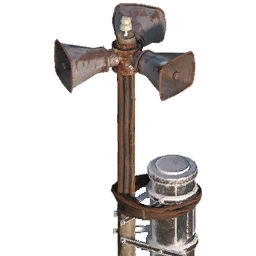|66|Siren|A high pitch alarm system.|<ul><li>10 Wood Plank</li><li>10 Scrap Metal</li><li>8 E_Electronic Parts</li></ul>|
|G2_Detector 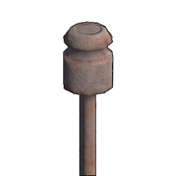|67|Detector|Activates nearby alarms when enemies enter its range.|<ul><li>8 Scrap Metal</li><li>2 E_Electronic Parts</li></ul>|
|Wall Spike |68|Wall Spikes|Mounted on walls and damages enemies upon contact.|<ul><li>6 Wood Plank</li><li>6 Scrap Metal</li></ul>|
|Wall Trap |69|Wall Trap|Mounted on walls, nearby enemies trigger dropping heavy objects.|<ul><li>10 Wood Plank</li><li>10 Scrap Metal</li></ul>|
|A0_Simple Bed |70|Simple Bed|Sleep to pass the night and restore stamina. Be cautious not to disrupt your sleep schedule.|<ul><li>10 Wood Plank</li><li>3 A2_Cloth</li></ul>|
|A1Marker Flag |71|Marker Flag|Place it to mark a location.|<ul><li>5 Wood Plank</li><li>1 A2_Cloth</li></ul>|
|B1_Wooden Chest |72|Wooden Chest|Used for storing items.|<ul><li>10 Wood Plank</li></ul>|
|B2_Metal Chest |73|Metal Chest|Used for storing items.|<ul><li>10 Scrap Metal</li></ul>|
|B3_Ammo Box |74|Ammo Box|Used for storing items.|<ul><li>15 Wood Plank</li><li>2 A3_Components</li></ul>|
|B4_Food Container |75|Food Container|Used for storing items.|<ul><li>10 Scrap Metal</li><li>2 A3_Components</li></ul>|
|B5_ToolBox 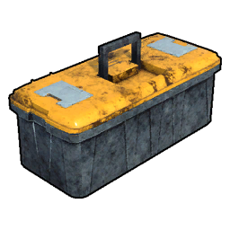|76|Tool Box|Used for storing items.|<ul><li>5 Scrap Metal</li><li>5 A3_Components</li></ul>|
|B6_Metal Barrel |77|Metal Barrel|Used for storing items.|<ul><li>12 Scrap Metal</li></ul>|
|B7_Fridge |78|Fridge|Used for storing items.|<ul><li>15 Scrap Metal</li><li>5 E_Electronic Parts</li></ul>|
|Blue Patterned Chair |79|Blue Patterned Chair|Decorative Furniture|<ul><li>6 Wood Plank</li><li>1 A2_Cloth</li></ul>|
|Concave Cabinet |80|Concave Cabinet|Used for storing items.|<ul><li>10 Wood Plank</li></ul>|
|D1_Wooden Shelving |81|Wooden Shelving|Used for storing wooden planks.|<ul><li>10 Wood Plank</li></ul>|
|D3_Metal Shelving |82|Metal Shelving|Used for storing scrap metal.|<ul><li>12 Scrap Metal</li></ul>|
|Desk 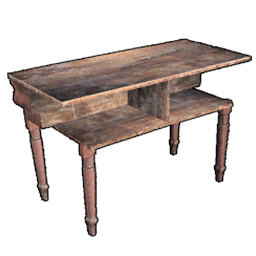|83|Desk|Decorative Furniture|<ul><li>8 Wood Plank</li></ul>|
|Humble Chair |84|Humble Chair|Decorative Furniture|<ul><li>5 Wood Plank</li></ul>|
|Humble Sofa |85|Humble Sofa|Decorative Furniture|<ul><li>10 Wood Plank</li><li>2 A2_Cloth</li></ul>|
|Humble Table |86|Humble Table|Decorative Furniture|<ul><li>6 Wood Plank</li></ul>|
|Plaid Couch |87|Plaid Couch|Decorative Furniture|<ul><li>12 Wood Plank</li><li>3 A2_Cloth</li></ul>|
|Red Cloth Sofa |88|Red Cloth Sofa|Decorative Furniture|<ul><li>8 Wood Plank</li><li>2 A2_Cloth</li></ul>|
|Simple Cabinet |89|Simple Cabinet|Used for storing items.|<ul><li>10 Wood Plank</li></ul>|
|Small Bench |90|Small Bench|Decorative Furniture|<ul><li>4 Wood Plank</li></ul>|
|Solid Wood Cabinet |91|Solid Wood Cabinet|Used for storing items.|<ul><li>8 Wood Plank</li></ul>|
|Square Table |92|Square Table|Decorative Furniture|<ul><li>8 Wood Plank</li></ul>|
|Wooden Closet |93|Wooden Closet|Used for storing items.|<ul><li>10 Wood Plank</li><li>3 Glass</li></ul>|
|Armchair |94|Armchair|Decorative Furniture|<ul><li>3 Fine Wood Plank</li><li>3 A2_Cloth</li></ul>|
|Backrest Chair |95|Backrest Chair|Decorative Furniture|<ul><li>3 Fine Wood Plank</li><li>3 A2_Cloth</li></ul>|
|Black Leather Chair |96|Black Leather Chair|Decorative Furniture|<ul><li>2 Fine Wood Plank</li><li>2 Leather</li></ul>|
|Black Leather Couch |97|Black Leather Couch|Decorative Furniture|<ul><li>3 Fine Wood Plank</li><li>5 Leather</li></ul>|
|Collection Cabinet |98|Collection Cabinet|Used for storing items.|<ul><li>6 Fine Wood Plank</li></ul>|
|Counter |99|Counter|Decorative Furniture|<ul><li>4 Fine Wood Plank</li></ul>|
|Double Door Wardrobe |100|Double Door Wardrobe|Used for storing items.|<ul><li>6 Fine Wood Plank</li></ul>|
|Double Shelf |101|Double Shelf|Decorative Furniture|<ul><li>4 Fine Wood Plank</li></ul>|
|Fireplace 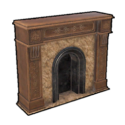|102|Fireplace|Decorative Furniture|<ul><li>10 Fine Wood Plank</li><li>3 Marble</li></ul>|
|Log Desk |103|Log Desk|Decorative Furniture|<ul><li>5 Fine Wood Plank</li></ul>|
|Makeup Table |104|Makeup Table|Decorative Furniture|<ul><li>5 Fine Wood Plank</li><li>5 Glass</li></ul>|
|Round Glass Table |105|Round Glass Table|Decorative Furniture|<ul><li>5 Fine Wood Plank</li><li>5 Glass</li></ul>|
|Round Table |106|Round Table|Decorative Furniture|<ul><li>5 Fine Wood Plank</li></ul>|
|Single bed |107|Single bed|Sleep to pass the night and restore stamina. Be cautious not to disrupt your sleep schedule.|<ul><li>10 Scrap Metal</li><li>5 Fine Wood Plank</li><li>8 A2_Cloth</li></ul>|
|Chaise Leather Couch |108|Chaise Leather Couch|Decorative Furniture|<ul><li>5 Fine Wood Plank</li><li>5 Leather</li></ul>|
|Double 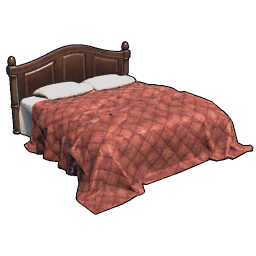|109|Double Bed|Sleep to pass the night and restore stamina. Be cautious not to disrupt your sleep schedule.|<ul><li>8 Fine Wood Plank</li><li>5 A2_Cloth</li><li>5 H_Cotton</li></ul>|
|European Leather Chair |110|European Leather Chair|Decorative Furniture|<ul><li>3 Fine Wood Plank</li><li>3 Leather</li></ul>|
|French Sofa |111|French Sofa|Decorative Furniture|<ul><li>5 Fine Wood Plank</li><li>5 Leather</li></ul>|
|Green Leather Couch |112|Green Leather Couch|Decorative Furniture|<ul><li>5 Fine Wood Plank</li><li>5 Leather</li></ul>|
|Hanging Clocks |113|Hanging Clock|Decorative Furniture|<ul><li>5 Fine Wood Plank</li><li>3 H_Copper Ingot</li><li>2 Advanced Parts</li></ul>|
|Premium Fireplace |114|Premium Fireplace|Decorative Furniture|<ul><li>10 Fine Wood Plank</li><li>5 H_Copper Ingot</li><li>5 Marble</li></ul>|
|Safe 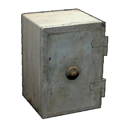|115|Safe|Used for storing items.|<ul><li>3 Iron Ingot</li><li>2 A3_Components</li></ul>|
|Single Leather Couch |116|Single Leather Couch|Decorative Furniture|<ul><li>5 Fine Wood Plank</li><li>5 Leather</li></ul>|
|TV 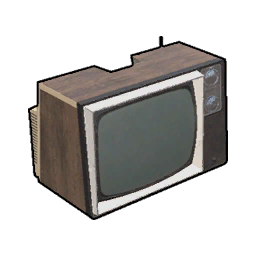|117|TV|Decorative Furniture|<ul><li>5 Fine Wood Plank</li><li>5 A3_Components</li><li>5 E_Electronic Parts</li><li>5 Glass</li></ul>|
|Vintage Leather Couch |118|Vintage Leather Couch|Decorative Furniture|<ul><li>6 Fine Wood Plank</li><li>6 Leather</li></ul>|
|A1_Paddle Boat |119|Paddle Boat|A simple boat powered by oars.|<ul><li>15 Scrap Metal</li><li>6 A3_Components</li></ul>|
|B_Sail Boat |120|Wooden Sailboat|A wooden sailboat that can accommodate 4 people. It has storage space.|<ul><li>25 Wood Plank</li><li>8 A2_Cloth</li><li>2 A1_Rope</li></ul>|
|C_Motor Boat |121|Motor Boat|A small gasoline-powered boat that can carry 2 people. It's faster and has storage space.|<ul><li>15 Scrap Metal</li><li>10 Rubber</li><li>10 A3_Components</li></ul>|
|D_JetSki 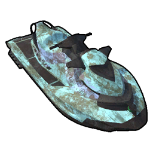|122|Jetski|Single-person high-speed jet ski. No storage space.|<ul><li>35 Scrap Metal</li><li>15 A3_Components</li><li>10 Iron Ingot</li></ul>|
|E_Jetstream Bowrider |123|Jetstream Bowrider|A wooden sailboat that can accommodate 4 people. It has storage space.|<ul><li>10 Steel Igot</li><li>15 Fine Wood Plank</li><li>10 Advanced Parts</li><li>10 E_Electronic Parts</li></ul>|
|F_Marine Fast Boat |124|Marine Fast Boat|A wooden sailboat that can accommodate 4 people. It has storage space.|<ul><li>8 Steel Igot</li><li>25 Rubber</li><li>10 A3_Components</li><li>10 Advanced Parts</li></ul>|
|G_Helicopter 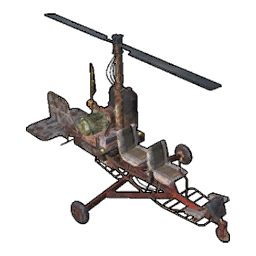|125|Light Helicopter|A small helicopter that can carry two people. It has storage space. It greatly challenges one's flying skills.|<ul><li>30 Scrap Metal</li><li>10 Steel Igot</li><li>6 Advanced Parts</li><li>10 E_Electronic Parts</li><li>10 A3_Components</li></ul>|
|A_Standing Torch |126|Standing Torch|Provide a small scope of illumination.|<ul><li>3 Wood Plank</li><li>2 Scrap Metal</li></ul>|
|B_Fire Bowl |127|Fire Bowl|The firelight is brighter and has a wider range.|<ul><li>5 Wood Plank</li><li>5 Scrap Metal</li><li>2 A2_Cloth</li></ul>|
|C_Hanging Lantern |128|Hanging Lantern|It can be hung from the ceiling.|<ul><li>5 Scrap Metal</li><li>1 A1_Rope</li></ul>|
|Campfire 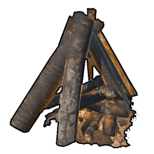|129|Bonfire|It can illuminate a wide area. Wood needs to be added. Suitable for lighting up large outdoor spaces.|<ul><li>6 Wood Plank</li></ul>|
|D1_Buoy |130|Buoy|Floating flags that can be placed on the sea.|<ul><li>8 Scrap Metal</li><li>6 Rubber</li><li>2 E_Electronic Parts</li><li>2 Glass</li></ul>|
|D2_Floor Lamp |131|Floor Lamp|Lighting devices. Require connection to a generator.|<ul><li>2 Scrap Metal</li><li>1 E_Electronic Parts</li><li>1 Glass</li></ul>|
|D3_Ceiling Light |132|Ceiling Light|Lighting devices. Require connection to a generator.|<ul><li>2 Scrap Metal</li><li>1 E_Electronic Parts</li><li>1 Glass</li></ul>|
|Searchlight 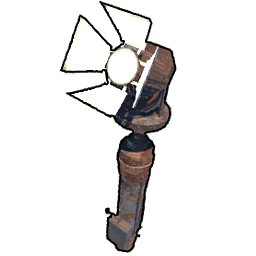|133|Searchlight|Direction-controllable searchlight. Requires connection to a generator.|<ul><li>4 Scrap Metal</li><li>4 E_Electronic Parts</li><li>4 Glass</li></ul>|
|Table Lamp |134|Table Lamp|Lighting devices. Require connection to a generator.|<ul><li>4 Scrap Metal</li><li>1 E_Electronic Parts</li><li>1 Glass</li></ul>|
|Crystal Chandelier |135|Crystal Chandelier|Lighting devices. Require connection to a generator.|<ul><li>1 H_Copper Ingot</li><li>1 E_Electronic Parts</li><li>8 Glass</li></ul>|
|European Chandelier |136|European Chandelier|Lighting devices. Require connection to a generator.|<ul><li>1 H_Copper Ingot</li><li>2 E_Electronic Parts</li><li>4 Glass</li></ul>|
|Modern Floor Lamp |137|Modern Floor Lamp|Lighting devices. Require connection to a generator.|<ul><li>1 H_Copper Ingot</li><li>2 E_Electronic Parts</li><li>4 Glass</li></ul>|
|Modern Garden Lamp |138|Modern Garden Lamp|Lighting devices. Require connection to a generator.|<ul><li>1 H_Copper Ingot</li><li>2 E_Electronic Parts</li><li>4 Glass</li></ul>|
|Modern Lamp Post |139|Modern Lamp Post|Lighting devices. Require connection to a generator.|<ul><li>1 H_Copper Ingot</li><li>2 E_Electronic Parts</li><li>4 Glass</li></ul>|
|Modern Wall Lamp |140|Modern Wall Lamp|Lighting devices. Require connection to a generator.|<ul><li>1 H_Copper Ingot</li><li>2 E_Electronic Parts</li><li>4 Glass</li></ul>|
