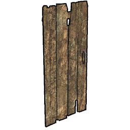

# Piece list
All of the pieces currently in the game.
This file is automatically generated from Sunkenland 0.5.12 using the SunkenDoc mod found on our GitHub.
# Building List

|Piece |Building ID |Name |Description |Resources required |
|---|---|---|---|---|
|BirdTrap |2|Bird Trap|Using plant seeds to lure seabirds and obtain bird meat|<ul><li>20 Scrap Metal</li><li>5 A3_Components</li></ul>|
|D1_Gridiron |3|Simple Grill|Cooks raw foods for more nutrition.|<ul><li>12 Scrap Metal</li></ul>|
|D3_Simple Purifier |4|Simple Purifier|Use of wood, distillation of sea water to obtain fresh water.|<ul><li>5 Wood Plank</li><li>10 Scrap Metal</li><li>3 A3_Components</li></ul>|
|F1_Stove |5|Stove|It can be used to cook a more nutritious meal and has a short gain effect when consumed.|<ul><li>10 Scrap Metal</li><li>5 A3_Components</li><li>2 Iron Ingot</li></ul>|
|G1_Fishnet |6|Fishnet|Put in a bait and harvest a sea fish.|<ul><li>2 A1_Rope</li><li>5 A3_Components</li></ul>|
|G2_Planter |7|Planter|Used for planting various types of fruits, vegetables, and shrubs.|<ul><li>20 Wood Plank</li><li>4 A2_Cloth</li></ul>|
|Underwater Planting Pot |279|Underwater Planting Pot|A structure used to grow underwater plants, such as certain algae.|<ul><li>20 Scrap Metal</li><li>10 A3_Components</li><li>2 A1_Rope</li></ul>|
|D2_Improved Gridiron |8|Improved Grill|Faster cooking, saving wood, more charcoal.|<ul><li>20 Scrap Metal</li><li>6 A3_Components</li><li>2 Rubber</li></ul>|
|D4_Advanced Purifier |9|Advanced Purifier|Pumps and distills seawater, accelerates purification.|<ul><li>20 Scrap Metal</li><li>2 Modern Parts</li><li>6 Rubber</li><li>10 Glass</li></ul>|
|Big Fish Basket |1|Big Fish Basket|Fully automatic capture of fish without the need for bait|<ul><li>10 A1_Rope</li><li>5 A3_Components</li></ul>|
|Fish Tank |10|Fish Tank|A beautiful glass aquarium|<ul><li>10 Glass</li><li>10 Scrap Metal</li><li>5 E_Electronic Parts</li></ul>|
|Fishpond |280|Fishpond|Artificial fish ponds filled with seawater to raise marine fish. The fish fry will hit up with the seawater, don't worry!|<ul><li>40 Scrap Metal</li><li>20 A3_Components</li><li>10 Rubber</li></ul>|
|A1_Research Table |11|Research Table|Used to unlock more constructible items and base facilities.|<ul><li>15 Wood Plank</li><li>15 Scrap Metal</li><li>6 A3_Components</li></ul>|
|AirFillingStation |12|Air Filling Station|Manually refills your air tanks.|<ul><li>20 Scrap Metal</li><li>8 A3_Components</li><li>4 Rubber</li></ul>|
|AutomaticFirearmsRecoveryStation |13|Advanced Firearms Workshop|Energized and working, the manufacturing platform used to make modern firearms.|<ul><li>20 Scrap Metal</li><li>3 E_Electronic Parts</li><li>3 Modern Parts</li></ul>|
|B1_Furnace |14|Furnace|Using wood as a fuel, it can be used to smelt ore into metal ingots.|<ul><li>15 Wood Plank</li><li>15 Scrap Metal</li><li>5 Rubber</li><li>2 A3_Components</li></ul>|
|B2_Avil |15|Anvil|Used for manufacturing or repairing advanced metal weapons.|<ul><li>10 Scrap Metal</li><li>2 Iron Ingot</li></ul>|
|Battery Charger |16|Battery Charger|Used to charge batteries. Requires power source.|<ul><li>3 H_Copper Ingot</li><li>5 A3_Components</li><li>3 E_Electronic Parts</li></ul>|
|C1_Gun Workshop |223|Black Powder Gun Workshop|Used for making black powder firearms and their ammunition.|<ul><li>15 Scrap Metal</li><li>15 Wood Plank</li><li>2 Modern Parts</li></ul>|
|C2_Ammo Workshop |18|Ammo Workshop|Needs to be electrified and used as a working platform for making modern ammunition.|<ul><li>25 Scrap Metal</li><li>10 Rubber</li><li>3 Modern Parts</li></ul>|
|C3_Armor Workshop |19|Armor Workshop|Used for crafting modern helmets and bulletproof vests.|<ul><li>20 Wood Plank</li><li>8 A2_Cloth</li><li>8 Rubber</li></ul>|
|C4_Heavy Workshop |282|Heavy Machinery Workbench|An electrically powered workbench used to produce heavy equipment such as engines, superchargers and turbines.|<ul><li>20 Scrap Metal</li><li>10 Rubber</li><li>2 Advanced Parts</li><li>2 E_Electronic Parts</li></ul>|
|C8_Sawmill |21|Sawmill|Work with electricity to process ordinary wooden boards into exquisite wooden boards.|<ul><li>20 Scrap Metal</li><li>3 Modern Parts</li><li>3 E_Electronic Parts</li></ul>|
|C9 Decompose Table |22|Recycler|Drag unused items into it to dismantle and obtain partial raw materials.|<ul><li>18 Scrap Metal</li><li>5 Iron Ingot</li><li>5 A3_Components</li><li>4 E_Electronic Parts</li></ul>|
|Electrolytic Furnace |23|Electrolytic Furnace|Energized to work, converting iron ore, copper ore, anatase, etc. into materials for synthesis.|<ul><li>20 Scrap Metal</li><li>1 Steel Igot</li><li>1 Compressor</li><li>1 Control Panel</li></ul>|
|H_Biofuel Lab |24|Biofuel Lab|Fuel is made from a variety of organic materials.|<ul><li>25 Scrap Metal</li><li>15 Glass</li><li>15 Rubber</li><li>4 Modern Parts</li></ul>|
|Inventory Management Robot |283|Inventory Management Robot|Power up and use, deposit the item into the machine and it can be automatically dispensed into a storage container that already holds the item.|<ul><li>20 Scrap Metal</li><li>1 Control Panel</li><li>1 Compressor</li><li>1 High-efficiency alloy motor</li></ul>|
|RepairStation |26|Repair Station|Repair equipment that has lost its durability.|<ul><li>15 Scrap Metal</li><li>6 A3_Components</li><li>4 Rubber</li></ul>|
|Steel Furnace |27|Steel Furnace|Use charcoal as a fuel to melt iron into bits of steel.|<ul><li>5 Iron Ingot</li><li>5 E_Electronic Parts</li><li>2 Advanced Parts</li><li>10 Glass</li></ul>|
|B2_Reinforced Foundation |30|Reinforced Foundation|The foundation of base construction.|<ul><li>1 Iron Ingot</li></ul>|
|G1_Glass Wall |45|Glass Wall|Can only be built on foundations and floors.|<ul><li>3 Scrap Metal</li><li>2 Glass</li></ul>|
|G1_Reinforced Wall |46|Reinforced Wall|Can only be built on foundations and floors.|<ul><li>1 Iron Ingot</li></ul>|
|G2_Reinforced Wall With Door |47|Reinforced Wall With Door|Can only be built on foundations and floors.|<ul><li>1 Iron Ingot</li></ul>|
|G3_Reinforced Wall With Window |48|Reinforced Wall With Window|Can only be built on foundations and floors.|<ul><li>1 Iron Ingot</li></ul>|
|G4_Reinforced Door |49|Reinforced Door|Can be attached to door frames.|<ul><li>1 Iron Ingot</li></ul>|
|G5_Reinforced Window |50|Reinforced Window|Can be attached to window frames.|<ul><li>1 Iron Ingot</li></ul>|
|L-shaped Reinforced Roof |66|L-shaped Reinforced Roof|Can only be built on pillars.|<ul><li>1 Iron Ingot</li></ul>|
|One-quarter Reinforced Triangular Wall |111|One-quarter Reinforced Triangular Wall|Can only be built on foundations and floors.|<ul><li>1 Iron Ingot</li></ul>|
|Reinforced Door 45 |113|Reinforced Door 45°|Can only be built on foundations and floors.|<ul><li>1 Iron Ingot</li></ul>|
|Reinforced Floor |76|Reinforced Floor|Can only be built on pillars.|<ul><li>1 Iron Ingot</li></ul>|
|Reinforced Floor Hole |75|Reinforced Floor Hole|Can only be built on pillars.|<ul><li>1 Iron Ingot</li></ul>|
|Reinforced Half Floor |77|Reinforced Half Floor|Can only be built on pillars.|<ul><li>1 Iron Ingot</li></ul>|
|Reinforced Half Foundation |226|Reinforced Half Foundation|The foundation of base construction.|<ul><li>1 Iron Ingot</li></ul>|
|Reinforced Half Wall |117|Reinforced Half Wall|Can only be built on foundations and floors.|<ul><li>1 Iron Ingot</li></ul>|
|Reinforced Half Wall 45 |114|Reinforced Half Wall 45°|Can only be built on foundations and floors.|<ul><li>1 Iron Ingot</li></ul>|
|Reinforced Half Wall Inverted Triangle |115|Reinforced Half Wall Inverted Triangle|Can only be built on foundations and floors.|<ul><li>1 Iron Ingot</li></ul>|
|Reinforced Half Wall Triangle |116|Reinforced Half Wall Triangle|Can only be built on foundations and floors.|<ul><li>1 Iron Ingot</li></ul>|
|Reinforced Roof 60 |78|Reinforced Roof 60°|Can only be built on pillars.|<ul><li>1 Iron Ingot</li></ul>|
|Reinforced Roof Herringbone |79|Reinforced Roof Herringbone|Can only be built on pillars.|<ul><li>1 Iron Ingot</li></ul>|
|Reinforced Roof Outside 60 |80|Reinforced Roof Outside 60°|Can only be built on pillars.|<ul><li>1 Iron Ingot</li></ul>|
|Reinforced Roof Triangle 60 |81|Reinforced Roof Triangle 60°|Can only be built on pillars.|<ul><li>1 Iron Ingot</li></ul>|
|Reinforced Roof Within 60 |82|Reinforced Roof Within 60°|Can only be built on pillars.|<ul><li>1 Iron Ingot</li></ul>|
|Reinforced Wall 45 |118|Reinforced Wall 45°|Can only be built on foundations and floors.|<ul><li>1 Iron Ingot</li></ul>|
|Reinforced Window 45 |119|Reinforced Window 45°|Can only be built on foundations and floors.|<ul><li>1 Iron Ingot</li></ul>|
|Sealed Reinforced Roof |84|Sealed Reinforced Roof|Can only be built on pillars.|<ul><li>4 Iron Ingot</li></ul>|
|T-shaped Reinforced Roof |87|T-shaped Reinforced Roof|Can only be built on pillars.|<ul><li>4 Iron Ingot</li></ul>|
|Tapered Reinforced Roof |90|Tapered Reinforced Roof|Can only be built on pillars.|<ul><li>4 Iron Ingot</li></ul>|
|X-shaped Reinforced Roof |101|X-shaped Reinforced Roof|Can only be built on pillars.|<ul><li>2 Iron Ingot</li></ul>|
|A2_Metal Foundation |29|Metal Foundation|The foundation of base construction.|<ul><li>6 Scrap Metal</li></ul>|
|F1_Metal Wall |39|Metal Wall|Can only be built on foundations and floors.|<ul><li>3 Scrap Metal</li></ul>|
|F2_Metal Wall WIth Door |40|Metal Wall With Door|Can only be built on foundations and floors.|<ul><li>3 Scrap Metal</li></ul>|
|F3_Metal Wall With Window |41|Metal Wall With Window|Can only be built on foundations and floors.|<ul><li>3 Scrap Metal</li></ul>|
|F4_Metal Floor |42|Metal Floor|Can only be built on pillars.|<ul><li>3 Scrap Metal</li></ul>|
|F5_Metal Door |43|Metal Door|Can be attached to door frames.|<ul><li>2 Scrap Metal</li></ul>|
|F6_Metal Window |44|Metal Window|Can be attached to window frames.|<ul><li>2 Scrap Metal</li></ul>|
|Glass Wall 45 |225|Glass Wall 45°|Can only be built on foundations and floors.|<ul><li>2 Scrap Metal</li><li>1 Glass</li></ul>|
|H4_Metal Column |51|Metal Column|Used to support upper structures.|<ul><li>2 Scrap Metal</li></ul>|
|Half Metal Stairs |52|Half Metal Stairs|A short half staircase that can be freely pieced together.|<ul><li>3 Scrap Metal</li></ul>|
|J3_Metal Stairs |56|Metal Stairs|Can be attached to foundations and floors.|<ul><li>4 Scrap Metal</li></ul>|
|J4_Metal Ledder |57|Metal Ladder|Can be attached to foundations and floors.|<ul><li>3 Scrap Metal</li></ul>|
|K2_Metal Roof |59|Metal Roof|Can only be built on pillars.|<ul><li>3 Scrap Metal</li></ul>|
|L-shaped Metal Roof |65|L-shaped Metal Roof|Can only be built on pillars.|<ul><li>3 Scrap Metal</li></ul>|
|Metal Door 45 |103|Metal Door 45°|Can only be built on foundations and floors.|<ul><li>3 Scrap Metal</li></ul>|
|Metal Floor Hole |68|Metal Floor Hole|Can only be built on pillars.|<ul><li>3 Scrap Metal</li></ul>|
|Metal Half Floor |69|Metal Half Floor|Can only be built on pillars.|<ul><li>3 Scrap Metal</li></ul>|
|Metal Half Foundation |224|Metal Half Foundation|The foundation of base construction.|<ul><li>4 Scrap Metal</li></ul>|
|Metal Half Wall |107|Metal Half Wall|Can only be built on foundations and floors.|<ul><li>2 Scrap Metal</li></ul>|
|Metal Half Wall 45 |104|Metal Half Wall 45°|Can only be built on foundations and floors.|<ul><li>2 Scrap Metal</li></ul>|
|Metal Half Wall Inverted Triangle |105|Metal Half Wall Inverted Triangle|Can only be built on foundations and floors.|<ul><li>2 Scrap Metal</li></ul>|
|Metal Half Wall Triangle |106|Metal Half Wall Triangle|Can only be built on foundations and floors.|<ul><li>2 Scrap Metal</li></ul>|
|Metal Roof 60 |70|Metal Roof 60°|Can only be built on pillars.|<ul><li>3 Scrap Metal</li></ul>|
|Metal Roof Herringbone |71|Metal Roof Herringbone|Can only be built on pillars.|<ul><li>3 Scrap Metal</li></ul>|
|Metal Roof Outside 60 |72|Metal Roof Outside 60°|Can only be built on pillars.|<ul><li>3 Scrap Metal</li></ul>|
|Metal Roof Triangle 60 |73|Metal Roof Triangle 60°|Can only be built on pillars.|<ul><li>3 Scrap Metal</li></ul>|
|Metal Roof Within 60 |74|Metal Roof Within 60°|Can only be built on pillars.|<ul><li>3 Scrap Metal</li></ul>|
|Metal Wall 45 |108|Metal Wall 45°|Can only be built on foundations and floors.|<ul><li>3 Scrap Metal</li></ul>|
|Metal Window 45 |109|Metal Window 45°|Can only be built on foundations and floors.|<ul><li>3 Scrap Metal</li></ul>|
|One-quarter Metal Triangular Wall |110|One-quarter Metal Triangular Wall|Can only be built on foundations and floors.|<ul><li>2 Scrap Metal</li></ul>|
|Sealed Metal Roof |83|Sealed Metal Roof|Can only be built on pillars.|<ul><li>3 Scrap Metal</li></ul>|
|T-shaped Metal Roof |86|T-shaped Metal Roof|Can only be built on pillars.|<ul><li>3 Scrap Metal</li></ul>|
|Tapered Metal Roof |89|Tapered Metal Roof|Can only be built on pillars.|<ul><li>3 Scrap Metal</li></ul>|
|X-shaped Metal Roof |100|X-shaped Metal Roof|Can only be built on pillars.|<ul><li>3 Scrap Metal</li></ul>|
|Floor Tile Half(European) |229|Floor Tile Half (European)|Can be attached to foundations and floors.|<ul><li>1 Fine Wood Plank</li></ul>|
|Floor Tile Half(White Tiles) |230|Floor Tile Half (White Tiles)|Can be attached to foundations and floors.|<ul><li>1 Fine Wood Plank</li></ul>|
|Floor Tile Half(Wooden) |231|Floor Tile Half (Wooden)|Can be attached to foundations and floors.|<ul><li>1 Fine Wood Plank</li></ul>|
|K1_Wallpaper (Blue) |58|Wallpaper (Blue)|Can be built on any wall.|<ul><li>2 Wood Plank</li><li>1 Paint</li></ul>|
|K2_Wallpaper (Green) |60|Wallpaper (Green)|Can be built on any wall.|<ul><li>2 Wood Plank</li><li>1 Paint</li></ul>|
|K3_Wallpaper (Yellow) |61|Wallpaper (Yellow)|Can be built on any wall.|<ul><li>2 Wood Plank</li><li>1 Paint</li></ul>|
|L1_Floor Tile (European) |62|Floor Tile (European)|Can be attached to foundations and floors.|<ul><li>1 Fine Wood Plank</li></ul>|
|L2_Floor Tile (White Tiles) |63|Floor Tile (White Tiles)|Can be attached to foundations and floors.|<ul><li>1 Fine Wood Plank</li></ul>|
|L3_Floor Tile (Wooden) |64|Floor Tile (Wooden)|Can be attached to foundations and floors.|<ul><li>1 Fine Wood Plank</li></ul>|
|Wallpaper  Half Wall  Triangle (Blue) |247|Wallpaper  Half Wall  Triangle (Blue)|Can be attached to foundations and floors.|<ul><li>2 Wood Plank</li><li>1 Paint</li></ul>|
|Wallpaper  Half Wall  Triangle (Green) |248|Wallpaper  Half Wall  Triangle (Green)|Can be attached to foundations and floors.|<ul><li>2 Wood Plank</li><li>1 Paint</li></ul>|
|Wallpaper  Half Wall  Triangle (Yellow) |249|Wallpaper  Half Wall  Triangle (Yellow)|Can be attached to foundations and floors.|<ul><li>2 Wood Plank</li><li>1 Paint</li></ul>|
|Wallpaper 45 (Blue) |232|Wallpaper 45° (Blue)|Can be built on any wall.|<ul><li>2 Wood Plank</li><li>1 Paint</li></ul>|
|Wallpaper 45 (Green) |233|Wallpaper 45° (Green)|Can be built on any wall.|<ul><li>2 Wood Plank</li><li>1 Paint</li></ul>|
|Wallpaper 45 (Yellow) |234|Wallpaper 45° (Yellow)|Can be built on any wall.|<ul><li>2 Wood Plank</li><li>1 Paint</li></ul>|
|Wallpaper Door  (Yellow) |253|Wallpaper Door  (Yellow)|Can be built on any door.|<ul><li>2 Wood Plank</li><li>1 Paint</li></ul>|
|Wallpaper Door (Blue) |254|Wallpaper Door (Blue)|Can be built on any door.|<ul><li>2 Wood Plank</li><li>1 Paint</li></ul>|
|Wallpaper Door (Green) |255|Wallpaper Door (Green)|Can be built on any door.|<ul><li>2 Wood Plank</li><li>1 Paint</li></ul>|
|Wallpaper Door 45 (Blue) |235|Wallpaper 45° (Blue)|Can be built on any wall.|<ul><li>2 Wood Plank</li><li>1 Paint</li></ul>|
|Wallpaper Door 45 (Green) |236|Wallpaper 45° (Green)|Can be built on any wall.|<ul><li>2 Wood Plank</li><li>1 Paint</li></ul>|
|Wallpaper Door 45 (Yellow) |237|Wallpaper 45° (Yellow)|Can be built on any wall.|<ul><li>2 Wood Plank</li><li>1 Paint</li></ul>|
|Wallpaper Half (Blue) |238|Wallpaper Half (Blue)|Can be built on any wall.|<ul><li>1 Wood Plank</li><li>1 Paint</li></ul>|
|Wallpaper Half (Green) |239|Wallpaper Half (Green)|Can be built on any wall.|<ul><li>1 Wood Plank</li><li>1 Paint</li></ul>|
|Wallpaper Half (Yellow) |240|Wallpaper Half (Yellow)|Can be built on any wall.|<ul><li>1 Wood Plank</li><li>1 Paint</li></ul>|
|Wallpaper Half Wall 45 (Blue) |241|Wallpaper Half Wall 45° (Blue)|Can be built on any wall.|<ul><li>1 Wood Plank</li><li>1 Paint</li></ul>|
|Wallpaper Half Wall 45 (Green) |242|Wallpaper Half Wall 45° (Green)|Can be built on any wall.|<ul><li>1 Wood Plank</li><li>1 Paint</li></ul>|
|Wallpaper Half Wall 45 (Yellow) |243|Wallpaper Half Wall 45°(Yellow)|Can be built on any wall.|<ul><li>1 Wood Plank</li><li>1 Paint</li></ul>|
|Wallpaper One-quarter Triangular Wall (Blue) |250|Wallpaper One-Quarter Triangular Wall (Blue)|Can be attached to foundations and floors.|<ul><li>1 Wood Plank</li><li>1 Paint</li></ul>|
|Wallpaper One-quarter Triangular Wall (Green) |251|Wallpaper One-Quarter Triangular Wall (Green)|Can be attached to foundations and floors.|<ul><li>1 Wood Plank</li><li>1 Paint</li></ul>|
|Wallpaper One-quarter Triangular Wall (Yellow) |252|Wallpaper One-Quarter Triangular Wall (Yellow)|Can be attached to foundations and floors.|<ul><li>1 Wood Plank</li><li>1 Paint</li></ul>|
|Wallpaper Window (Blue) |256|Wallpaper Window (Blue)|Can be built on any window.|<ul><li>2 Wood Plank</li><li>1 Paint</li></ul>|
|Wallpaper Window (Green) |257|Wallpaper Window (Green)|Can be built on any window.|<ul><li>2 Wood Plank</li><li>1 Paint</li></ul>|
|Wallpaper Window (Yellow) |258|Wallpaper Window (Yellow)|Can be built on any window.|<ul><li>2 Wood Plank</li><li>1 Paint</li></ul>|
|Wallpaper Window 45 (Blue) |244|Wallpaper 45° (Blue)|Can be built on any wall.|<ul><li>2 Wood Plank</li><li>1 Paint</li></ul>|
|Wallpaper Window 45 (Green) |245|Wallpaper 45° (Green)|Can be built on any wall.|<ul><li>2 Wood Plank</li><li>1 Paint</li></ul>|
|Wallpaper Window 45 (Yellow) |246|Wallpaper 45° (Yellow)|Can be built on any wall.|<ul><li>2 Wood Plank</li><li>1 Paint</li></ul>|
|Wallpaper With Door |129|Wallpaper (Blue)|Can be built on any wall.|<ul><li>2 Wood Plank</li></ul>|
|Wallpaper With Door_1 |130|Wallpaper (Green)|Can be built on any wall.|<ul><li>2 Wood Plank</li></ul>|
|Wallpaper With Door_2 |131|Wallpaper (Yellow)|Can be built on any wall.|<ul><li>2 Wood Plank</li></ul>|
|Wallpaper With Window |132|Wallpaper (Blue)|Can be built on any wall.|<ul><li>2 Wood Plank</li></ul>|
|Wallpaper With Window_1 |133|Wallpaper (Green)|Can be built on any wall.|<ul><li>2 Wood Plank</li></ul>|
|Wallpaper With Window_2 |134|Wallpaper (Yellow)|Can be built on any wall.|<ul><li>2 Wood Plank</li></ul>|
|A1_Wooden Foundation |28|Wooden Foundation|The foundation of base construction.|<ul><li>6 Wood Plank</li></ul>|
|E1_WoodenWall |31|Wooden Wall|Can only be built on foundations and floors.|<ul><li>3 Wood Plank</li></ul>|
|E2_WoodenWallWithDoorSlot |32|Wooden Wall With Door Slot|Can only be built on foundations and floors.|<ul><li>3 Wood Plank</li></ul>|
|E3_WoodenWallWithWindow |33|Wooden Wall With Window|Can only be built on foundations and floors.|<ul><li>3 Wood Plank</li></ul>|
|E4_Wooden Floor |34|Wooden Floor|Can only be built on pillars.|<ul><li>3 Wood Plank</li></ul>|
|E5_Wooden Column |35|Wooden Pillar|Used to support upper structures.|<ul><li>2 Wood Plank</li></ul>|
|E6_Wooden Roof |36|Wooden Roof|Can only be built on pillars.|<ul><li>3 Wood Plank</li></ul>|
|E7_WoodenDoor |37|Wooden Door|Can be attached to door frames.|<ul><li>2 Wood Plank</li></ul>|
|E8_WoodenWindow |38|Wooden Window|Can be attached to window frames.|<ul><li>2 Wood Plank</li></ul>|
|Half Wooden Stairs |53|Half Wooden Stairs|A short half staircase that can be freely pieced together.|<ul><li>3 Wood Plank</li></ul>|
|J1_Wooden Stairs |54|Wooden Stairs|Can be attached to foundations and floors.|<ul><li>4 Wood Plank</li></ul>|
|J2_Wooden Ladder |55|Wooden Ladder|Can be attached to foundations and floors.|<ul><li>3 Wood Plank</li></ul>|
|L-shaped Wooden Roof |67|L-shaped Wooden Roof|Can only be built on pillars.|<ul><li>3 Wood Plank</li></ul>|
|One-quarter Wooden Triangular Wall |112|One-quarter Wooden Triangular Wall|Can only be built on foundations and floors.|<ul><li>2 Wood Plank</li></ul>|
|Sealed Wooden Roof |85|Sealed Wooden Roof|Can only be built on pillars.|<ul><li>3 Wood Plank</li></ul>|
|T-shaped Wooden Roof |88|T-shaped Wooden Roof|Can only be built on pillars.|<ul><li>3 Wood Plank</li></ul>|
|Tapered Wooden Roof |91|Tapered Wooden Roof|Can only be built on pillars.|<ul><li>3 Wood Plank</li></ul>|
|Wooden Door 45 |120|Wooden Door 45°|Can only be built on foundations and floors.|<ul><li>4 Wood Plank</li></ul>|
|Wooden Floor Hole |92|Wooden Floor Hole|Can only be built on pillars.|<ul><li>2 Wood Plank</li></ul>|
|Wooden Half Floor |93|Wooden Half Floor|Can only be built on pillars.|<ul><li>2 Wood Plank</li></ul>|
|Wooden Half Foundation |227|Wooden Half Foundation|The foundation of base construction.|<ul><li>4 Wood Plank</li></ul>|
|Wooden Half Wall |126|Wooden Half Wall|Can only be built on foundations and floors.|<ul><li>2 Wood Plank</li></ul>|
|Wooden Half Wall 45 |121|Wooden Half Wall 45°|Can only be built on foundations and floors.|<ul><li>2 Wood Plank</li></ul>|
|Wooden Half Wall Inverted Triangle |122|Wooden Half Wall Inverted Triangle|Can only be built on foundations and floors.|<ul><li>2 Wood Plank</li></ul>|
|Wooden Half Wall Triangle |123|Wooden Half Wall Triangle|Can only be built on foundations and floors.|<ul><li>2 Wood Plank</li></ul>|
|Wooden Half Wall With Window |125|Wooden Half Wall With Window|Can only be built on foundations and floors.|<ul><li>2 Wood Plank</li></ul>|
|Wooden Half Wall With Window 45 |124|Wooden Half Wall With Window 45°|Can only be built on foundations and floors.|<ul><li>2 Wood Plank</li></ul>|
|Wooden Roof 60 |94|Wooden Roof 60°|Can only be built on pillars.|<ul><li>3 Wood Plank</li></ul>|
|Wooden Roof Herringbone |95|Wooden Roof Herringbone|Can only be built on pillars.|<ul><li>3 Wood Plank</li></ul>|
|Wooden Roof Outside 60 |96|Wooden Roof Outside 60°|Can only be built on pillars.|<ul><li>3 Wood Plank</li></ul>|
|Wooden Roof Triangle 60 |97|Wooden Roof Triangle 60°|Can only be built on pillars.|<ul><li>3 Wood Plank</li></ul>|
|Wooden Roof With Window 60 |98|Wooden Roof With Window 60°|Can only be built on pillars.|<ul><li>3 Wood Plank</li></ul>|
|Wooden Roof Within 60 |99|Wooden Roof Within 60°|Can only be built on pillars.|<ul><li>3 Wood Plank</li></ul>|
|Wooden Wall 45 |127|Wooden Wall 45°|Can only be built on foundations and floors.|<ul><li>3 Wood Plank</li></ul>|
|Wooden Window 45 |128|Wooden Window 45°|Can only be built on foundations and floors.|<ul><li>3 Wood Plank</li></ul>|
|X-shaped Wooden Roof |102|X-shaped Wooden Roof|Can only be built on pillars.|<ul><li>3 Wood Plank</li></ul>|
|A1_Wooden Defensive Wall |135|Wooden Defensive Wall|Wooden defensive wall that can be used to enclose your base.|<ul><li>15 Wood Plank</li><li>5 Scrap Metal</li></ul>|
|A2_Wooden Gate |136|Wooden Gate|Wooden door that can be opened and closed.|<ul><li>20 Wood Plank</li><li>5 Scrap Metal</li></ul>|
|AP Mine |272|AP Mine|Powerful anti-personnel mines.|<ul><li>8 Scrap Metal</li><li>8 B1_Black Powder</li><li>3 A3_Components</li></ul>|
|Artillery |273|Artillery|Launches homemade projectiles, causing widespread damage to invading enemies.|<ul><li>20 Scrap Metal</li><li>8 Iron Ingot</li><li>12 D_Gun Parts</li></ul>|
|Auto Turret |277|Automatic machine gun turret|Electrically powered for use and automatically shoots incoming enemies.|<ul><li>3 Steel Igot</li><li>1 High-efficiency alloy motor</li><li>1 Control Panel</li></ul>|
|B1_Metal Defensive Wall |137|Metal Defensive Wall|Even sturdier defensive wall.|<ul><li>15 Scrap Metal</li><li>2 A3_Components</li></ul>|
|B2_Metal Gate |138|Metal Gate|Even sturdier metal door that can be opened and closed.|<ul><li>20 Scrap Metal</li><li>4 A3_Components</li></ul>|
|BarbedTip |281|Ground thorns|Placed on the ground, it deals damage to enemies standing on it.|<ul><li>6 Wood Plank</li><li>6 Scrap Metal</li></ul>|
|C1_Wooden Barricade |139|Wooden Barricade|Simple barricade that can obstruct invaders.|<ul><li>15 Wood Plank</li></ul>|
|C2_Barbed Wire |140|Barbed Wire|Simple barricade that can obstruct invaders.|<ul><li>12 Scrap Metal</li><li>1 A3_Components</li></ul>|
|D1_Barricade |141|Barricade|Simple wooden cover that can be crouched behind for shooting.|<ul><li>10 Scrap Metal</li><li>4 Wood Plank</li></ul>|
|D2_Reinforced Barricade |142|Reinforced Barricade|Sturdy metal cover that can withstand gunfire, providing you with maximum protection.|<ul><li>8 Scrap Metal</li><li>2 Iron Ingot</li></ul>|
|E1_Metal Armor Plate |143|Metal Armor Plate|Small armor plates that can be attached anywhere to reinforce and provide protection.|<ul><li>3 Scrap Metal</li></ul>|
|E1_Tire Stack |144|Tire Stack|A pile of discarded tires for creating makeshift cover.|<ul><li>4 Rubber</li><li>3 Scrap Metal</li></ul>|
|F1_Heavy Machine Gun |145|Heavy Machine Gun|Stationary heavy weapon that can rotate. Uses large caliber ammunition.|<ul><li>25 Scrap Metal</li><li>10 D_Gun Parts</li><li>5 Steel Igot</li><li>4 Advanced Parts</li></ul>|
|G1_Siren |146|Siren|A high pitch alarm system.|<ul><li>20 Scrap Metal</li><li>3 Iron Ingot</li><li>3 H_Duct Tape</li><li>3 E_Electronic Parts</li></ul>|
